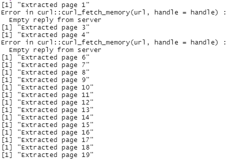
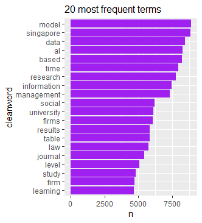
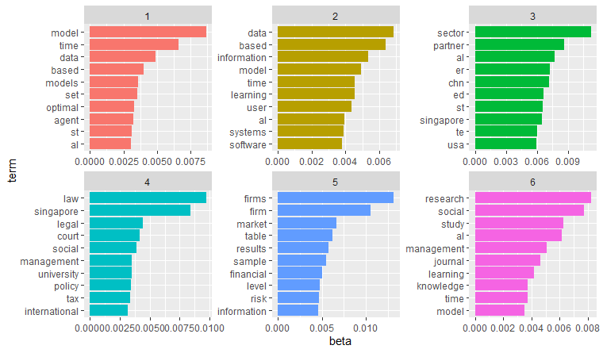
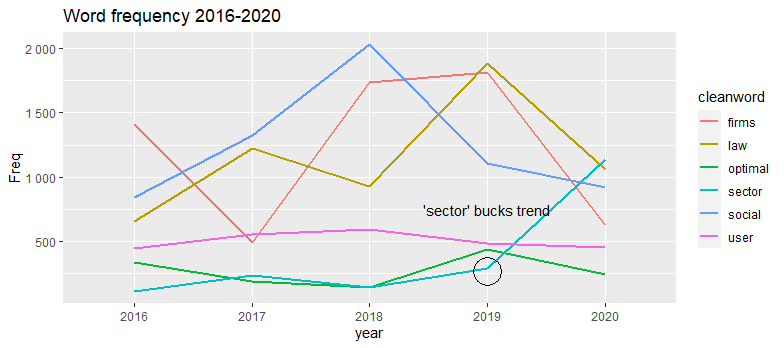
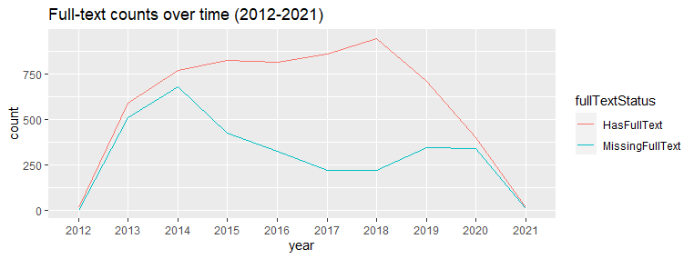
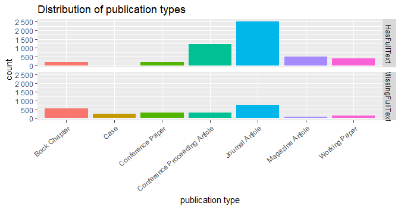

Trends in SMU research papers (CORE dataset)
================

## 1. Introduction

This analysis is based on a scenario in which a user is interested in
seeing what is possible with the text mining of SMU journal articles
that are deposited in open repositories. We will analyse data for SMU
INK (<https://ink.library.smu.edu.sg/>) records extracted from CORE
(<https://core.ac.uk/>), an aggregator of open access articles.

### 1.1 Notable findings

-   There are **12,041 full-text records** from SMU INK found in CORE.
-   Topic modelling suggests topics that mostly echo SMU’s official
    research areas.
-   Records with and without full texts differ in their distribution of
    publication types.

### 1.2 Packages

The packages shown below are used for this project. They can be grouped
as follows:

1.  Packages for interacting with the CORE API and web scraping
2.  Packages for manipulation, analysis and visualisation
3.  `renv` package for supporting reproducible code

``` r
library(renv)
library(rcoreoa)
library(magrittr)
library(tibble)
library(dplyr)
library(ggplot2)
library(httr)
library(tidyr)
library(qdap)
library(summarytools)
library(tidytext)
library(stringr)
library(topicmodels)
library(scales)
library(data.table)
```

``` r
#initialise renv
renv::init()

#take snapshot of packages periodically and at the end of the project
renv::snapshot()
```

## 2. Data extraction

### 2.1 Repository statistics

Repository statistics are extracted via the CORE API using the URL
below. The API key is redacted below and throughout the code.

<https://core.ac.uk/api-v2/articles/search/repositories.id:517?apiKey=REDACTED&stats=TRUE>

**Output:**

``` r
output <-
  {"status":"OK","data":{"name":"Institutional Knowledge at Singapore Management University","uri":"https:\/\/ink.library.smu.edu.sg\/do\/oai\/","urlOaipmh":"https:\/\/ink.library.smu.edu.sg\/do\/oai\/","urlHomepage":"https:\/\/ink.library.smu.edu.sg","id":517,"OpenDoarId":2269,"repositoryStats":{"dateLastProcessed":"2021-01-22","countMetadata":25085,"countFulltext":12041},"lastSeen":{"harvest_times":{"2021-02-02 13:57:53.000000":"unsuccessful","2021-01-22 03:20:28.000000":"successful","2021-01-21 05:21:22.000000":"unsuccessful","2021-01-16 05:21:15.000000":"unsuccessful","2021-01-04 11:44:46.000000":"unsuccessful"},"isActive":true},"dataProviderSourceStats":{"metadataCount":24986,"metadataNonDeletedCount":24986,"fulltextCount":11829},"type":"repository"}}
```

According to `repositoryStats`, as of 22 Jan 2021:

-   there are **25,085 records in total** (`countMetadata`)

-   of these records, **12,041 are full-text** (`countFulltext`).

Note: Counts provided by SMU INK (`dataProviderSourceStats`) are lower.

### 2.2 Article records

Data is extracted from CORE using a series of GET requests using these
URL elements:

``` r
#initialise URL components
url_base <- "https://core.ac.uk/api-v2/articles/search/repositories.id:517?"

url_key <- "REDACTED"

url_page <- "&page=" #the page number will be added later when looping

url_pagesize <- "&pageSize=100"

url_fulltext <- "&fulltext=TRUE"
```

We will extract 100 pages, or up to 10,000 records.

``` r
#1st batch: pages 1-100

#initialise list to collect records
batch1 <- vector(mode = "list", length = 0)

#extract records from pages 1-100
for (n in c(1:100)){
  url_scrape <- paste(url_base, 
                      url_key, #to replace "REDACTED" with actual key 
                      url_page, 
                      n, #this is the page number
                      url_pagesize, 
                      url_fulltext, sep = "")
  try({
    resp <- httr::GET(url_scrape) #get up to 100 records
    cont_raw <- httr::content(resp) #change from JSON to list of lists
    #extract records from element "data" 
    
    for (record in cont_raw$data){
      batch1 <- batch1 %>% append(list(record))
    }
    print(
      paste("Extracted page", n, sep=" ") #prints if page extracted successfully
    )
  })
    
  
  Sys.sleep(2) #To limit the request rate per CORE rules
  
}
```

The printed output shows the pages that could not be scraped due to lack
of response from the server.



We use similar code to extract the missing pages. Then all records are
combined in a list.

``` r
#extracting missing pages
batch2 <- vector(mode = "list", length = 0)

for (n in c(2, 5, 20, 43,
            51, 52, 53, 54,
            64, 70, 74, 76,
            77, 78, 94, 98, 99)){
  url_scrape <- paste(url_base, 
                      url_key, #to replace "REDACTED" with actual key 
                      url_page, 
                      n, #this is the page number
                      url_pagesize, 
                      url_fulltext, sep = "")
  try({
    resp <- httr::GET(url_scrape) #get up to 100 records
    cont_raw <- httr::content(resp) #change from JSON to list of lists
    #extract records from element "data" 
    
    for (record in cont_raw$data){
      batch2 <- batch2 %>% append(list(record))
    }
    print(
      paste("Extracted page", n, sep=" ")
    )
  })
  
  
  Sys.sleep(2) #To limit the request rate per CORE rules
  
}

#all pages were extracted except page 2, so we'll try to extract it again

batch3 <- vector(mode = "list", length = 0)

for (n in c(2)){
  url_scrape <- paste(url_base, 
                      url_key, #to replace "REDACTED" with actual key 
                      url_page, 
                      n, #this is the page number
                      url_pagesize, 
                      url_fulltext, sep = "")
  try({
    resp <- httr::GET(url_scrape) #get up to 100 records
    cont_raw <- httr::content(resp) #change from JSON to list of lists
    #extract records from element "data" 
    
    for (record in cont_raw$data){
      batch3 <- batch3 %>% append(list(record))
    }
    print(
      paste("Extracted page", n, sep=" ")
    )
  })
  
}
#page 2 extracted successfully


#combine all batches into one list
batches_all <- append(batch1, c(batch2, batch3))


batches_all %>% str(max.level = 3, list.len = 4) # list of 10,000
```

## 3. Data preparation

### 3.1 Inspecting the data

Sampling the records, we notice a couple of structural attributes that
will need to be addressed before analysis:

-   Each record is a list of lists.

-   Records do not have the same set of fields/columns (e.g. not all
    records have `fullText`).

### 3.2 Restructuring the data

In this section, our goal is to get the data into a **tidy data frame**
to facilitate analysis. “Tidy” means that each observation has a row,
each variable has a column and each value has its own cell. [More
information](https://r4ds.had.co.nz/tidy-data.html).

We will reshape each record as a tidy data frame by applying the
function `TidyDF`:

``` r
TidyDF <- function(x){
  # Some code adapted from
  # https://www.r-bloggers.com/2018/10/converting-nested-json-to-a-tidy-data-frame-with-r/
  
  x <- unlist(x) #flatten into vector
  x <- enframe(x) #turn into df
  x <- t(x) #transpose df
  x <- as.data.frame(x)
  rownames(x) <- NULL #reset row names to default numbering
  colnames(x) <- x[1,] #set column names as correct variable names
  x <- x[-1,] #delete original row of variable names
  
  return(x)
}
```

We loop through all the records with this function and combine the
records into a list.Then we merge all the records into a single
dataset.`full_join` is used for the merge because the records do not
have the same set of fields/columns.

The resulting data frame is **record\_df**.

``` r
##Initialise empty df with key columns
record_df <- data.frame(id=character(),
                        year=character(),
                        #character for now to match data type of raw data.
                        #will be changed to integer type in filled df later
                        title=character(), 
                        fullText=character(),
                        authors=character(),
                        subjects=character(),
                        publisher=character(),
                        topics=character(),
                        description=character(),
                        stringsAsFactors=FALSE)


#tidy all records and combine into single df
for (item in batches_all){
  item_tidy <- item %>% TidyDF()
  record_df <- full_join(record_df,item_tidy)
}
----------------------

#inspect df
record_df %>%  str(max.level = 3, list.len = 4)
record_df %>% View()

##check for duplicate IDs
length(unique(record_df$id)) == nrow(record_df) #returns TRUE if all IDs are unique

#write df to csv
write.csv(record_df, "data/record_df.csv")
```

``` r
#read in record_df data frame
record_df <- data.table::fread("data/record_df.csv", stringsAsFactors = FALSE)
```

    ## Warning in require_bit64_if_needed(ans): Some columns are type 'integer64'
    ## but package bit64 is not installed. Those columns will print as strange
    ## looking floating point data. There is no need to reload the data. Simply
    ## install.packages('bit64') to obtain the integer64 print method and print the
    ## data again.

``` r
#see summary of data

record_df %>% str(max.level = 3, list.len = 4)
```

    ## Classes 'data.table' and 'data.frame':   9009 obs. of  100 variables:
    ##  $ V1                                : chr  "1" "2" "3" "4" ...
    ##  $ id                                : chr  "328839245" "328839234" "328839233" "328839236" ...
    ##  $ year                              : chr  "2020" "2020" "2020" "2020" ...
    ##  $ title                             : chr  "Global challenges and regulatory strategies to fintech" "The tax treatment of haircuts in financial reorganizations" "Revisiting the automation tax debate in light of Covid-19 and resulting structural unemployment" "Hierarchical multimodal attention for end-to-end audio-visual scene-aware dialogue response generation" ...
    ##   [list output truncated]
    ##  - attr(*, ".internal.selfref")=<externalptr>

``` r
record_df %>% View()
```


**Note:** The data frame is missing about 1,000 rows, probably dropped
during the joining process.

For the purposes of demonstration, we will move on with the present
data.

### 3.3 Subsetting the data

For processing convenience, we will work on a **subset of the variables
and observations** for most of the analysis.

We first reduce the variables to **id, year, title, fullText, authors,
subjects, publisher, cleanword.** We then add the column
**fullTextStatus** to indicate whether a record has full text.

``` r
# trim variables
cut_vars <- c("id","year","title","fullText","authors","subjects","publisher")

record_cut <- record_df %>% select(all_of(cut_vars))


# add helper column indicating fulltext status
record_cut$fullTextStatus <- ifelse(is.na(record_cut$fullText), "MissingFullText", "HasFullText")

# frequencies of full-text status
record_cut$fullTextStatus %>% freq() #66% of records have full text
```

Next, we extract the full-text records.

``` r
# extract full-text records
record_cut_full <- record_cut %>% subset(fullTextStatus == "HasFullText")
```

**Selecting 500 records from last 5 years**

From the full-text records, we randomly select 100 records from each of
the last 5 full years (2016-2020).Total: 500 records

``` r
#randomly select 100 records from each year from 2016-2020

set.seed(123) # for repeatable selection
record_2020 <- record_cut_full %>% subset(year=="2020") %>% sample_n(100)

set.seed(123)
record_2019 <- record_cut_full %>% subset(year=="2019") %>% sample_n(100)

set.seed(123)
record_2018 <- record_cut_full %>% subset(year=="2018") %>% sample_n(100)

set.seed(123)
record_2017 <- record_cut_full %>% subset(year=="2017") %>% sample_n(100)

set.seed(123)
record_2016 <- record_cut_full %>% subset(year=="2016") %>% sample_n(100)

#compile records into list
record_1620 <-list(
  record_2020,
  record_2019,
  record_2018,
  record_2017,
  record_2016)

#initialise empty df with key columns
sample_yr_df <- data.frame(id=character(),
                           year=character(),
                           title=character(), 
                           fullText=character())

#combine records into df
for (item in record_1620){
  sample_yr_df <- full_join(sample_yr_df,item)
}
```

``` r
#read in df
sample_yr_df <- data.table::fread("data/sample_yr_df.csv", stringsAsFactors = FALSE)

#inspect df
sample_yr_df %>%  str()
```

    ## Classes 'data.table' and 'data.frame':   500 obs. of  9 variables:
    ##  $ V1            : int  1 2 3 4 5 6 7 8 9 10 ...
    ##  $ id            : int  359403319 322912271 365265281 372715114 328839149 333875478 372715195 328839276 287750884 323512727 ...
    ##  $ year          : int  2020 2020 2020 2020 2020 2020 2020 2020 2020 2020 ...
    ##  $ title         : chr  "Archives of societies and historical climatology in East and Southeast Asia" "W8-Scope: Fine-grained, practical monitoring of weight stack-based exercises" "Bermudan option in Singapore savings bonds" "Walls have ears: Eavesdropping user behaviors via graphics-interrupt-based side channel" ...
    ##  $ fullText      : chr  "Singapore Management University \r\nInstitutional Knowledge at Singapore Management University \r\nResearch Col"| __truncated__ "Singapore Management University \r\nInstitutional Knowledge at Singapore Management University \r\nResearch Col"| __truncated__ "Singapore Management University \r\nInstitutional Knowledge at Singapore Management University \r\nResearch Col"| __truncated__ "Singapore Management University \r\nInstitutional Knowledge at Singapore Management University \r\nResearch Col"| __truncated__ ...
    ##  $ authors       : chr  NA NA "LIM, Kian Guan" NA ...
    ##  $ subjects      : chr  "Magazine Article" "Conference Proceeding Article" "Journal Article" "Conference Proceeding Article" ...
    ##  $ publisher     : chr  "'Past Global Changes (PAGES)'" "'Institute of Electrical and Electronics Engineers (IEEE)'" "'Springer Science and Business Media LLC'" "'Springer Science and Business Media LLC'" ...
    ##  $ fullTextStatus: chr  "HasFullText" "HasFullText" "HasFullText" "HasFullText" ...
    ##  - attr(*, ".internal.selfref")=<externalptr>

``` r
##check for duplicate IDs
length(unique(sample_yr_df$id)) == nrow(sample_yr_df) #returns TRUE if all IDs are unique
```

    ## [1] TRUE

### 3.4 Cleaning the text

We tokenise the full texts using the `tidytext` package. The tokenised
text is put into a new column **word**.

``` r
#tokenise full texts
record_tok <- unnest_tokens(sample_yr_df, word, fullText)

##note: this removes the fullText column
```

The text is cleaned with the function `CleanseAcadText`.

``` r
CleanseAcadText <- function(x){
  x <- rm_number(x) # remove numbers (inc. numbers with commas, decimals and negatives)
  x <- rm_non_words(x) #removes anything that's not a letter or apostrophe
  x <- rm_non_ascii(x) # remove non_ascii characters
  x <- str_replace_all(x, fixed(" "), "") #remove all spaces
  return(x)
}
```

The cleaned text is put in the new column **cleanword**.

From this column, stop words are removed, followed by rows that leave
the column empty or NA. The resulting data frame is saved as
**record\_noempty**.

``` r
#clean text with CleanseAcadText
record_tok$cleanword <- record_tok$word %>% CleanseAcadText()

#remove $word column, the 8th column
record_tok <- record_tok[,-8]

#check
record_tok %>% names() #$word column has been removed

#remove stop words

##load stop words from tidytext
data("stop_words") 

##remove stop words in $cleanword col
record_nostop <- record_tok %>% anti_join(stop_words, by= c("cleanword" ="word"))

#remove all NAs and empty cells in $cleanword col
record_noempty <- record_nostop %>%
  drop_na(c("cleanword")) %>% 
  dplyr:: filter(cleanword != "")
```

**Example of text before and after cleaning**

``` r
#before cleaning

demo <- " \na r t i c l e i n f o \nKeywords: \nCloud data deduplication \nFree riding \nGame theory \nIncentive mechanism \nPrivacy \na b s t r a c t \nData deduplication eliminates redundant data and is receiving increasing attention in cloud storage ser- \nvices due to the proliferation of big data and the demand for efficient storage. "
demo_df <- as.data.frame(demo)
```

``` r
##tokenised
demo_tok <- unnest_tokens(demo_df, word, demo)

##CleanseAcadText
demo_tok$cleanword <- demo_tok$word %>% CleanseAcadText()

##removing stop words
demo_tok_nostop <- demo_tok %>% anti_join(stop_words, by= c("cleanword" ="word"))

#after cleaning
demo_tok_nostop$word %>% head(10)
```

    ##  [1] "keywords"      "cloud"         "data"          "deduplication"
    ##  [5] "free"          "riding"        "game"          "theory"       
    ##  [9] "incentive"     "mechanism"

## 4. Analysis

Wordcounts and topic modelling code is adapted from
<https://www.tidytextmining.com/>

``` r
#read in the data 
record_noempty <- read.csv("data/record_noempty.csv", stringsAsFactors = FALSE)
```

``` r
#look at structure
record_noempty %>%  str()
```

    ## 'data.frame':    2416753 obs. of  9 variables:
    ##  $ X             : int  1 2 3 4 5 6 7 8 9 10 ...
    ##  $ id            : int  359403319 359403319 359403319 359403319 359403319 359403319 359403319 359403319 359403319 359403319 ...
    ##  $ year          : int  2020 2020 2020 2020 2020 2020 2020 2020 2020 2020 ...
    ##  $ title         : chr  "Archives of societies and historical climatology in East and Southeast Asia" "Archives of societies and historical climatology in East and Southeast Asia" "Archives of societies and historical climatology in East and Southeast Asia" "Archives of societies and historical climatology in East and Southeast Asia" ...
    ##  $ authors       : chr  NA NA NA NA ...
    ##  $ subjects      : chr  "Magazine Article" "Magazine Article" "Magazine Article" "Magazine Article" ...
    ##  $ publisher     : chr  "'Past Global Changes (PAGES)'" "'Past Global Changes (PAGES)'" "'Past Global Changes (PAGES)'" "'Past Global Changes (PAGES)'" ...
    ##  $ fullTextStatus: chr  "HasFullText" "HasFullText" "HasFullText" "HasFullText" ...
    ##  $ cleanword     : chr  "singapore" "management" "university" "institutional" ...

### 4.1 Most frequent terms

The 20 most frequent terms in the text are visualised.

``` r
#visualise top 20 terms
record_noempty %>% 
  dplyr::count(cleanword, sort = TRUE) %>% #count cleanwords
  head(20) %>%
  mutate(cleanword = reorder(cleanword, n)) %>% #reorder by count of words
  ggplot(aes(n, cleanword)) +
  geom_col(fill="purple")+
  labs(title = "20 most frequent terms")+
  theme(plot.title = element_text(size=12))
```



-   Most of the terms seem to be **common research vocabulary**
    (e.g. “data”, “model”, “results”) not specific to a domain

-   A few terms evoke **business** (“firm”, “firms”) and law (“law”).

-   “singapore”, “management” and “university” likely originate from
    references to SMU (e.g. on title pages)

### 4.2 Topic modelling

#### 4.2.1 Topics and associated words

We perform topic modelling with 6 clusters to parallel the number of
SMU’s official research areas.

``` r
# 
#turn into document term matrix (not tidy)
record_dtm <- record_noempty %>%
  count(id, cleanword) %>% #turn into document, term, count structure (tidy)
  cast_dtm(id, cleanword, n)

#create 6-topic LDA model
## (set a seed for repeatable model)

record_lda <- LDA(record_dtm, k = 6, control = list(seed = 42))

#put back into tidy format
record_topics <- tidy(record_lda, matrix = "beta") #beta: per-topic-per-word probability

record_topics

#see top 10 terms for each topic
record_top_terms <- record_topics %>%
  group_by(topic) %>%
  top_n(10, beta) %>%
  ungroup() %>%
  arrange(topic, -beta)

#visualise top terms per topic
record_top_terms %>%
  mutate(term = reorder_within(term, beta, topic)) %>%
  ggplot(aes(beta, term, fill = factor(topic))) +
  geom_col(show.legend = FALSE) +
  facet_wrap(~ topic, scales = "free") + #wrap facets into rectangular layout, scale varies per topic
  scale_y_reordered()
```



-   **Words under Topics 4 and 5 have the highest betas**, suggesting
    that these words have higher representativeness of their respective
    topics than the words under other topics.

-   Topic 4 evokes **law** (“legal”, “court”), while Topic 5 suggests
    **business or accountancy** (“firms”, “financial”, “risk”).

-   Topic 2 evokes **computing** (“data”, “user”, “software”).

-   Topic 1 evokes **economics** (“model”, “optimal”, “agent”)

-   Topics 3 and 6 are more difficult to interpret, but topic 3 may
    represent **international economics** (“sector”, “partner”,
    “singapore”, “usa”) and Topic 6 may represent **social sciences**
    (“social”).

#### 4.4.2 Topic words over time

Based on the interpretations of the topics, we select a word to
represent each topic and track the counts of these words over time.

``` r
#generate frequencies of selected words, put in df
word_time <- record_noempty %>% 
  select(c("year","cleanword")) %>% 
  filter(cleanword %in% c("optimal", "user","law","firms", "social", "sector")) %>%
  table() %>% 
  data.frame()

word_time$year %>% as.integer()

#generate plot
ggplot(word_time, aes(x=year, y=Freq, group=cleanword, colour=cleanword)) +
  geom_line(size=1)+
  labs(title='Word frequency 2016-2020')+
  scale_y_continuous(labels = scales::number_format(accuracy = 1))+
  annotate(geom="text", x="2019", y=750, 
           label="'sector' bucks trend")+
  annotate(geom="point", x="2019", y=270, size=10, shape=21, fill="transparent")
```



-   The **top word for Topic 3**, ‘sector’, appears to have had a
    **sharp increase in frequency between 2019 and 2020**, unlike other
    words that have seen a decline. Whether this reflects a surge of
    research in Topic 3 could be further investigated.

### 4.3 Comparing full-text records with those without full text

For this section, we will use the larger dataset **record\_cut**, which
has 9,009 records.

#### 4.3.1 Full-text counts over time

``` r
# Freq of full-text status over years
fullstatus_time <- record_cut %>% 
  select(c("year","fullTextStatus")) %>%
  table() %>% 
  data.frame()

fullstatus_time$year %>% as.integer()


#generate plot from freq table (turned df)
ggplot(fullstatus_time, 
       aes(x=year, y=Freq, group=fullTextStatus, colour=fullTextStatus)) +
  geom_line()+
  scale_y_continuous(labels = scales::number_format(accuracy = 1))+ #to remove decimal places
  labs(title='Full-text counts over time (2012-2021)', y="count")
```



-   As a proportion of all records, *records without full text declined
    between 2014 and 2017* with a small uptick in more recent years.

#### 4.3.2 Distribution of publication types

``` r
# Distribution of publication types

##generate a df of publication types ($subjects) and their fullTextStatus frequencies
pub_freq <- record_cut %>% 
  select(c("subjects","fullTextStatus")) %>%
  table() %>% 
  data.frame()

##generate plot for publication types with counts >200
ggplot(subset(pub_freq, subjects=="Book Chapter"|
                subjects=="Case"|
                subjects=="Conference Paper"|
                subjects=="Conference Proceeding Article"|
                subjects=="Journal Article"|
                subjects=="Magazine Article"|
              subjects=="Working Paper"),
       aes(x=subjects, y=Freq, fill=subjects)) +
  geom_col()+
  scale_y_continuous(labels = scales::number_format(accuracy = 1))+
  labs(title='Distribution of publication types', y="count", x="publication type")+
  facet_grid(rows = vars(fullTextStatus))+
  theme(legend.position="none", axis.text.x=element_text(angle=40, hjust=1))
```



-   The distribution of publication types across records with full text
    is **more uneven** than that for records with no full text.

-   All **cases** are missing full text.

**Package versions**

Using `renv`, we save the state of packages loaded for this project to
the lockfile. Subsequently, the lockfile may be used to restore the
packages used in this project. [More
information](https://rstudio.github.io/renv/articles/renv.html)

``` r
renv::snapshot()
```
