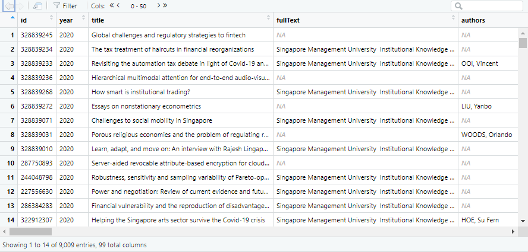

Trends in SMU research papers (CORE dataset)
================

<style type="text/css">
pre {
  max-height: 400px;
  overflow-y: auto;
}

pre[class] {
  max-height: 100px;
}

</style>

## 1. Introduction

This analysis is based on a scenario in which a user is interested in
seeing what is possible with the text mining of SMU journal articles
that are deposited in open repositories. We will analyse data for SMU
INK (<https://ink.library.smu.edu.sg/>) records extracted from CORE
(<https://core.ac.uk/>), an aggregator of open access articles.

### 1.1 Notable findings

-   There are **12,041 full-text records** from SMU INK found in CORE.
-   Topic modelling suggests topics that mostly echo SMU’s official
    research areas.
-   Records with and without full texts differ in their distribution of
    publication types.

### 1.2 Packages

The packages shown below are used for this project. They can be grouped
as follows:

1.  Packages for interacting with the CORE API and web scraping
2.  Packages for manipulation, analysis and visualisation
3.  `renv` package for supporting reproducible code

``` r
library(renv)
library(rcoreoa)
library(magrittr)
library(tibble)
library(dplyr)
library(ggplot2)
library(httr)
library(tidyr)
library(qdap)
library(summarytools)
library(tidytext)
library(stringr)
library(topicmodels)
library(scales)
library(data.table)
```

``` r
#initialise renv
renv::init()

#take snapshot of packages periodically and at the end of the project
renv::snapshot()
```

## 2. Data extraction

### 2.1 Repository statistics

Repository statistics are extracted via the CORE API using the URL
below. The API key is redacted below and throughout the code.

<https://core.ac.uk/api-v2/articles/search/repositories.id:517?apiKey=REDACTED&stats=TRUE>

**Output:**

``` r
output <-
  {"status":"OK","data":{"name":"Institutional Knowledge at Singapore Management University","uri":"https:\/\/ink.library.smu.edu.sg\/do\/oai\/","urlOaipmh":"https:\/\/ink.library.smu.edu.sg\/do\/oai\/","urlHomepage":"https:\/\/ink.library.smu.edu.sg","id":517,"OpenDoarId":2269,"repositoryStats":{"dateLastProcessed":"2021-01-22","countMetadata":25085,"countFulltext":12041},"lastSeen":{"harvest_times":{"2021-02-02 13:57:53.000000":"unsuccessful","2021-01-22 03:20:28.000000":"successful","2021-01-21 05:21:22.000000":"unsuccessful","2021-01-16 05:21:15.000000":"unsuccessful","2021-01-04 11:44:46.000000":"unsuccessful"},"isActive":true},"dataProviderSourceStats":{"metadataCount":24986,"metadataNonDeletedCount":24986,"fulltextCount":11829},"type":"repository"}}
```

According to `repositoryStats`, as of 22 Jan 2021:

-   there are **25,085 records in total** (`countMetadata`)

-   of these records, **12,041 are full-text** (`countFulltext`).

Note: Counts provided by SMU INK (`dataProviderSourceStats`) are lower.

### 2.2 Article records

Data is extracted from CORE using a series of GET requests using these
URL elements:

``` r
#initialise URL components
url_base <- "https://core.ac.uk/api-v2/articles/search/repositories.id:517?"

url_key <- "REDACTED"

url_page <- "&page=" #the page number will be added later when looping

url_pagesize <- "&pageSize=100"

url_fulltext <- "&fulltext=TRUE"
```

We will extract 100 pages, or up to 10,000 records.

``` r
#1st batch: pages 1-100

#initialise list to collect records
batch1 <- vector(mode = "list", length = 0)

#extract records from pages 1-100
for (n in c(1:100)){
  url_scrape <- paste(url_base, 
                      url_key, #to replace "REDACTED" with actual key 
                      url_page, 
                      n, #this is the page number
                      url_pagesize, 
                      url_fulltext, sep = "")
  try({
    resp <- httr::GET(url_scrape) #get up to 100 records
    cont_raw <- httr::content(resp) #change from JSON to list of lists
    #extract records from element "data" 
    
    for (record in cont_raw$data){
      batch1 <- batch1 %>% append(list(record))
    }
    print(
      paste("Extracted page", n, sep=" ") #prints if page extracted successfully
    )
  })
    
  
  Sys.sleep(2) #To limit the request rate per CORE rules
  
}
```

The printed output shows the pages that could not be scraped due to lack
of response from the server.


We use similar code to extract the missing pages. Then all records are
combined in a list.

``` r
#extracting missing pages
batch2 <- vector(mode = "list", length = 0)

for (n in c(2, 5, 20, 43,
            51, 52, 53, 54,
            64, 70, 74, 76,
            77, 78, 94, 98, 99)){
  url_scrape <- paste(url_base, 
                      url_key, #to replace "REDACTED" with actual key 
                      url_page, 
                      n, #this is the page number
                      url_pagesize, 
                      url_fulltext, sep = "")
  try({
    resp <- httr::GET(url_scrape) #get up to 100 records
    cont_raw <- httr::content(resp) #change from JSON to list of lists
    #extract records from element "data" 
    
    for (record in cont_raw$data){
      batch2 <- batch2 %>% append(list(record))
    }
    print(
      paste("Extracted page", n, sep=" ")
    )
  })
  
  
  Sys.sleep(2) #To limit the request rate per CORE rules
  
}

#all pages were extracted except page 2, so we'll try to extract it again

batch3 <- vector(mode = "list", length = 0)

for (n in c(2)){
  url_scrape <- paste(url_base, 
                      url_key, #to replace "REDACTED" with actual key 
                      url_page, 
                      n, #this is the page number
                      url_pagesize, 
                      url_fulltext, sep = "")
  try({
    resp <- httr::GET(url_scrape) #get up to 100 records
    cont_raw <- httr::content(resp) #change from JSON to list of lists
    #extract records from element "data" 
    
    for (record in cont_raw$data){
      batch3 <- batch3 %>% append(list(record))
    }
    print(
      paste("Extracted page", n, sep=" ")
    )
  })
  
}
#page 2 extracted successfully


#combine all batches into one list
batches_all <- append(batch1, c(batch2, batch3))


batches_all %>% str(max.level = 3, list.len = 4) # list of 10,000
```

## 3. Data preparation

### 3.1 Inspecting the data

Sampling the records, we notice a couple of structural attributes that
will need to be addressed before analysis:

-   Each record is a list of lists.

-   Records do not have the same set of fields/columns (e.g. not all
    records have `fullText`).

### 3.2 Restructuring the data

In this section, our goal is to get the data into a **tidy data frame**
to facilitate analysis. “Tidy” means that each observation has a row,
each variable has a column and each value has its own cell. [More
information](https://r4ds.had.co.nz/tidy-data.html).

We will reshape each record as a tidy data frame by applying the
function `TidyDF`:

``` r
TidyDF <- function(x){
  # Some code adapted from
  # https://www.r-bloggers.com/2018/10/converting-nested-json-to-a-tidy-data-frame-with-r/
  
  x <- unlist(x) #flatten into vector
  x <- enframe(x) #turn into df
  x <- t(x) #transpose df
  x <- as.data.frame(x)
  rownames(x) <- NULL #reset row names to default numbering
  colnames(x) <- x[1,] #set column names as correct variable names
  x <- x[-1,] #delete original row of variable names
  
  return(x)
}
```

We loop through all the records with this function and combine the
records into a list.Then we merge all the records into a single
dataset.`full_join` is used for the merge because the records do not
have the same set of fields/columns.

The resulting data frame is **record\_df**.

``` r
##Initialise empty df with key columns
record_df <- data.frame(id=character(),
                        year=character(),
                        #character for now to match data type of raw data.
                        #will be changed to integer type in filled df later
                        title=character(), 
                        fullText=character(),
                        authors=character(),
                        subjects=character(),
                        publisher=character(),
                        topics=character(),
                        description=character(),
                        stringsAsFactors=FALSE)


#tidy all records and combine into single df
for (item in batches_all){
  item_tidy <- item %>% TidyDF()
  record_df <- full_join(record_df,item_tidy)
}
----------------------

#inspect df
record_df %>%  str(max.level = 3, list.len = 4)
record_df %>% View()

##check for duplicate IDs
length(unique(record_df$id)) == nrow(record_df) #returns TRUE if all IDs are unique

#write df to csv
write.csv(record_df, "data/record_df.csv")
```

``` r
#read in record_df data frame
record_df <- data.table::fread("data/record_df.csv", stringsAsFactors = FALSE)
```

``` r
#see summary of data

record_df %>% str(max.level = 3, list.len = 4)
```

    ## Classes 'data.table' and 'data.frame':   9009 obs. of  100 variables:
    ##  $ V1                                : chr  "1" "2" "3" "4" ...
    ##  $ id                                : chr  "328839245" "328839234" "328839233" "328839236" ...
    ##  $ year                              : chr  "2020" "2020" "2020" "2020" ...
    ##  $ title                             : chr  "Global challenges and regulatory strategies to fintech" "The tax treatment of haircuts in financial reorganizations" "Revisiting the automation tax debate in light of Covid-19 and resulting structural unemployment" "Hierarchical multimodal attention for end-to-end audio-visual scene-aware dialogue response generation" ...
    ##   [list output truncated]
    ##  - attr(*, ".internal.selfref")=<externalptr>

``` r
print(dfSummary(record_df, valid.col = FALSE, graph.magnif = 0.75), 
      max.tbl.height = 300, method = "render")
```

<div class="container st-container">
<h3>Data Frame Summary</h3>
<h4>record_df</h4>
<strong>Dimensions</strong>: 9009 x 100
  <br/><strong>Duplicates</strong>: 0
<br/>
<div style="max-height:300px;overflow-y:scroll;margin:10px 2px">
  <table class="table table-striped table-bordered st-table st-table-striped st-table-bordered st-multiline ">
    <thead>
      <tr>
        <th align="center" class="st-protect-top-border"><strong>No</strong></th>
        <th align="center" class="st-protect-top-border"><strong>Variable</strong></th>
        <th align="center" class="st-protect-top-border"><strong>Stats / Values</strong></th>
        <th align="center" class="st-protect-top-border"><strong>Freqs (% of Valid)</strong></th>
        <th align="center" class="st-protect-top-border"><strong>Graph</strong></th>
        <th align="center" class="st-protect-top-border"><strong>Missing</strong></th>
      </tr>
    </thead>
    <tbody>
      <tr>
        <td align="center">1</td>
        <td align="left">V1
[character]</td>
        <td align="left">1. 1
2. 10
3. 100
4. 1000
5. 1001
6. 1002
7. 1003
8. 1004
9. 1005
10. 1006
[ 8999 others ]</td>
        <td align="left" style="padding:0;vertical-align:middle"><table style="border-collapse:collapse;border:none;margin:0"><tr style="background-color:transparent"><td style="padding:0 5px 0 7px;margin:0;border:0" align="right">1</td><td style="padding:0 2px 0 0;border:0;" align="left">(</td><td style="padding:0;border:0" align="right">0.0%</td><td style="padding:0 4px 0 2px;border:0" align="left">)</td></tr><tr style="background-color:transparent"><td style="padding:0 5px 0 7px;margin:0;border:0" align="right">1</td><td style="padding:0 2px 0 0;border:0;" align="left">(</td><td style="padding:0;border:0" align="right">0.0%</td><td style="padding:0 4px 0 2px;border:0" align="left">)</td></tr><tr style="background-color:transparent"><td style="padding:0 5px 0 7px;margin:0;border:0" align="right">1</td><td style="padding:0 2px 0 0;border:0;" align="left">(</td><td style="padding:0;border:0" align="right">0.0%</td><td style="padding:0 4px 0 2px;border:0" align="left">)</td></tr><tr style="background-color:transparent"><td style="padding:0 5px 0 7px;margin:0;border:0" align="right">1</td><td style="padding:0 2px 0 0;border:0;" align="left">(</td><td style="padding:0;border:0" align="right">0.0%</td><td style="padding:0 4px 0 2px;border:0" align="left">)</td></tr><tr style="background-color:transparent"><td style="padding:0 5px 0 7px;margin:0;border:0" align="right">1</td><td style="padding:0 2px 0 0;border:0;" align="left">(</td><td style="padding:0;border:0" align="right">0.0%</td><td style="padding:0 4px 0 2px;border:0" align="left">)</td></tr><tr style="background-color:transparent"><td style="padding:0 5px 0 7px;margin:0;border:0" align="right">1</td><td style="padding:0 2px 0 0;border:0;" align="left">(</td><td style="padding:0;border:0" align="right">0.0%</td><td style="padding:0 4px 0 2px;border:0" align="left">)</td></tr><tr style="background-color:transparent"><td style="padding:0 5px 0 7px;margin:0;border:0" align="right">1</td><td style="padding:0 2px 0 0;border:0;" align="left">(</td><td style="padding:0;border:0" align="right">0.0%</td><td style="padding:0 4px 0 2px;border:0" align="left">)</td></tr><tr style="background-color:transparent"><td style="padding:0 5px 0 7px;margin:0;border:0" align="right">1</td><td style="padding:0 2px 0 0;border:0;" align="left">(</td><td style="padding:0;border:0" align="right">0.0%</td><td style="padding:0 4px 0 2px;border:0" align="left">)</td></tr><tr style="background-color:transparent"><td style="padding:0 5px 0 7px;margin:0;border:0" align="right">1</td><td style="padding:0 2px 0 0;border:0;" align="left">(</td><td style="padding:0;border:0" align="right">0.0%</td><td style="padding:0 4px 0 2px;border:0" align="left">)</td></tr><tr style="background-color:transparent"><td style="padding:0 5px 0 7px;margin:0;border:0" align="right">1</td><td style="padding:0 2px 0 0;border:0;" align="left">(</td><td style="padding:0;border:0" align="right">0.0%</td><td style="padding:0 4px 0 2px;border:0" align="left">)</td></tr><tr style="background-color:transparent"><td style="padding:0 5px 0 7px;margin:0;border:0" align="right">8999</td><td style="padding:0 2px 0 0;border:0;" align="left">(</td><td style="padding:0;border:0" align="right">99.9%</td><td style="padding:0 4px 0 2px;border:0" align="left">)</td></tr></table></td>
        <td align="left" style="vertical-align:middle;padding:0;background-color:transparent"></td>
        <td align="center">0
(0.0%)</td>
      </tr>
      <tr>
        <td align="center">2</td>
        <td align="left">id
[character]</td>
        <td align="left">1. 111742384
2. 111742847
3. 111742885
4. 111742892
5. 111742893
6. 111742897
7. 111742906
8. 111743160
9. 111743162
10. 111743163
[ 8999 others ]</td>
        <td align="left" style="padding:0;vertical-align:middle"><table style="border-collapse:collapse;border:none;margin:0"><tr style="background-color:transparent"><td style="padding:0 5px 0 7px;margin:0;border:0" align="right">1</td><td style="padding:0 2px 0 0;border:0;" align="left">(</td><td style="padding:0;border:0" align="right">0.0%</td><td style="padding:0 4px 0 2px;border:0" align="left">)</td></tr><tr style="background-color:transparent"><td style="padding:0 5px 0 7px;margin:0;border:0" align="right">1</td><td style="padding:0 2px 0 0;border:0;" align="left">(</td><td style="padding:0;border:0" align="right">0.0%</td><td style="padding:0 4px 0 2px;border:0" align="left">)</td></tr><tr style="background-color:transparent"><td style="padding:0 5px 0 7px;margin:0;border:0" align="right">1</td><td style="padding:0 2px 0 0;border:0;" align="left">(</td><td style="padding:0;border:0" align="right">0.0%</td><td style="padding:0 4px 0 2px;border:0" align="left">)</td></tr><tr style="background-color:transparent"><td style="padding:0 5px 0 7px;margin:0;border:0" align="right">1</td><td style="padding:0 2px 0 0;border:0;" align="left">(</td><td style="padding:0;border:0" align="right">0.0%</td><td style="padding:0 4px 0 2px;border:0" align="left">)</td></tr><tr style="background-color:transparent"><td style="padding:0 5px 0 7px;margin:0;border:0" align="right">1</td><td style="padding:0 2px 0 0;border:0;" align="left">(</td><td style="padding:0;border:0" align="right">0.0%</td><td style="padding:0 4px 0 2px;border:0" align="left">)</td></tr><tr style="background-color:transparent"><td style="padding:0 5px 0 7px;margin:0;border:0" align="right">1</td><td style="padding:0 2px 0 0;border:0;" align="left">(</td><td style="padding:0;border:0" align="right">0.0%</td><td style="padding:0 4px 0 2px;border:0" align="left">)</td></tr><tr style="background-color:transparent"><td style="padding:0 5px 0 7px;margin:0;border:0" align="right">1</td><td style="padding:0 2px 0 0;border:0;" align="left">(</td><td style="padding:0;border:0" align="right">0.0%</td><td style="padding:0 4px 0 2px;border:0" align="left">)</td></tr><tr style="background-color:transparent"><td style="padding:0 5px 0 7px;margin:0;border:0" align="right">1</td><td style="padding:0 2px 0 0;border:0;" align="left">(</td><td style="padding:0;border:0" align="right">0.0%</td><td style="padding:0 4px 0 2px;border:0" align="left">)</td></tr><tr style="background-color:transparent"><td style="padding:0 5px 0 7px;margin:0;border:0" align="right">1</td><td style="padding:0 2px 0 0;border:0;" align="left">(</td><td style="padding:0;border:0" align="right">0.0%</td><td style="padding:0 4px 0 2px;border:0" align="left">)</td></tr><tr style="background-color:transparent"><td style="padding:0 5px 0 7px;margin:0;border:0" align="right">1</td><td style="padding:0 2px 0 0;border:0;" align="left">(</td><td style="padding:0;border:0" align="right">0.0%</td><td style="padding:0 4px 0 2px;border:0" align="left">)</td></tr><tr style="background-color:transparent"><td style="padding:0 5px 0 7px;margin:0;border:0" align="right">8999</td><td style="padding:0 2px 0 0;border:0;" align="left">(</td><td style="padding:0;border:0" align="right">99.9%</td><td style="padding:0 4px 0 2px;border:0" align="left">)</td></tr></table></td>
        <td align="left" style="vertical-align:middle;padding:0;background-color:transparent"></td>
        <td align="center">0
(0.0%)</td>
      </tr>
      <tr>
        <td align="center">3</td>
        <td align="left">year
[character]</td>
        <td align="left">1. 2012
2. 2013
3. 2014
4. 2015
5. 2016
6. 2017
7. 2018
8. 2019
9. 2020
10. 2021</td>
        <td align="left" style="padding:0;vertical-align:middle"><table style="border-collapse:collapse;border:none;margin:0"><tr style="background-color:transparent"><td style="padding:0 5px 0 7px;margin:0;border:0" align="right">13</td><td style="padding:0 2px 0 0;border:0;" align="left">(</td><td style="padding:0;border:0" align="right">0.1%</td><td style="padding:0 4px 0 2px;border:0" align="left">)</td></tr><tr style="background-color:transparent"><td style="padding:0 5px 0 7px;margin:0;border:0" align="right">1101</td><td style="padding:0 2px 0 0;border:0;" align="left">(</td><td style="padding:0;border:0" align="right">12.2%</td><td style="padding:0 4px 0 2px;border:0" align="left">)</td></tr><tr style="background-color:transparent"><td style="padding:0 5px 0 7px;margin:0;border:0" align="right">1451</td><td style="padding:0 2px 0 0;border:0;" align="left">(</td><td style="padding:0;border:0" align="right">16.1%</td><td style="padding:0 4px 0 2px;border:0" align="left">)</td></tr><tr style="background-color:transparent"><td style="padding:0 5px 0 7px;margin:0;border:0" align="right">1250</td><td style="padding:0 2px 0 0;border:0;" align="left">(</td><td style="padding:0;border:0" align="right">13.9%</td><td style="padding:0 4px 0 2px;border:0" align="left">)</td></tr><tr style="background-color:transparent"><td style="padding:0 5px 0 7px;margin:0;border:0" align="right">1139</td><td style="padding:0 2px 0 0;border:0;" align="left">(</td><td style="padding:0;border:0" align="right">12.6%</td><td style="padding:0 4px 0 2px;border:0" align="left">)</td></tr><tr style="background-color:transparent"><td style="padding:0 5px 0 7px;margin:0;border:0" align="right">1077</td><td style="padding:0 2px 0 0;border:0;" align="left">(</td><td style="padding:0;border:0" align="right">12.0%</td><td style="padding:0 4px 0 2px;border:0" align="left">)</td></tr><tr style="background-color:transparent"><td style="padding:0 5px 0 7px;margin:0;border:0" align="right">1167</td><td style="padding:0 2px 0 0;border:0;" align="left">(</td><td style="padding:0;border:0" align="right">13.0%</td><td style="padding:0 4px 0 2px;border:0" align="left">)</td></tr><tr style="background-color:transparent"><td style="padding:0 5px 0 7px;margin:0;border:0" align="right">1056</td><td style="padding:0 2px 0 0;border:0;" align="left">(</td><td style="padding:0;border:0" align="right">11.7%</td><td style="padding:0 4px 0 2px;border:0" align="left">)</td></tr><tr style="background-color:transparent"><td style="padding:0 5px 0 7px;margin:0;border:0" align="right">736</td><td style="padding:0 2px 0 0;border:0;" align="left">(</td><td style="padding:0;border:0" align="right">8.2%</td><td style="padding:0 4px 0 2px;border:0" align="left">)</td></tr><tr style="background-color:transparent"><td style="padding:0 5px 0 7px;margin:0;border:0" align="right">19</td><td style="padding:0 2px 0 0;border:0;" align="left">(</td><td style="padding:0;border:0" align="right">0.2%</td><td style="padding:0 4px 0 2px;border:0" align="left">)</td></tr></table></td>
        <td align="left" style="vertical-align:middle;padding:0;background-color:transparent"></td>
        <td align="center">0
(0.0%)</td>
      </tr>
      <tr>
        <td align="center">4</td>
        <td align="left">title
[character]</td>
        <td align="left">1. Introduction
2. Zombie board:board tenure
3. Cost Growth and Stock Ret
4. Contract Law
5. Forecasting Stock Returns
6. Gender and Connections am
7. Mutual Fund Trading Costs
8. Short sellers and corpora
9. Singapore
10. The Geography of Corporat
[ 8643 others ]</td>
        <td align="left" style="padding:0;vertical-align:middle"><table style="border-collapse:collapse;border:none;margin:0"><tr style="background-color:transparent"><td style="padding:0 5px 0 7px;margin:0;border:0" align="right">6</td><td style="padding:0 2px 0 0;border:0;" align="left">(</td><td style="padding:0;border:0" align="right">0.1%</td><td style="padding:0 4px 0 2px;border:0" align="left">)</td></tr><tr style="background-color:transparent"><td style="padding:0 5px 0 7px;margin:0;border:0" align="right">6</td><td style="padding:0 2px 0 0;border:0;" align="left">(</td><td style="padding:0;border:0" align="right">0.1%</td><td style="padding:0 4px 0 2px;border:0" align="left">)</td></tr><tr style="background-color:transparent"><td style="padding:0 5px 0 7px;margin:0;border:0" align="right">5</td><td style="padding:0 2px 0 0;border:0;" align="left">(</td><td style="padding:0;border:0" align="right">0.1%</td><td style="padding:0 4px 0 2px;border:0" align="left">)</td></tr><tr style="background-color:transparent"><td style="padding:0 5px 0 7px;margin:0;border:0" align="right">4</td><td style="padding:0 2px 0 0;border:0;" align="left">(</td><td style="padding:0;border:0" align="right">0.0%</td><td style="padding:0 4px 0 2px;border:0" align="left">)</td></tr><tr style="background-color:transparent"><td style="padding:0 5px 0 7px;margin:0;border:0" align="right">4</td><td style="padding:0 2px 0 0;border:0;" align="left">(</td><td style="padding:0;border:0" align="right">0.0%</td><td style="padding:0 4px 0 2px;border:0" align="left">)</td></tr><tr style="background-color:transparent"><td style="padding:0 5px 0 7px;margin:0;border:0" align="right">4</td><td style="padding:0 2px 0 0;border:0;" align="left">(</td><td style="padding:0;border:0" align="right">0.0%</td><td style="padding:0 4px 0 2px;border:0" align="left">)</td></tr><tr style="background-color:transparent"><td style="padding:0 5px 0 7px;margin:0;border:0" align="right">4</td><td style="padding:0 2px 0 0;border:0;" align="left">(</td><td style="padding:0;border:0" align="right">0.0%</td><td style="padding:0 4px 0 2px;border:0" align="left">)</td></tr><tr style="background-color:transparent"><td style="padding:0 5px 0 7px;margin:0;border:0" align="right">4</td><td style="padding:0 2px 0 0;border:0;" align="left">(</td><td style="padding:0;border:0" align="right">0.0%</td><td style="padding:0 4px 0 2px;border:0" align="left">)</td></tr><tr style="background-color:transparent"><td style="padding:0 5px 0 7px;margin:0;border:0" align="right">4</td><td style="padding:0 2px 0 0;border:0;" align="left">(</td><td style="padding:0;border:0" align="right">0.0%</td><td style="padding:0 4px 0 2px;border:0" align="left">)</td></tr><tr style="background-color:transparent"><td style="padding:0 5px 0 7px;margin:0;border:0" align="right">4</td><td style="padding:0 2px 0 0;border:0;" align="left">(</td><td style="padding:0;border:0" align="right">0.0%</td><td style="padding:0 4px 0 2px;border:0" align="left">)</td></tr><tr style="background-color:transparent"><td style="padding:0 5px 0 7px;margin:0;border:0" align="right">8964</td><td style="padding:0 2px 0 0;border:0;" align="left">(</td><td style="padding:0;border:0" align="right">99.5%</td><td style="padding:0 4px 0 2px;border:0" align="left">)</td></tr></table></td>
        <td align="left" style="vertical-align:middle;padding:0;background-color:transparent"></td>
        <td align="center">0
(0.0%)</td>
      </tr>
      <tr>
        <td align="center">5</td>
        <td align="left">fullText
[character]
Emails</td>
        <td align="left">Valid
Invalid
Duplicates</td>
        <td align="left" style="padding:0;vertical-align:middle"><table style="border-collapse:collapse;border:none;margin:0"><tr style="background-color:transparent"><td style="padding:0 5px 0 7px;margin:0;border:0" align="right">5945</td><td style="padding:0 2px 0 0;border:0;" align="left">(</td><td style="padding:0;border:0" align="right">99.9%</td><td style="padding:0 4px 0 2px;border:0" align="left">)</td></tr><tr style="background-color:transparent"><td style="padding:0 5px 0 7px;margin:0;border:0" align="right">4</td><td style="padding:0 2px 0 0;border:0;" align="left">(</td><td style="padding:0;border:0" align="right">0.1%</td><td style="padding:0 4px 0 2px;border:0" align="left">)</td></tr><tr style="background-color:transparent"><td style="padding:0 5px 0 7px;margin:0;border:0" align="right">1</td><td style="padding:0 2px 0 0;border:0;" align="left">(</td><td style="padding:0;border:0" align="right">0.0%</td><td style="padding:0 4px 0 2px;border:0" align="left">)</td></tr></table></td>
        <td align="left" style="vertical-align:middle;padding:0;background-color:transparent"></td>
        <td align="center">3060
(34.0%)</td>
      </tr>
      <tr>
        <td align="center">6</td>
        <td align="left">authors
[character]</td>
        <td align="left">1. Singapore Management Univ
2. CHAN, David
3. CHAN, Gary Kok Yew
4. CHEN, Siyuan
5. GOH, Yihan
6. YIP, Man
7. GOH, Clarence
8. Institute of Service Exce
9. ALEXANDER, Nadja
10. TAN, Sor-hoon
[ 945 others ]</td>
        <td align="left" style="padding:0;vertical-align:middle"><table style="border-collapse:collapse;border:none;margin:0"><tr style="background-color:transparent"><td style="padding:0 5px 0 7px;margin:0;border:0" align="right">569</td><td style="padding:0 2px 0 0;border:0;" align="left">(</td><td style="padding:0;border:0" align="right">18.4%</td><td style="padding:0 4px 0 2px;border:0" align="left">)</td></tr><tr style="background-color:transparent"><td style="padding:0 5px 0 7px;margin:0;border:0" align="right">74</td><td style="padding:0 2px 0 0;border:0;" align="left">(</td><td style="padding:0;border:0" align="right">2.4%</td><td style="padding:0 4px 0 2px;border:0" align="left">)</td></tr><tr style="background-color:transparent"><td style="padding:0 5px 0 7px;margin:0;border:0" align="right">47</td><td style="padding:0 2px 0 0;border:0;" align="left">(</td><td style="padding:0;border:0" align="right">1.5%</td><td style="padding:0 4px 0 2px;border:0" align="left">)</td></tr><tr style="background-color:transparent"><td style="padding:0 5px 0 7px;margin:0;border:0" align="right">40</td><td style="padding:0 2px 0 0;border:0;" align="left">(</td><td style="padding:0;border:0" align="right">1.3%</td><td style="padding:0 4px 0 2px;border:0" align="left">)</td></tr><tr style="background-color:transparent"><td style="padding:0 5px 0 7px;margin:0;border:0" align="right">40</td><td style="padding:0 2px 0 0;border:0;" align="left">(</td><td style="padding:0;border:0" align="right">1.3%</td><td style="padding:0 4px 0 2px;border:0" align="left">)</td></tr><tr style="background-color:transparent"><td style="padding:0 5px 0 7px;margin:0;border:0" align="right">31</td><td style="padding:0 2px 0 0;border:0;" align="left">(</td><td style="padding:0;border:0" align="right">1.0%</td><td style="padding:0 4px 0 2px;border:0" align="left">)</td></tr><tr style="background-color:transparent"><td style="padding:0 5px 0 7px;margin:0;border:0" align="right">29</td><td style="padding:0 2px 0 0;border:0;" align="left">(</td><td style="padding:0;border:0" align="right">0.9%</td><td style="padding:0 4px 0 2px;border:0" align="left">)</td></tr><tr style="background-color:transparent"><td style="padding:0 5px 0 7px;margin:0;border:0" align="right">29</td><td style="padding:0 2px 0 0;border:0;" align="left">(</td><td style="padding:0;border:0" align="right">0.9%</td><td style="padding:0 4px 0 2px;border:0" align="left">)</td></tr><tr style="background-color:transparent"><td style="padding:0 5px 0 7px;margin:0;border:0" align="right">28</td><td style="padding:0 2px 0 0;border:0;" align="left">(</td><td style="padding:0;border:0" align="right">0.9%</td><td style="padding:0 4px 0 2px;border:0" align="left">)</td></tr><tr style="background-color:transparent"><td style="padding:0 5px 0 7px;margin:0;border:0" align="right">28</td><td style="padding:0 2px 0 0;border:0;" align="left">(</td><td style="padding:0;border:0" align="right">0.9%</td><td style="padding:0 4px 0 2px;border:0" align="left">)</td></tr><tr style="background-color:transparent"><td style="padding:0 5px 0 7px;margin:0;border:0" align="right">2184</td><td style="padding:0 2px 0 0;border:0;" align="left">(</td><td style="padding:0;border:0" align="right">70.5%</td><td style="padding:0 4px 0 2px;border:0" align="left">)</td></tr></table></td>
        <td align="left" style="vertical-align:middle;padding:0;background-color:transparent"></td>
        <td align="center">5910
(65.6%)</td>
      </tr>
      <tr>
        <td align="center">7</td>
        <td align="left">subjects
[character]</td>
        <td align="left">1. Journal Article
2. Conference Proceeding Art
3. Book Chapter
4. Magazine Article
5. Working Paper
6. Conference Paper
7. Case
8. PhD Dissertation
9. News Article
10. Presentation
[ 23 others ]</td>
        <td align="left" style="padding:0;vertical-align:middle"><table style="border-collapse:collapse;border:none;margin:0"><tr style="background-color:transparent"><td style="padding:0 5px 0 7px;margin:0;border:0" align="right">3266</td><td style="padding:0 2px 0 0;border:0;" align="left">(</td><td style="padding:0;border:0" align="right">36.3%</td><td style="padding:0 4px 0 2px;border:0" align="left">)</td></tr><tr style="background-color:transparent"><td style="padding:0 5px 0 7px;margin:0;border:0" align="right">1539</td><td style="padding:0 2px 0 0;border:0;" align="left">(</td><td style="padding:0;border:0" align="right">17.1%</td><td style="padding:0 4px 0 2px;border:0" align="left">)</td></tr><tr style="background-color:transparent"><td style="padding:0 5px 0 7px;margin:0;border:0" align="right">771</td><td style="padding:0 2px 0 0;border:0;" align="left">(</td><td style="padding:0;border:0" align="right">8.6%</td><td style="padding:0 4px 0 2px;border:0" align="left">)</td></tr><tr style="background-color:transparent"><td style="padding:0 5px 0 7px;margin:0;border:0" align="right">577</td><td style="padding:0 2px 0 0;border:0;" align="left">(</td><td style="padding:0;border:0" align="right">6.4%</td><td style="padding:0 4px 0 2px;border:0" align="left">)</td></tr><tr style="background-color:transparent"><td style="padding:0 5px 0 7px;margin:0;border:0" align="right">549</td><td style="padding:0 2px 0 0;border:0;" align="left">(</td><td style="padding:0;border:0" align="right">6.1%</td><td style="padding:0 4px 0 2px;border:0" align="left">)</td></tr><tr style="background-color:transparent"><td style="padding:0 5px 0 7px;margin:0;border:0" align="right">504</td><td style="padding:0 2px 0 0;border:0;" align="left">(</td><td style="padding:0;border:0" align="right">5.6%</td><td style="padding:0 4px 0 2px;border:0" align="left">)</td></tr><tr style="background-color:transparent"><td style="padding:0 5px 0 7px;margin:0;border:0" align="right">248</td><td style="padding:0 2px 0 0;border:0;" align="left">(</td><td style="padding:0;border:0" align="right">2.8%</td><td style="padding:0 4px 0 2px;border:0" align="left">)</td></tr><tr style="background-color:transparent"><td style="padding:0 5px 0 7px;margin:0;border:0" align="right">206</td><td style="padding:0 2px 0 0;border:0;" align="left">(</td><td style="padding:0;border:0" align="right">2.3%</td><td style="padding:0 4px 0 2px;border:0" align="left">)</td></tr><tr style="background-color:transparent"><td style="padding:0 5px 0 7px;margin:0;border:0" align="right">194</td><td style="padding:0 2px 0 0;border:0;" align="left">(</td><td style="padding:0;border:0" align="right">2.2%</td><td style="padding:0 4px 0 2px;border:0" align="left">)</td></tr><tr style="background-color:transparent"><td style="padding:0 5px 0 7px;margin:0;border:0" align="right">171</td><td style="padding:0 2px 0 0;border:0;" align="left">(</td><td style="padding:0;border:0" align="right">1.9%</td><td style="padding:0 4px 0 2px;border:0" align="left">)</td></tr><tr style="background-color:transparent"><td style="padding:0 5px 0 7px;margin:0;border:0" align="right">984</td><td style="padding:0 2px 0 0;border:0;" align="left">(</td><td style="padding:0;border:0" align="right">10.9%</td><td style="padding:0 4px 0 2px;border:0" align="left">)</td></tr></table></td>
        <td align="left" style="vertical-align:middle;padding:0;background-color:transparent"></td>
        <td align="center">0
(0.0%)</td>
      </tr>
      <tr>
        <td align="center">8</td>
        <td align="left">publisher
[character]</td>
        <td align="left">1. 'Institute of Electrical 
2. 'Elsevier BV'
3. Singapore Management Univ
4. 'Springer Science and Bus
5. 'Association for Computin
6. 'Informa UK Limited'
7. 'Wiley'
8. 'SAGE Publications'
9. 'Oxford University Press 
10. 'Cambridge University Pre
[ 872 others ]</td>
        <td align="left" style="padding:0;vertical-align:middle"><table style="border-collapse:collapse;border:none;margin:0"><tr style="background-color:transparent"><td style="padding:0 5px 0 7px;margin:0;border:0" align="right">727</td><td style="padding:0 2px 0 0;border:0;" align="left">(</td><td style="padding:0;border:0" align="right">10.0%</td><td style="padding:0 4px 0 2px;border:0" align="left">)</td></tr><tr style="background-color:transparent"><td style="padding:0 5px 0 7px;margin:0;border:0" align="right">715</td><td style="padding:0 2px 0 0;border:0;" align="left">(</td><td style="padding:0;border:0" align="right">9.9%</td><td style="padding:0 4px 0 2px;border:0" align="left">)</td></tr><tr style="background-color:transparent"><td style="padding:0 5px 0 7px;margin:0;border:0" align="right">694</td><td style="padding:0 2px 0 0;border:0;" align="left">(</td><td style="padding:0;border:0" align="right">9.6%</td><td style="padding:0 4px 0 2px;border:0" align="left">)</td></tr><tr style="background-color:transparent"><td style="padding:0 5px 0 7px;margin:0;border:0" align="right">566</td><td style="padding:0 2px 0 0;border:0;" align="left">(</td><td style="padding:0;border:0" align="right">7.8%</td><td style="padding:0 4px 0 2px;border:0" align="left">)</td></tr><tr style="background-color:transparent"><td style="padding:0 5px 0 7px;margin:0;border:0" align="right">490</td><td style="padding:0 2px 0 0;border:0;" align="left">(</td><td style="padding:0;border:0" align="right">6.8%</td><td style="padding:0 4px 0 2px;border:0" align="left">)</td></tr><tr style="background-color:transparent"><td style="padding:0 5px 0 7px;margin:0;border:0" align="right">323</td><td style="padding:0 2px 0 0;border:0;" align="left">(</td><td style="padding:0;border:0" align="right">4.5%</td><td style="padding:0 4px 0 2px;border:0" align="left">)</td></tr><tr style="background-color:transparent"><td style="padding:0 5px 0 7px;margin:0;border:0" align="right">322</td><td style="padding:0 2px 0 0;border:0;" align="left">(</td><td style="padding:0;border:0" align="right">4.4%</td><td style="padding:0 4px 0 2px;border:0" align="left">)</td></tr><tr style="background-color:transparent"><td style="padding:0 5px 0 7px;margin:0;border:0" align="right">180</td><td style="padding:0 2px 0 0;border:0;" align="left">(</td><td style="padding:0;border:0" align="right">2.5%</td><td style="padding:0 4px 0 2px;border:0" align="left">)</td></tr><tr style="background-color:transparent"><td style="padding:0 5px 0 7px;margin:0;border:0" align="right">125</td><td style="padding:0 2px 0 0;border:0;" align="left">(</td><td style="padding:0;border:0" align="right">1.7%</td><td style="padding:0 4px 0 2px;border:0" align="left">)</td></tr><tr style="background-color:transparent"><td style="padding:0 5px 0 7px;margin:0;border:0" align="right">121</td><td style="padding:0 2px 0 0;border:0;" align="left">(</td><td style="padding:0;border:0" align="right">1.7%</td><td style="padding:0 4px 0 2px;border:0" align="left">)</td></tr><tr style="background-color:transparent"><td style="padding:0 5px 0 7px;margin:0;border:0" align="right">2984</td><td style="padding:0 2px 0 0;border:0;" align="left">(</td><td style="padding:0;border:0" align="right">41.2%</td><td style="padding:0 4px 0 2px;border:0" align="left">)</td></tr></table></td>
        <td align="left" style="vertical-align:middle;padding:0;background-color:transparent"></td>
        <td align="center">1762
(19.6%)</td>
      </tr>
      <tr>
        <td align="center">9</td>
        <td align="left">topics
[character]</td>
        <td align="left">1. Business
2. Accounting
3. Higher Education
4. Computer Sciences
5. Technology and Innovation
6. Finance and Financial Man
7. Business Administration, 
8. Library and Information S
9. International Economics
10. Law
[ 43 others ]</td>
        <td align="left" style="padding:0;vertical-align:middle"><table style="border-collapse:collapse;border:none;margin:0"><tr style="background-color:transparent"><td style="padding:0 5px 0 7px;margin:0;border:0" align="right">83</td><td style="padding:0 2px 0 0;border:0;" align="left">(</td><td style="padding:0;border:0" align="right">33.2%</td><td style="padding:0 4px 0 2px;border:0" align="left">)</td></tr><tr style="background-color:transparent"><td style="padding:0 5px 0 7px;margin:0;border:0" align="right">27</td><td style="padding:0 2px 0 0;border:0;" align="left">(</td><td style="padding:0;border:0" align="right">10.8%</td><td style="padding:0 4px 0 2px;border:0" align="left">)</td></tr><tr style="background-color:transparent"><td style="padding:0 5px 0 7px;margin:0;border:0" align="right">22</td><td style="padding:0 2px 0 0;border:0;" align="left">(</td><td style="padding:0;border:0" align="right">8.8%</td><td style="padding:0 4px 0 2px;border:0" align="left">)</td></tr><tr style="background-color:transparent"><td style="padding:0 5px 0 7px;margin:0;border:0" align="right">12</td><td style="padding:0 2px 0 0;border:0;" align="left">(</td><td style="padding:0;border:0" align="right">4.8%</td><td style="padding:0 4px 0 2px;border:0" align="left">)</td></tr><tr style="background-color:transparent"><td style="padding:0 5px 0 7px;margin:0;border:0" align="right">11</td><td style="padding:0 2px 0 0;border:0;" align="left">(</td><td style="padding:0;border:0" align="right">4.4%</td><td style="padding:0 4px 0 2px;border:0" align="left">)</td></tr><tr style="background-color:transparent"><td style="padding:0 5px 0 7px;margin:0;border:0" align="right">8</td><td style="padding:0 2px 0 0;border:0;" align="left">(</td><td style="padding:0;border:0" align="right">3.2%</td><td style="padding:0 4px 0 2px;border:0" align="left">)</td></tr><tr style="background-color:transparent"><td style="padding:0 5px 0 7px;margin:0;border:0" align="right">7</td><td style="padding:0 2px 0 0;border:0;" align="left">(</td><td style="padding:0;border:0" align="right">2.8%</td><td style="padding:0 4px 0 2px;border:0" align="left">)</td></tr><tr style="background-color:transparent"><td style="padding:0 5px 0 7px;margin:0;border:0" align="right">6</td><td style="padding:0 2px 0 0;border:0;" align="left">(</td><td style="padding:0;border:0" align="right">2.4%</td><td style="padding:0 4px 0 2px;border:0" align="left">)</td></tr><tr style="background-color:transparent"><td style="padding:0 5px 0 7px;margin:0;border:0" align="right">5</td><td style="padding:0 2px 0 0;border:0;" align="left">(</td><td style="padding:0;border:0" align="right">2.0%</td><td style="padding:0 4px 0 2px;border:0" align="left">)</td></tr><tr style="background-color:transparent"><td style="padding:0 5px 0 7px;margin:0;border:0" align="right">5</td><td style="padding:0 2px 0 0;border:0;" align="left">(</td><td style="padding:0;border:0" align="right">2.0%</td><td style="padding:0 4px 0 2px;border:0" align="left">)</td></tr><tr style="background-color:transparent"><td style="padding:0 5px 0 7px;margin:0;border:0" align="right">64</td><td style="padding:0 2px 0 0;border:0;" align="left">(</td><td style="padding:0;border:0" align="right">25.6%</td><td style="padding:0 4px 0 2px;border:0" align="left">)</td></tr></table></td>
        <td align="left" style="vertical-align:middle;padding:0;background-color:transparent"></td>
        <td align="center">8759
(97.2%)</td>
      </tr>
      <tr>
        <td align="center">10</td>
        <td align="left">description
[character]</td>
        <td align="left">1. Ministry of Education, Si
2. National Research Foundat
3. tru
4. National Research Foundat
5. (Empty string)
6. National Research Foundat
7. Singapore National Resear
8. National Research Foundat
9. fals
10. Singapore Management Univ
[ 667 others ]</td>
        <td align="left" style="padding:0;vertical-align:middle"><table style="border-collapse:collapse;border:none;margin:0"><tr style="background-color:transparent"><td style="padding:0 5px 0 7px;margin:0;border:0" align="right">236</td><td style="padding:0 2px 0 0;border:0;" align="left">(</td><td style="padding:0;border:0" align="right">17.5%</td><td style="padding:0 4px 0 2px;border:0" align="left">)</td></tr><tr style="background-color:transparent"><td style="padding:0 5px 0 7px;margin:0;border:0" align="right">74</td><td style="padding:0 2px 0 0;border:0;" align="left">(</td><td style="padding:0;border:0" align="right">5.5%</td><td style="padding:0 4px 0 2px;border:0" align="left">)</td></tr><tr style="background-color:transparent"><td style="padding:0 5px 0 7px;margin:0;border:0" align="right">54</td><td style="padding:0 2px 0 0;border:0;" align="left">(</td><td style="padding:0;border:0" align="right">4.0%</td><td style="padding:0 4px 0 2px;border:0" align="left">)</td></tr><tr style="background-color:transparent"><td style="padding:0 5px 0 7px;margin:0;border:0" align="right">50</td><td style="padding:0 2px 0 0;border:0;" align="left">(</td><td style="padding:0;border:0" align="right">3.7%</td><td style="padding:0 4px 0 2px;border:0" align="left">)</td></tr><tr style="background-color:transparent"><td style="padding:0 5px 0 7px;margin:0;border:0" align="right">37</td><td style="padding:0 2px 0 0;border:0;" align="left">(</td><td style="padding:0;border:0" align="right">2.7%</td><td style="padding:0 4px 0 2px;border:0" align="left">)</td></tr><tr style="background-color:transparent"><td style="padding:0 5px 0 7px;margin:0;border:0" align="right">28</td><td style="padding:0 2px 0 0;border:0;" align="left">(</td><td style="padding:0;border:0" align="right">2.1%</td><td style="padding:0 4px 0 2px;border:0" align="left">)</td></tr><tr style="background-color:transparent"><td style="padding:0 5px 0 7px;margin:0;border:0" align="right">26</td><td style="padding:0 2px 0 0;border:0;" align="left">(</td><td style="padding:0;border:0" align="right">1.9%</td><td style="padding:0 4px 0 2px;border:0" align="left">)</td></tr><tr style="background-color:transparent"><td style="padding:0 5px 0 7px;margin:0;border:0" align="right">13</td><td style="padding:0 2px 0 0;border:0;" align="left">(</td><td style="padding:0;border:0" align="right">1.0%</td><td style="padding:0 4px 0 2px;border:0" align="left">)</td></tr><tr style="background-color:transparent"><td style="padding:0 5px 0 7px;margin:0;border:0" align="right">12</td><td style="padding:0 2px 0 0;border:0;" align="left">(</td><td style="padding:0;border:0" align="right">0.9%</td><td style="padding:0 4px 0 2px;border:0" align="left">)</td></tr><tr style="background-color:transparent"><td style="padding:0 5px 0 7px;margin:0;border:0" align="right">12</td><td style="padding:0 2px 0 0;border:0;" align="left">(</td><td style="padding:0;border:0" align="right">0.9%</td><td style="padding:0 4px 0 2px;border:0" align="left">)</td></tr><tr style="background-color:transparent"><td style="padding:0 5px 0 7px;margin:0;border:0" align="right">807</td><td style="padding:0 2px 0 0;border:0;" align="left">(</td><td style="padding:0;border:0" align="right">59.8%</td><td style="padding:0 4px 0 2px;border:0" align="left">)</td></tr></table></td>
        <td align="left" style="vertical-align:middle;padding:0;background-color:transparent"></td>
        <td align="center">7660
(85.0%)</td>
      </tr>
      <tr>
        <td align="center">11</td>
        <td align="left">authors1
[character]</td>
        <td align="left">1. SU, Liangjun
2. CHENG, Qiang
3. PAN, Gary
4. XIA, Xin
5. CHEN, Siyuan
6. SEOW, Poh Sun
7. GUNAWAN, Aldy
8. THOMAS, Howard
9. BERNILE, Gennaro
10. CHEN, Xia
[ 2848 others ]</td>
        <td align="left" style="padding:0;vertical-align:middle"><table style="border-collapse:collapse;border:none;margin:0"><tr style="background-color:transparent"><td style="padding:0 5px 0 7px;margin:0;border:0" align="right">39</td><td style="padding:0 2px 0 0;border:0;" align="left">(</td><td style="padding:0;border:0" align="right">0.7%</td><td style="padding:0 4px 0 2px;border:0" align="left">)</td></tr><tr style="background-color:transparent"><td style="padding:0 5px 0 7px;margin:0;border:0" align="right">31</td><td style="padding:0 2px 0 0;border:0;" align="left">(</td><td style="padding:0;border:0" align="right">0.5%</td><td style="padding:0 4px 0 2px;border:0" align="left">)</td></tr><tr style="background-color:transparent"><td style="padding:0 5px 0 7px;margin:0;border:0" align="right">30</td><td style="padding:0 2px 0 0;border:0;" align="left">(</td><td style="padding:0;border:0" align="right">0.5%</td><td style="padding:0 4px 0 2px;border:0" align="left">)</td></tr><tr style="background-color:transparent"><td style="padding:0 5px 0 7px;margin:0;border:0" align="right">27</td><td style="padding:0 2px 0 0;border:0;" align="left">(</td><td style="padding:0;border:0" align="right">0.5%</td><td style="padding:0 4px 0 2px;border:0" align="left">)</td></tr><tr style="background-color:transparent"><td style="padding:0 5px 0 7px;margin:0;border:0" align="right">26</td><td style="padding:0 2px 0 0;border:0;" align="left">(</td><td style="padding:0;border:0" align="right">0.4%</td><td style="padding:0 4px 0 2px;border:0" align="left">)</td></tr><tr style="background-color:transparent"><td style="padding:0 5px 0 7px;margin:0;border:0" align="right">25</td><td style="padding:0 2px 0 0;border:0;" align="left">(</td><td style="padding:0;border:0" align="right">0.4%</td><td style="padding:0 4px 0 2px;border:0" align="left">)</td></tr><tr style="background-color:transparent"><td style="padding:0 5px 0 7px;margin:0;border:0" align="right">24</td><td style="padding:0 2px 0 0;border:0;" align="left">(</td><td style="padding:0;border:0" align="right">0.4%</td><td style="padding:0 4px 0 2px;border:0" align="left">)</td></tr><tr style="background-color:transparent"><td style="padding:0 5px 0 7px;margin:0;border:0" align="right">21</td><td style="padding:0 2px 0 0;border:0;" align="left">(</td><td style="padding:0;border:0" align="right">0.4%</td><td style="padding:0 4px 0 2px;border:0" align="left">)</td></tr><tr style="background-color:transparent"><td style="padding:0 5px 0 7px;margin:0;border:0" align="right">20</td><td style="padding:0 2px 0 0;border:0;" align="left">(</td><td style="padding:0;border:0" align="right">0.3%</td><td style="padding:0 4px 0 2px;border:0" align="left">)</td></tr><tr style="background-color:transparent"><td style="padding:0 5px 0 7px;margin:0;border:0" align="right">20</td><td style="padding:0 2px 0 0;border:0;" align="left">(</td><td style="padding:0;border:0" align="right">0.3%</td><td style="padding:0 4px 0 2px;border:0" align="left">)</td></tr><tr style="background-color:transparent"><td style="padding:0 5px 0 7px;margin:0;border:0" align="right">5647</td><td style="padding:0 2px 0 0;border:0;" align="left">(</td><td style="padding:0;border:0" align="right">95.5%</td><td style="padding:0 4px 0 2px;border:0" align="left">)</td></tr></table></td>
        <td align="left" style="vertical-align:middle;padding:0;background-color:transparent"></td>
        <td align="center">3099
(34.4%)</td>
      </tr>
      <tr>
        <td align="center">12</td>
        <td align="left">authors2
[character]</td>
        <td align="left">1. LO, David
2. SUN, Jun
3. LAU, Hoong Chuin
4. MISRA, Archan
5. DENG, Robert H.
6. HOI, Steven C. H.
7. David LO,
8. SU, Liangjun
9. DULA, Christopher
10. LIEVENS, Filip
[ 2945 others ]</td>
        <td align="left" style="padding:0;vertical-align:middle"><table style="border-collapse:collapse;border:none;margin:0"><tr style="background-color:transparent"><td style="padding:0 5px 0 7px;margin:0;border:0" align="right">75</td><td style="padding:0 2px 0 0;border:0;" align="left">(</td><td style="padding:0;border:0" align="right">1.3%</td><td style="padding:0 4px 0 2px;border:0" align="left">)</td></tr><tr style="background-color:transparent"><td style="padding:0 5px 0 7px;margin:0;border:0" align="right">41</td><td style="padding:0 2px 0 0;border:0;" align="left">(</td><td style="padding:0;border:0" align="right">0.7%</td><td style="padding:0 4px 0 2px;border:0" align="left">)</td></tr><tr style="background-color:transparent"><td style="padding:0 5px 0 7px;margin:0;border:0" align="right">36</td><td style="padding:0 2px 0 0;border:0;" align="left">(</td><td style="padding:0;border:0" align="right">0.6%</td><td style="padding:0 4px 0 2px;border:0" align="left">)</td></tr><tr style="background-color:transparent"><td style="padding:0 5px 0 7px;margin:0;border:0" align="right">36</td><td style="padding:0 2px 0 0;border:0;" align="left">(</td><td style="padding:0;border:0" align="right">0.6%</td><td style="padding:0 4px 0 2px;border:0" align="left">)</td></tr><tr style="background-color:transparent"><td style="padding:0 5px 0 7px;margin:0;border:0" align="right">34</td><td style="padding:0 2px 0 0;border:0;" align="left">(</td><td style="padding:0;border:0" align="right">0.6%</td><td style="padding:0 4px 0 2px;border:0" align="left">)</td></tr><tr style="background-color:transparent"><td style="padding:0 5px 0 7px;margin:0;border:0" align="right">30</td><td style="padding:0 2px 0 0;border:0;" align="left">(</td><td style="padding:0;border:0" align="right">0.5%</td><td style="padding:0 4px 0 2px;border:0" align="left">)</td></tr><tr style="background-color:transparent"><td style="padding:0 5px 0 7px;margin:0;border:0" align="right">28</td><td style="padding:0 2px 0 0;border:0;" align="left">(</td><td style="padding:0;border:0" align="right">0.5%</td><td style="padding:0 4px 0 2px;border:0" align="left">)</td></tr><tr style="background-color:transparent"><td style="padding:0 5px 0 7px;margin:0;border:0" align="right">28</td><td style="padding:0 2px 0 0;border:0;" align="left">(</td><td style="padding:0;border:0" align="right">0.5%</td><td style="padding:0 4px 0 2px;border:0" align="left">)</td></tr><tr style="background-color:transparent"><td style="padding:0 5px 0 7px;margin:0;border:0" align="right">26</td><td style="padding:0 2px 0 0;border:0;" align="left">(</td><td style="padding:0;border:0" align="right">0.4%</td><td style="padding:0 4px 0 2px;border:0" align="left">)</td></tr><tr style="background-color:transparent"><td style="padding:0 5px 0 7px;margin:0;border:0" align="right">26</td><td style="padding:0 2px 0 0;border:0;" align="left">(</td><td style="padding:0;border:0" align="right">0.4%</td><td style="padding:0 4px 0 2px;border:0" align="left">)</td></tr><tr style="background-color:transparent"><td style="padding:0 5px 0 7px;margin:0;border:0" align="right">5550</td><td style="padding:0 2px 0 0;border:0;" align="left">(</td><td style="padding:0;border:0" align="right">93.9%</td><td style="padding:0 4px 0 2px;border:0" align="left">)</td></tr></table></td>
        <td align="left" style="vertical-align:middle;padding:0;background-color:transparent"></td>
        <td align="center">3099
(34.4%)</td>
      </tr>
      <tr>
        <td align="center">13</td>
        <td align="left">datePublished
[character]</td>
        <td align="left">1. 2014-01-01T08:00:00
2. 2013-01-01T08:00:00
3. 2015-01-01T08:00:00
4. 2017-01-01T08:00:00
5. 2018-01-01T08:00:00
6. 2016-01-01T08:00:00
7. 2014-12-01T08:00:00
8. 2019-01-01T08:00:00
9. 2014-08-01T07:00:00
10. 2018-06-01T07:00:00
[ 696 others ]</td>
        <td align="left" style="padding:0;vertical-align:middle"><table style="border-collapse:collapse;border:none;margin:0"><tr style="background-color:transparent"><td style="padding:0 5px 0 7px;margin:0;border:0" align="right">298</td><td style="padding:0 2px 0 0;border:0;" align="left">(</td><td style="padding:0;border:0" align="right">3.3%</td><td style="padding:0 4px 0 2px;border:0" align="left">)</td></tr><tr style="background-color:transparent"><td style="padding:0 5px 0 7px;margin:0;border:0" align="right">280</td><td style="padding:0 2px 0 0;border:0;" align="left">(</td><td style="padding:0;border:0" align="right">3.1%</td><td style="padding:0 4px 0 2px;border:0" align="left">)</td></tr><tr style="background-color:transparent"><td style="padding:0 5px 0 7px;margin:0;border:0" align="right">205</td><td style="padding:0 2px 0 0;border:0;" align="left">(</td><td style="padding:0;border:0" align="right">2.3%</td><td style="padding:0 4px 0 2px;border:0" align="left">)</td></tr><tr style="background-color:transparent"><td style="padding:0 5px 0 7px;margin:0;border:0" align="right">174</td><td style="padding:0 2px 0 0;border:0;" align="left">(</td><td style="padding:0;border:0" align="right">1.9%</td><td style="padding:0 4px 0 2px;border:0" align="left">)</td></tr><tr style="background-color:transparent"><td style="padding:0 5px 0 7px;margin:0;border:0" align="right">159</td><td style="padding:0 2px 0 0;border:0;" align="left">(</td><td style="padding:0;border:0" align="right">1.8%</td><td style="padding:0 4px 0 2px;border:0" align="left">)</td></tr><tr style="background-color:transparent"><td style="padding:0 5px 0 7px;margin:0;border:0" align="right">156</td><td style="padding:0 2px 0 0;border:0;" align="left">(</td><td style="padding:0;border:0" align="right">1.7%</td><td style="padding:0 4px 0 2px;border:0" align="left">)</td></tr><tr style="background-color:transparent"><td style="padding:0 5px 0 7px;margin:0;border:0" align="right">122</td><td style="padding:0 2px 0 0;border:0;" align="left">(</td><td style="padding:0;border:0" align="right">1.4%</td><td style="padding:0 4px 0 2px;border:0" align="left">)</td></tr><tr style="background-color:transparent"><td style="padding:0 5px 0 7px;margin:0;border:0" align="right">116</td><td style="padding:0 2px 0 0;border:0;" align="left">(</td><td style="padding:0;border:0" align="right">1.3%</td><td style="padding:0 4px 0 2px;border:0" align="left">)</td></tr><tr style="background-color:transparent"><td style="padding:0 5px 0 7px;margin:0;border:0" align="right">113</td><td style="padding:0 2px 0 0;border:0;" align="left">(</td><td style="padding:0;border:0" align="right">1.3%</td><td style="padding:0 4px 0 2px;border:0" align="left">)</td></tr><tr style="background-color:transparent"><td style="padding:0 5px 0 7px;margin:0;border:0" align="right">113</td><td style="padding:0 2px 0 0;border:0;" align="left">(</td><td style="padding:0;border:0" align="right">1.3%</td><td style="padding:0 4px 0 2px;border:0" align="left">)</td></tr><tr style="background-color:transparent"><td style="padding:0 5px 0 7px;margin:0;border:0" align="right">7273</td><td style="padding:0 2px 0 0;border:0;" align="left">(</td><td style="padding:0;border:0" align="right">80.7%</td><td style="padding:0 4px 0 2px;border:0" align="left">)</td></tr></table></td>
        <td align="left" style="vertical-align:middle;padding:0;background-color:transparent"></td>
        <td align="center">0
(0.0%)</td>
      </tr>
      <tr>
        <td align="center">14</td>
        <td align="left">identifiers1
[character]</td>
        <td align="left">1. oai:ink.library.smu.edu.s
2. oai:ink.library.smu.edu.s
3. oai:ink.library.smu.edu.s
4. oai:ink.library.smu.edu.s
5. oai:ink.library.smu.edu.s
6. oai:ink.library.smu.edu.s
7. oai:ink.library.smu.edu.s
8. oai:ink.library.smu.edu.s
9. oai:ink.library.smu.edu.s
10. oai:ink.library.smu.edu.s
[ 4353 others ]</td>
        <td align="left" style="padding:0;vertical-align:middle"><table style="border-collapse:collapse;border:none;margin:0"><tr style="background-color:transparent"><td style="padding:0 5px 0 7px;margin:0;border:0" align="right">1</td><td style="padding:0 2px 0 0;border:0;" align="left">(</td><td style="padding:0;border:0" align="right">0.0%</td><td style="padding:0 4px 0 2px;border:0" align="left">)</td></tr><tr style="background-color:transparent"><td style="padding:0 5px 0 7px;margin:0;border:0" align="right">1</td><td style="padding:0 2px 0 0;border:0;" align="left">(</td><td style="padding:0;border:0" align="right">0.0%</td><td style="padding:0 4px 0 2px;border:0" align="left">)</td></tr><tr style="background-color:transparent"><td style="padding:0 5px 0 7px;margin:0;border:0" align="right">1</td><td style="padding:0 2px 0 0;border:0;" align="left">(</td><td style="padding:0;border:0" align="right">0.0%</td><td style="padding:0 4px 0 2px;border:0" align="left">)</td></tr><tr style="background-color:transparent"><td style="padding:0 5px 0 7px;margin:0;border:0" align="right">1</td><td style="padding:0 2px 0 0;border:0;" align="left">(</td><td style="padding:0;border:0" align="right">0.0%</td><td style="padding:0 4px 0 2px;border:0" align="left">)</td></tr><tr style="background-color:transparent"><td style="padding:0 5px 0 7px;margin:0;border:0" align="right">1</td><td style="padding:0 2px 0 0;border:0;" align="left">(</td><td style="padding:0;border:0" align="right">0.0%</td><td style="padding:0 4px 0 2px;border:0" align="left">)</td></tr><tr style="background-color:transparent"><td style="padding:0 5px 0 7px;margin:0;border:0" align="right">1</td><td style="padding:0 2px 0 0;border:0;" align="left">(</td><td style="padding:0;border:0" align="right">0.0%</td><td style="padding:0 4px 0 2px;border:0" align="left">)</td></tr><tr style="background-color:transparent"><td style="padding:0 5px 0 7px;margin:0;border:0" align="right">1</td><td style="padding:0 2px 0 0;border:0;" align="left">(</td><td style="padding:0;border:0" align="right">0.0%</td><td style="padding:0 4px 0 2px;border:0" align="left">)</td></tr><tr style="background-color:transparent"><td style="padding:0 5px 0 7px;margin:0;border:0" align="right">1</td><td style="padding:0 2px 0 0;border:0;" align="left">(</td><td style="padding:0;border:0" align="right">0.0%</td><td style="padding:0 4px 0 2px;border:0" align="left">)</td></tr><tr style="background-color:transparent"><td style="padding:0 5px 0 7px;margin:0;border:0" align="right">1</td><td style="padding:0 2px 0 0;border:0;" align="left">(</td><td style="padding:0;border:0" align="right">0.0%</td><td style="padding:0 4px 0 2px;border:0" align="left">)</td></tr><tr style="background-color:transparent"><td style="padding:0 5px 0 7px;margin:0;border:0" align="right">1</td><td style="padding:0 2px 0 0;border:0;" align="left">(</td><td style="padding:0;border:0" align="right">0.0%</td><td style="padding:0 4px 0 2px;border:0" align="left">)</td></tr><tr style="background-color:transparent"><td style="padding:0 5px 0 7px;margin:0;border:0" align="right">4353</td><td style="padding:0 2px 0 0;border:0;" align="left">(</td><td style="padding:0;border:0" align="right">99.8%</td><td style="padding:0 4px 0 2px;border:0" align="left">)</td></tr></table></td>
        <td align="left" style="vertical-align:middle;padding:0;background-color:transparent"></td>
        <td align="center">4646
(51.6%)</td>
      </tr>
      <tr>
        <td align="center">15</td>
        <td align="left">identifiers2
[character]</td>
        <td align="left">1. 10.4324/9781315527413
2. 10.1142/10785
3. 10.1016/j.jeconom.2016.02
4. 10.1057/978-1-349-94846-8
5. 10.1111/jels.12197
6. 10.1002/9781118783665.iei
7. 10.1002/job.1863
8. 10.1007/978-3-319-48989-6
9. 10.1007/978-3-319-69904-2
10. 10.1007/s10551-015-2679-0
[ 4200 others ]</td>
        <td align="left" style="padding:0;vertical-align:middle"><table style="border-collapse:collapse;border:none;margin:0"><tr style="background-color:transparent"><td style="padding:0 5px 0 7px;margin:0;border:0" align="right">6</td><td style="padding:0 2px 0 0;border:0;" align="left">(</td><td style="padding:0;border:0" align="right">0.1%</td><td style="padding:0 4px 0 2px;border:0" align="left">)</td></tr><tr style="background-color:transparent"><td style="padding:0 5px 0 7px;margin:0;border:0" align="right">5</td><td style="padding:0 2px 0 0;border:0;" align="left">(</td><td style="padding:0;border:0" align="right">0.1%</td><td style="padding:0 4px 0 2px;border:0" align="left">)</td></tr><tr style="background-color:transparent"><td style="padding:0 5px 0 7px;margin:0;border:0" align="right">3</td><td style="padding:0 2px 0 0;border:0;" align="left">(</td><td style="padding:0;border:0" align="right">0.1%</td><td style="padding:0 4px 0 2px;border:0" align="left">)</td></tr><tr style="background-color:transparent"><td style="padding:0 5px 0 7px;margin:0;border:0" align="right">3</td><td style="padding:0 2px 0 0;border:0;" align="left">(</td><td style="padding:0;border:0" align="right">0.1%</td><td style="padding:0 4px 0 2px;border:0" align="left">)</td></tr><tr style="background-color:transparent"><td style="padding:0 5px 0 7px;margin:0;border:0" align="right">3</td><td style="padding:0 2px 0 0;border:0;" align="left">(</td><td style="padding:0;border:0" align="right">0.1%</td><td style="padding:0 4px 0 2px;border:0" align="left">)</td></tr><tr style="background-color:transparent"><td style="padding:0 5px 0 7px;margin:0;border:0" align="right">2</td><td style="padding:0 2px 0 0;border:0;" align="left">(</td><td style="padding:0;border:0" align="right">0.0%</td><td style="padding:0 4px 0 2px;border:0" align="left">)</td></tr><tr style="background-color:transparent"><td style="padding:0 5px 0 7px;margin:0;border:0" align="right">2</td><td style="padding:0 2px 0 0;border:0;" align="left">(</td><td style="padding:0;border:0" align="right">0.0%</td><td style="padding:0 4px 0 2px;border:0" align="left">)</td></tr><tr style="background-color:transparent"><td style="padding:0 5px 0 7px;margin:0;border:0" align="right">2</td><td style="padding:0 2px 0 0;border:0;" align="left">(</td><td style="padding:0;border:0" align="right">0.0%</td><td style="padding:0 4px 0 2px;border:0" align="left">)</td></tr><tr style="background-color:transparent"><td style="padding:0 5px 0 7px;margin:0;border:0" align="right">2</td><td style="padding:0 2px 0 0;border:0;" align="left">(</td><td style="padding:0;border:0" align="right">0.0%</td><td style="padding:0 4px 0 2px;border:0" align="left">)</td></tr><tr style="background-color:transparent"><td style="padding:0 5px 0 7px;margin:0;border:0" align="right">2</td><td style="padding:0 2px 0 0;border:0;" align="left">(</td><td style="padding:0;border:0" align="right">0.0%</td><td style="padding:0 4px 0 2px;border:0" align="left">)</td></tr><tr style="background-color:transparent"><td style="padding:0 5px 0 7px;margin:0;border:0" align="right">4333</td><td style="padding:0 2px 0 0;border:0;" align="left">(</td><td style="padding:0;border:0" align="right">99.3%</td><td style="padding:0 4px 0 2px;border:0" align="left">)</td></tr></table></td>
        <td align="left" style="vertical-align:middle;padding:0;background-color:transparent"></td>
        <td align="center">4646
(51.6%)</td>
      </tr>
      <tr>
        <td align="center">16</td>
        <td align="left">repositories.id
[integer]</td>
        <td align="left">1 distinct value</td>
        <td align="left" style="padding:0;vertical-align:middle"><table style="border-collapse:collapse;border:none;margin:0"><tr style="background-color:transparent"><td style="padding:0 2px 0 7px;margin:0;border:0" align="right">517</td><td style="padding:0 2px;border:0;" align="left">:</td><td style="padding:0 4px 0 6px;margin:0;border:0" align="right">9009</td><td style="padding:0;border:0" align="left">(</td><td style="padding:0 2px;margin:0;border:0" align="right">100.0%</td><td style="padding:0 4px 0 0;border:0" align="left">)</td></tr></table></td>
        <td align="left" style="vertical-align:middle;padding:0;background-color:transparent"></td>
        <td align="center">0
(0.0%)</td>
      </tr>
      <tr>
        <td align="center">17</td>
        <td align="left">repositories.openDoarId
[integer]</td>
        <td align="left">1 distinct value</td>
        <td align="left" style="padding:0;vertical-align:middle"><table style="border-collapse:collapse;border:none;margin:0"><tr style="background-color:transparent"><td style="padding:0 2px 0 7px;margin:0;border:0" align="right">0</td><td style="padding:0 2px;border:0;" align="left">:</td><td style="padding:0 4px 0 6px;margin:0;border:0" align="right">9009</td><td style="padding:0;border:0" align="left">(</td><td style="padding:0 2px;margin:0;border:0" align="right">100.0%</td><td style="padding:0 4px 0 0;border:0" align="left">)</td></tr></table></td>
        <td align="left" style="vertical-align:middle;padding:0;background-color:transparent"></td>
        <td align="center">0
(0.0%)</td>
      </tr>
      <tr>
        <td align="center">18</td>
        <td align="left">repositories.name
[character]</td>
        <td align="left">1. Institutional Knowledge a</td>
        <td align="left" style="padding:0;vertical-align:middle"><table style="border-collapse:collapse;border:none;margin:0"><tr style="background-color:transparent"><td style="padding:0 5px 0 7px;margin:0;border:0" align="right">9009</td><td style="padding:0 2px 0 0;border:0;" align="left">(</td><td style="padding:0;border:0" align="right">100.0%</td><td style="padding:0 4px 0 2px;border:0" align="left">)</td></tr></table></td>
        <td align="left" style="vertical-align:middle;padding:0;background-color:transparent"></td>
        <td align="center">0
(0.0%)</td>
      </tr>
      <tr>
        <td align="center">19</td>
        <td align="left">repositories.physicalName
[character]</td>
        <td align="left">1. noname</td>
        <td align="left" style="padding:0;vertical-align:middle"><table style="border-collapse:collapse;border:none;margin:0"><tr style="background-color:transparent"><td style="padding:0 5px 0 7px;margin:0;border:0" align="right">9009</td><td style="padding:0 2px 0 0;border:0;" align="left">(</td><td style="padding:0;border:0" align="right">100.0%</td><td style="padding:0 4px 0 2px;border:0" align="left">)</td></tr></table></td>
        <td align="left" style="vertical-align:middle;padding:0;background-color:transparent"></td>
        <td align="center">0
(0.0%)</td>
      </tr>
      <tr>
        <td align="center">20</td>
        <td align="left">repositories.roarId
[integer]</td>
        <td align="left">1 distinct value</td>
        <td align="left" style="padding:0;vertical-align:middle"><table style="border-collapse:collapse;border:none;margin:0"><tr style="background-color:transparent"><td style="padding:0 2px 0 7px;margin:0;border:0" align="right">0</td><td style="padding:0 2px;border:0;" align="left">:</td><td style="padding:0 4px 0 6px;margin:0;border:0" align="right">9009</td><td style="padding:0;border:0" align="left">(</td><td style="padding:0 2px;margin:0;border:0" align="right">100.0%</td><td style="padding:0 4px 0 0;border:0" align="left">)</td></tr></table></td>
        <td align="left" style="vertical-align:middle;padding:0;background-color:transparent"></td>
        <td align="center">0
(0.0%)</td>
      </tr>
      <tr>
        <td align="center">21</td>
        <td align="left">repositories.baseId
[integer]</td>
        <td align="left">1 distinct value</td>
        <td align="left" style="padding:0;vertical-align:middle"><table style="border-collapse:collapse;border:none;margin:0"><tr style="background-color:transparent"><td style="padding:0 2px 0 7px;margin:0;border:0" align="right">0</td><td style="padding:0 2px;border:0;" align="left">:</td><td style="padding:0 4px 0 6px;margin:0;border:0" align="right">9007</td><td style="padding:0;border:0" align="left">(</td><td style="padding:0 2px;margin:0;border:0" align="right">100.0%</td><td style="padding:0 4px 0 0;border:0" align="left">)</td></tr></table></td>
        <td align="left" style="vertical-align:middle;padding:0;background-color:transparent"></td>
        <td align="center">2
(0.0%)</td>
      </tr>
      <tr>
        <td align="center">22</td>
        <td align="left">repositories.nrUpdates
[integer]</td>
        <td align="left">1 distinct value</td>
        <td align="left" style="padding:0;vertical-align:middle"><table style="border-collapse:collapse;border:none;margin:0"><tr style="background-color:transparent"><td style="padding:0 2px 0 7px;margin:0;border:0" align="right">0</td><td style="padding:0 2px;border:0;" align="left">:</td><td style="padding:0 4px 0 6px;margin:0;border:0" align="right">9009</td><td style="padding:0;border:0" align="left">(</td><td style="padding:0 2px;margin:0;border:0" align="right">100.0%</td><td style="padding:0 4px 0 0;border:0" align="left">)</td></tr></table></td>
        <td align="left" style="vertical-align:middle;padding:0;background-color:transparent"></td>
        <td align="center">0
(0.0%)</td>
      </tr>
      <tr>
        <td align="center">23</td>
        <td align="left">repositories.disabled
[logical]</td>
        <td align="left">1. FALSE</td>
        <td align="left" style="padding:0;vertical-align:middle"><table style="border-collapse:collapse;border:none;margin:0"><tr style="background-color:transparent"><td style="padding:0 5px 0 7px;margin:0;border:0" align="right">9009</td><td style="padding:0 2px 0 0;border:0;" align="left">(</td><td style="padding:0;border:0" align="right">100.0%</td><td style="padding:0 4px 0 2px;border:0" align="left">)</td></tr></table></td>
        <td align="left" style="vertical-align:middle;padding:0;background-color:transparent"></td>
        <td align="center">0
(0.0%)</td>
      </tr>
      <tr>
        <td align="center">24</td>
        <td align="left">repositoryDocument.pdfStatus
[integer]</td>
        <td align="left">Min : 0
Mean : 0.7
Max : 1</td>
        <td align="left" style="padding:0;vertical-align:middle"><table style="border-collapse:collapse;border:none;margin:0"><tr style="background-color:transparent"><td style="padding:0 2px 0 7px;margin:0;border:0" align="right">0</td><td style="padding:0 2px;border:0;" align="left">:</td><td style="padding:0 4px 0 6px;margin:0;border:0" align="right">3021</td><td style="padding:0;border:0" align="left">(</td><td style="padding:0 2px;margin:0;border:0" align="right">33.5%</td><td style="padding:0 4px 0 0;border:0" align="left">)</td></tr><tr style="background-color:transparent"><td style="padding:0 2px 0 7px;margin:0;border:0" align="right">1</td><td style="padding:0 2px;border:0;" align="left">:</td><td style="padding:0 4px 0 6px;margin:0;border:0" align="right">5988</td><td style="padding:0;border:0" align="left">(</td><td style="padding:0 2px;margin:0;border:0" align="right">66.5%</td><td style="padding:0 4px 0 0;border:0" align="left">)</td></tr></table></td>
        <td align="left" style="vertical-align:middle;padding:0;background-color:transparent"></td>
        <td align="center">0
(0.0%)</td>
      </tr>
      <tr>
        <td align="center">25</td>
        <td align="left">repositoryDocument.metadataAdded
[numeric]</td>
        <td align="left">Mean (sd) : 1.515064e+12 (63612080596)
min < med < max:
1.376928e+12 < 1.509797e+12 < 1.611286e+12
IQR (CV) : 98640842000 (0)</td>
        <td align="left" style="vertical-align:middle">932 distinct values</td>
        <td align="left" style="vertical-align:middle;padding:0;background-color:transparent"></td>
        <td align="center">0
(0.0%)</td>
      </tr>
      <tr>
        <td align="center">26</td>
        <td align="left">repositoryDocument.metadataUpdated
[integer64]</td>
        <td align="left">Mean (sd) : 0 (0)
min < med < max:
0 < 0 < 0
IQR (CV) : 0 (0)</td>
        <td align="left" style="vertical-align:middle">303 distinct values</td>
        <td align="left" style="vertical-align:middle;padding:0;background-color:transparent"></td>
        <td align="center">0
(0.0%)</td>
      </tr>
      <tr>
        <td align="center">27</td>
        <td align="left">repositoryDocument.depositedDate
[numeric]</td>
        <td align="left">Mean (sd) : 1.51068e+12 (62872405654)
min < med < max:
1.287184e+12 < 1.514506e+12 < 1.611107e+12
IQR (CV) : 86234042000 (0)</td>
        <td align="left" style="vertical-align:middle">3911 distinct values</td>
        <td align="left" style="vertical-align:middle;padding:0;background-color:transparent"></td>
        <td align="center">0
(0.0%)</td>
      </tr>
      <tr>
        <td align="center">28</td>
        <td align="left">topics1
[character]</td>
        <td align="left">1. Basic or Discovery Schola
2. Applied or Integration/Ap
3. Not Applicable
4. (Empty string)
5. Teaching and Learning Sch
6. Singapore
7. Asian Studies
8. Business
9. Business Administration, 
10. Customer satisfaction
[ 4151 others ]</td>
        <td align="left" style="padding:0;vertical-align:middle"><table style="border-collapse:collapse;border:none;margin:0"><tr style="background-color:transparent"><td style="padding:0 5px 0 7px;margin:0;border:0" align="right">1448</td><td style="padding:0 2px 0 0;border:0;" align="left">(</td><td style="padding:0;border:0" align="right">16.5%</td><td style="padding:0 4px 0 2px;border:0" align="left">)</td></tr><tr style="background-color:transparent"><td style="padding:0 5px 0 7px;margin:0;border:0" align="right">569</td><td style="padding:0 2px 0 0;border:0;" align="left">(</td><td style="padding:0;border:0" align="right">6.5%</td><td style="padding:0 4px 0 2px;border:0" align="left">)</td></tr><tr style="background-color:transparent"><td style="padding:0 5px 0 7px;margin:0;border:0" align="right">287</td><td style="padding:0 2px 0 0;border:0;" align="left">(</td><td style="padding:0;border:0" align="right">3.3%</td><td style="padding:0 4px 0 2px;border:0" align="left">)</td></tr><tr style="background-color:transparent"><td style="padding:0 5px 0 7px;margin:0;border:0" align="right">250</td><td style="padding:0 2px 0 0;border:0;" align="left">(</td><td style="padding:0;border:0" align="right">2.9%</td><td style="padding:0 4px 0 2px;border:0" align="left">)</td></tr><tr style="background-color:transparent"><td style="padding:0 5px 0 7px;margin:0;border:0" align="right">96</td><td style="padding:0 2px 0 0;border:0;" align="left">(</td><td style="padding:0;border:0" align="right">1.1%</td><td style="padding:0 4px 0 2px;border:0" align="left">)</td></tr><tr style="background-color:transparent"><td style="padding:0 5px 0 7px;margin:0;border:0" align="right">86</td><td style="padding:0 2px 0 0;border:0;" align="left">(</td><td style="padding:0;border:0" align="right">1.0%</td><td style="padding:0 4px 0 2px;border:0" align="left">)</td></tr><tr style="background-color:transparent"><td style="padding:0 5px 0 7px;margin:0;border:0" align="right">84</td><td style="padding:0 2px 0 0;border:0;" align="left">(</td><td style="padding:0;border:0" align="right">1.0%</td><td style="padding:0 4px 0 2px;border:0" align="left">)</td></tr><tr style="background-color:transparent"><td style="padding:0 5px 0 7px;margin:0;border:0" align="right">42</td><td style="padding:0 2px 0 0;border:0;" align="left">(</td><td style="padding:0;border:0" align="right">0.5%</td><td style="padding:0 4px 0 2px;border:0" align="left">)</td></tr><tr style="background-color:transparent"><td style="padding:0 5px 0 7px;margin:0;border:0" align="right">31</td><td style="padding:0 2px 0 0;border:0;" align="left">(</td><td style="padding:0;border:0" align="right">0.4%</td><td style="padding:0 4px 0 2px;border:0" align="left">)</td></tr><tr style="background-color:transparent"><td style="padding:0 5px 0 7px;margin:0;border:0" align="right">27</td><td style="padding:0 2px 0 0;border:0;" align="left">(</td><td style="padding:0;border:0" align="right">0.3%</td><td style="padding:0 4px 0 2px;border:0" align="left">)</td></tr><tr style="background-color:transparent"><td style="padding:0 5px 0 7px;margin:0;border:0" align="right">5839</td><td style="padding:0 2px 0 0;border:0;" align="left">(</td><td style="padding:0;border:0" align="right">66.7%</td><td style="padding:0 4px 0 2px;border:0" align="left">)</td></tr></table></td>
        <td align="left" style="vertical-align:middle;padding:0;background-color:transparent"></td>
        <td align="center">250
(2.8%)</td>
      </tr>
      <tr>
        <td align="center">29</td>
        <td align="left">topics2
[character]</td>
        <td align="left">1. Asian Studies
2. Accounting
3. Databases and Information
4. Software Engineering
5. Computer Sciences
6. Business
7. Singapore
8. Human Resources Managemen
9. Artificial Intelligence a
10. Organizational Behavior a
[ 4495 others ]</td>
        <td align="left" style="padding:0;vertical-align:middle"><table style="border-collapse:collapse;border:none;margin:0"><tr style="background-color:transparent"><td style="padding:0 5px 0 7px;margin:0;border:0" align="right">516</td><td style="padding:0 2px 0 0;border:0;" align="left">(</td><td style="padding:0;border:0" align="right">5.9%</td><td style="padding:0 4px 0 2px;border:0" align="left">)</td></tr><tr style="background-color:transparent"><td style="padding:0 5px 0 7px;margin:0;border:0" align="right">224</td><td style="padding:0 2px 0 0;border:0;" align="left">(</td><td style="padding:0;border:0" align="right">2.6%</td><td style="padding:0 4px 0 2px;border:0" align="left">)</td></tr><tr style="background-color:transparent"><td style="padding:0 5px 0 7px;margin:0;border:0" align="right">163</td><td style="padding:0 2px 0 0;border:0;" align="left">(</td><td style="padding:0;border:0" align="right">1.9%</td><td style="padding:0 4px 0 2px;border:0" align="left">)</td></tr><tr style="background-color:transparent"><td style="padding:0 5px 0 7px;margin:0;border:0" align="right">130</td><td style="padding:0 2px 0 0;border:0;" align="left">(</td><td style="padding:0;border:0" align="right">1.5%</td><td style="padding:0 4px 0 2px;border:0" align="left">)</td></tr><tr style="background-color:transparent"><td style="padding:0 5px 0 7px;margin:0;border:0" align="right">125</td><td style="padding:0 2px 0 0;border:0;" align="left">(</td><td style="padding:0;border:0" align="right">1.4%</td><td style="padding:0 4px 0 2px;border:0" align="left">)</td></tr><tr style="background-color:transparent"><td style="padding:0 5px 0 7px;margin:0;border:0" align="right">108</td><td style="padding:0 2px 0 0;border:0;" align="left">(</td><td style="padding:0;border:0" align="right">1.2%</td><td style="padding:0 4px 0 2px;border:0" align="left">)</td></tr><tr style="background-color:transparent"><td style="padding:0 5px 0 7px;margin:0;border:0" align="right">100</td><td style="padding:0 2px 0 0;border:0;" align="left">(</td><td style="padding:0;border:0" align="right">1.1%</td><td style="padding:0 4px 0 2px;border:0" align="left">)</td></tr><tr style="background-color:transparent"><td style="padding:0 5px 0 7px;margin:0;border:0" align="right">86</td><td style="padding:0 2px 0 0;border:0;" align="left">(</td><td style="padding:0;border:0" align="right">1.0%</td><td style="padding:0 4px 0 2px;border:0" align="left">)</td></tr><tr style="background-color:transparent"><td style="padding:0 5px 0 7px;margin:0;border:0" align="right">85</td><td style="padding:0 2px 0 0;border:0;" align="left">(</td><td style="padding:0;border:0" align="right">1.0%</td><td style="padding:0 4px 0 2px;border:0" align="left">)</td></tr><tr style="background-color:transparent"><td style="padding:0 5px 0 7px;margin:0;border:0" align="right">85</td><td style="padding:0 2px 0 0;border:0;" align="left">(</td><td style="padding:0;border:0" align="right">1.0%</td><td style="padding:0 4px 0 2px;border:0" align="left">)</td></tr><tr style="background-color:transparent"><td style="padding:0 5px 0 7px;margin:0;border:0" align="right">7137</td><td style="padding:0 2px 0 0;border:0;" align="left">(</td><td style="padding:0;border:0" align="right">81.5%</td><td style="padding:0 4px 0 2px;border:0" align="left">)</td></tr></table></td>
        <td align="left" style="vertical-align:middle;padding:0;background-color:transparent"></td>
        <td align="center">250
(2.8%)</td>
      </tr>
      <tr>
        <td align="center">30</td>
        <td align="left">topics3
[character]</td>
        <td align="left">1. Basic or Discovery Schola
2. Software and Cyber-Physic
3. Organizational Behavior a
4. Psychology
5. Software Engineering
6. Political Science
7. Applied or Integration/Ap
8. Singapore
9. Asian Studies
10. Data Science and Engineer
[ 4418 others ]</td>
        <td align="left" style="padding:0;vertical-align:middle"><table style="border-collapse:collapse;border:none;margin:0"><tr style="background-color:transparent"><td style="padding:0 5px 0 7px;margin:0;border:0" align="right">235</td><td style="padding:0 2px 0 0;border:0;" align="left">(</td><td style="padding:0;border:0" align="right">2.8%</td><td style="padding:0 4px 0 2px;border:0" align="left">)</td></tr><tr style="background-color:transparent"><td style="padding:0 5px 0 7px;margin:0;border:0" align="right">118</td><td style="padding:0 2px 0 0;border:0;" align="left">(</td><td style="padding:0;border:0" align="right">1.4%</td><td style="padding:0 4px 0 2px;border:0" align="left">)</td></tr><tr style="background-color:transparent"><td style="padding:0 5px 0 7px;margin:0;border:0" align="right">107</td><td style="padding:0 2px 0 0;border:0;" align="left">(</td><td style="padding:0;border:0" align="right">1.3%</td><td style="padding:0 4px 0 2px;border:0" align="left">)</td></tr><tr style="background-color:transparent"><td style="padding:0 5px 0 7px;margin:0;border:0" align="right">92</td><td style="padding:0 2px 0 0;border:0;" align="left">(</td><td style="padding:0;border:0" align="right">1.1%</td><td style="padding:0 4px 0 2px;border:0" align="left">)</td></tr><tr style="background-color:transparent"><td style="padding:0 5px 0 7px;margin:0;border:0" align="right">85</td><td style="padding:0 2px 0 0;border:0;" align="left">(</td><td style="padding:0;border:0" align="right">1.0%</td><td style="padding:0 4px 0 2px;border:0" align="left">)</td></tr><tr style="background-color:transparent"><td style="padding:0 5px 0 7px;margin:0;border:0" align="right">84</td><td style="padding:0 2px 0 0;border:0;" align="left">(</td><td style="padding:0;border:0" align="right">1.0%</td><td style="padding:0 4px 0 2px;border:0" align="left">)</td></tr><tr style="background-color:transparent"><td style="padding:0 5px 0 7px;margin:0;border:0" align="right">77</td><td style="padding:0 2px 0 0;border:0;" align="left">(</td><td style="padding:0;border:0" align="right">0.9%</td><td style="padding:0 4px 0 2px;border:0" align="left">)</td></tr><tr style="background-color:transparent"><td style="padding:0 5px 0 7px;margin:0;border:0" align="right">72</td><td style="padding:0 2px 0 0;border:0;" align="left">(</td><td style="padding:0;border:0" align="right">0.9%</td><td style="padding:0 4px 0 2px;border:0" align="left">)</td></tr><tr style="background-color:transparent"><td style="padding:0 5px 0 7px;margin:0;border:0" align="right">69</td><td style="padding:0 2px 0 0;border:0;" align="left">(</td><td style="padding:0;border:0" align="right">0.8%</td><td style="padding:0 4px 0 2px;border:0" align="left">)</td></tr><tr style="background-color:transparent"><td style="padding:0 5px 0 7px;margin:0;border:0" align="right">68</td><td style="padding:0 2px 0 0;border:0;" align="left">(</td><td style="padding:0;border:0" align="right">0.8%</td><td style="padding:0 4px 0 2px;border:0" align="left">)</td></tr><tr style="background-color:transparent"><td style="padding:0 5px 0 7px;margin:0;border:0" align="right">7259</td><td style="padding:0 2px 0 0;border:0;" align="left">(</td><td style="padding:0;border:0" align="right">87.8%</td><td style="padding:0 4px 0 2px;border:0" align="left">)</td></tr></table></td>
        <td align="left" style="vertical-align:middle;padding:0;background-color:transparent"></td>
        <td align="center">743
(8.2%)</td>
      </tr>
      <tr>
        <td align="center">31</td>
        <td align="left">topics4
[character]</td>
        <td align="left">1. Basic or Discovery Schola
2. Applied or Integration/Ap
3. Organisational Behaviour 
4. Singapore
5. Asian Studies
6. Data Science and Engineer
7. Political Science
8. Software and Cyber-Physic
9. Not Applicable
10. (Empty string)
[ 3642 others ]</td>
        <td align="left" style="padding:0;vertical-align:middle"><table style="border-collapse:collapse;border:none;margin:0"><tr style="background-color:transparent"><td style="padding:0 5px 0 7px;margin:0;border:0" align="right">557</td><td style="padding:0 2px 0 0;border:0;" align="left">(</td><td style="padding:0;border:0" align="right">8.0%</td><td style="padding:0 4px 0 2px;border:0" align="left">)</td></tr><tr style="background-color:transparent"><td style="padding:0 5px 0 7px;margin:0;border:0" align="right">228</td><td style="padding:0 2px 0 0;border:0;" align="left">(</td><td style="padding:0;border:0" align="right">3.3%</td><td style="padding:0 4px 0 2px;border:0" align="left">)</td></tr><tr style="background-color:transparent"><td style="padding:0 5px 0 7px;margin:0;border:0" align="right">119</td><td style="padding:0 2px 0 0;border:0;" align="left">(</td><td style="padding:0;border:0" align="right">1.7%</td><td style="padding:0 4px 0 2px;border:0" align="left">)</td></tr><tr style="background-color:transparent"><td style="padding:0 5px 0 7px;margin:0;border:0" align="right">94</td><td style="padding:0 2px 0 0;border:0;" align="left">(</td><td style="padding:0;border:0" align="right">1.4%</td><td style="padding:0 4px 0 2px;border:0" align="left">)</td></tr><tr style="background-color:transparent"><td style="padding:0 5px 0 7px;margin:0;border:0" align="right">82</td><td style="padding:0 2px 0 0;border:0;" align="left">(</td><td style="padding:0;border:0" align="right">1.2%</td><td style="padding:0 4px 0 2px;border:0" align="left">)</td></tr><tr style="background-color:transparent"><td style="padding:0 5px 0 7px;margin:0;border:0" align="right">82</td><td style="padding:0 2px 0 0;border:0;" align="left">(</td><td style="padding:0;border:0" align="right">1.2%</td><td style="padding:0 4px 0 2px;border:0" align="left">)</td></tr><tr style="background-color:transparent"><td style="padding:0 5px 0 7px;margin:0;border:0" align="right">82</td><td style="padding:0 2px 0 0;border:0;" align="left">(</td><td style="padding:0;border:0" align="right">1.2%</td><td style="padding:0 4px 0 2px;border:0" align="left">)</td></tr><tr style="background-color:transparent"><td style="padding:0 5px 0 7px;margin:0;border:0" align="right">74</td><td style="padding:0 2px 0 0;border:0;" align="left">(</td><td style="padding:0;border:0" align="right">1.1%</td><td style="padding:0 4px 0 2px;border:0" align="left">)</td></tr><tr style="background-color:transparent"><td style="padding:0 5px 0 7px;margin:0;border:0" align="right">69</td><td style="padding:0 2px 0 0;border:0;" align="left">(</td><td style="padding:0;border:0" align="right">1.0%</td><td style="padding:0 4px 0 2px;border:0" align="left">)</td></tr><tr style="background-color:transparent"><td style="padding:0 5px 0 7px;margin:0;border:0" align="right">66</td><td style="padding:0 2px 0 0;border:0;" align="left">(</td><td style="padding:0;border:0" align="right">1.0%</td><td style="padding:0 4px 0 2px;border:0" align="left">)</td></tr><tr style="background-color:transparent"><td style="padding:0 5px 0 7px;margin:0;border:0" align="right">5484</td><td style="padding:0 2px 0 0;border:0;" align="left">(</td><td style="padding:0;border:0" align="right">79.1%</td><td style="padding:0 4px 0 2px;border:0" align="left">)</td></tr></table></td>
        <td align="left" style="vertical-align:middle;padding:0;background-color:transparent"></td>
        <td align="center">2072
(23.0%)</td>
      </tr>
      <tr>
        <td align="center">32</td>
        <td align="left">topics5
[character]</td>
        <td align="left">1. Basic or Discovery Schola
2. Applied or Integration/Ap
3. Asian Studies
4. Databases and Information
5. (Empty string)
6. Software Engineering
7. Computer Sciences
8. Not Applicable
9. Accounting
10. Singapore
[ 2681 others ]</td>
        <td align="left" style="padding:0;vertical-align:middle"><table style="border-collapse:collapse;border:none;margin:0"><tr style="background-color:transparent"><td style="padding:0 5px 0 7px;margin:0;border:0" align="right">723</td><td style="padding:0 2px 0 0;border:0;" align="left">(</td><td style="padding:0;border:0" align="right">12.4%</td><td style="padding:0 4px 0 2px;border:0" align="left">)</td></tr><tr style="background-color:transparent"><td style="padding:0 5px 0 7px;margin:0;border:0" align="right">260</td><td style="padding:0 2px 0 0;border:0;" align="left">(</td><td style="padding:0;border:0" align="right">4.5%</td><td style="padding:0 4px 0 2px;border:0" align="left">)</td></tr><tr style="background-color:transparent"><td style="padding:0 5px 0 7px;margin:0;border:0" align="right">193</td><td style="padding:0 2px 0 0;border:0;" align="left">(</td><td style="padding:0;border:0" align="right">3.3%</td><td style="padding:0 4px 0 2px;border:0" align="left">)</td></tr><tr style="background-color:transparent"><td style="padding:0 5px 0 7px;margin:0;border:0" align="right">149</td><td style="padding:0 2px 0 0;border:0;" align="left">(</td><td style="padding:0;border:0" align="right">2.6%</td><td style="padding:0 4px 0 2px;border:0" align="left">)</td></tr><tr style="background-color:transparent"><td style="padding:0 5px 0 7px;margin:0;border:0" align="right">100</td><td style="padding:0 2px 0 0;border:0;" align="left">(</td><td style="padding:0;border:0" align="right">1.7%</td><td style="padding:0 4px 0 2px;border:0" align="left">)</td></tr><tr style="background-color:transparent"><td style="padding:0 5px 0 7px;margin:0;border:0" align="right">97</td><td style="padding:0 2px 0 0;border:0;" align="left">(</td><td style="padding:0;border:0" align="right">1.7%</td><td style="padding:0 4px 0 2px;border:0" align="left">)</td></tr><tr style="background-color:transparent"><td style="padding:0 5px 0 7px;margin:0;border:0" align="right">76</td><td style="padding:0 2px 0 0;border:0;" align="left">(</td><td style="padding:0;border:0" align="right">1.3%</td><td style="padding:0 4px 0 2px;border:0" align="left">)</td></tr><tr style="background-color:transparent"><td style="padding:0 5px 0 7px;margin:0;border:0" align="right">69</td><td style="padding:0 2px 0 0;border:0;" align="left">(</td><td style="padding:0;border:0" align="right">1.2%</td><td style="padding:0 4px 0 2px;border:0" align="left">)</td></tr><tr style="background-color:transparent"><td style="padding:0 5px 0 7px;margin:0;border:0" align="right">64</td><td style="padding:0 2px 0 0;border:0;" align="left">(</td><td style="padding:0;border:0" align="right">1.1%</td><td style="padding:0 4px 0 2px;border:0" align="left">)</td></tr><tr style="background-color:transparent"><td style="padding:0 5px 0 7px;margin:0;border:0" align="right">43</td><td style="padding:0 2px 0 0;border:0;" align="left">(</td><td style="padding:0;border:0" align="right">0.7%</td><td style="padding:0 4px 0 2px;border:0" align="left">)</td></tr><tr style="background-color:transparent"><td style="padding:0 5px 0 7px;margin:0;border:0" align="right">4040</td><td style="padding:0 2px 0 0;border:0;" align="left">(</td><td style="padding:0;border:0" align="right">69.5%</td><td style="padding:0 4px 0 2px;border:0" align="left">)</td></tr></table></td>
        <td align="left" style="vertical-align:middle;padding:0;background-color:transparent"></td>
        <td align="center">3195
(35.5%)</td>
      </tr>
      <tr>
        <td align="center">33</td>
        <td align="left">topics6
[character]</td>
        <td align="left">1. Basic or Discovery Schola
2. Applied or Integration/Ap
3. Asian Studies
4. Databases and Information
5. Software Engineering
6. Computer Sciences
7. (Empty string)
8. Accounting
9. Software and Cyber-Physic
10. Not Applicable
[ 1684 others ]</td>
        <td align="left" style="padding:0;vertical-align:middle"><table style="border-collapse:collapse;border:none;margin:0"><tr style="background-color:transparent"><td style="padding:0 5px 0 7px;margin:0;border:0" align="right">757</td><td style="padding:0 2px 0 0;border:0;" align="left">(</td><td style="padding:0;border:0" align="right">14.3%</td><td style="padding:0 4px 0 2px;border:0" align="left">)</td></tr><tr style="background-color:transparent"><td style="padding:0 5px 0 7px;margin:0;border:0" align="right">230</td><td style="padding:0 2px 0 0;border:0;" align="left">(</td><td style="padding:0;border:0" align="right">4.3%</td><td style="padding:0 4px 0 2px;border:0" align="left">)</td></tr><tr style="background-color:transparent"><td style="padding:0 5px 0 7px;margin:0;border:0" align="right">210</td><td style="padding:0 2px 0 0;border:0;" align="left">(</td><td style="padding:0;border:0" align="right">4.0%</td><td style="padding:0 4px 0 2px;border:0" align="left">)</td></tr><tr style="background-color:transparent"><td style="padding:0 5px 0 7px;margin:0;border:0" align="right">159</td><td style="padding:0 2px 0 0;border:0;" align="left">(</td><td style="padding:0;border:0" align="right">3.0%</td><td style="padding:0 4px 0 2px;border:0" align="left">)</td></tr><tr style="background-color:transparent"><td style="padding:0 5px 0 7px;margin:0;border:0" align="right">156</td><td style="padding:0 2px 0 0;border:0;" align="left">(</td><td style="padding:0;border:0" align="right">2.9%</td><td style="padding:0 4px 0 2px;border:0" align="left">)</td></tr><tr style="background-color:transparent"><td style="padding:0 5px 0 7px;margin:0;border:0" align="right">107</td><td style="padding:0 2px 0 0;border:0;" align="left">(</td><td style="padding:0;border:0" align="right">2.0%</td><td style="padding:0 4px 0 2px;border:0" align="left">)</td></tr><tr style="background-color:transparent"><td style="padding:0 5px 0 7px;margin:0;border:0" align="right">87</td><td style="padding:0 2px 0 0;border:0;" align="left">(</td><td style="padding:0;border:0" align="right">1.6%</td><td style="padding:0 4px 0 2px;border:0" align="left">)</td></tr><tr style="background-color:transparent"><td style="padding:0 5px 0 7px;margin:0;border:0" align="right">80</td><td style="padding:0 2px 0 0;border:0;" align="left">(</td><td style="padding:0;border:0" align="right">1.5%</td><td style="padding:0 4px 0 2px;border:0" align="left">)</td></tr><tr style="background-color:transparent"><td style="padding:0 5px 0 7px;margin:0;border:0" align="right">77</td><td style="padding:0 2px 0 0;border:0;" align="left">(</td><td style="padding:0;border:0" align="right">1.4%</td><td style="padding:0 4px 0 2px;border:0" align="left">)</td></tr><tr style="background-color:transparent"><td style="padding:0 5px 0 7px;margin:0;border:0" align="right">72</td><td style="padding:0 2px 0 0;border:0;" align="left">(</td><td style="padding:0;border:0" align="right">1.4%</td><td style="padding:0 4px 0 2px;border:0" align="left">)</td></tr><tr style="background-color:transparent"><td style="padding:0 5px 0 7px;margin:0;border:0" align="right">3376</td><td style="padding:0 2px 0 0;border:0;" align="left">(</td><td style="padding:0;border:0" align="right">63.6%</td><td style="padding:0 4px 0 2px;border:0" align="left">)</td></tr></table></td>
        <td align="left" style="vertical-align:middle;padding:0;background-color:transparent"></td>
        <td align="center">3698
(41.0%)</td>
      </tr>
      <tr>
        <td align="center">34</td>
        <td align="left">topics7
[character]</td>
        <td align="left">1. Basic or Discovery Schola
2. Asian Studies
3. Software Engineering
4. Databases and Information
5. Applied or Integration/Ap
6. Software and Cyber-Physic
7. Data Science and Engineer
8. Computer Sciences
9. (Empty string)
10. Finance
[ 1050 others ]</td>
        <td align="left" style="padding:0;vertical-align:middle"><table style="border-collapse:collapse;border:none;margin:0"><tr style="background-color:transparent"><td style="padding:0 5px 0 7px;margin:0;border:0" align="right">428</td><td style="padding:0 2px 0 0;border:0;" align="left">(</td><td style="padding:0;border:0" align="right">9.1%</td><td style="padding:0 4px 0 2px;border:0" align="left">)</td></tr><tr style="background-color:transparent"><td style="padding:0 5px 0 7px;margin:0;border:0" align="right">247</td><td style="padding:0 2px 0 0;border:0;" align="left">(</td><td style="padding:0;border:0" align="right">5.2%</td><td style="padding:0 4px 0 2px;border:0" align="left">)</td></tr><tr style="background-color:transparent"><td style="padding:0 5px 0 7px;margin:0;border:0" align="right">150</td><td style="padding:0 2px 0 0;border:0;" align="left">(</td><td style="padding:0;border:0" align="right">3.2%</td><td style="padding:0 4px 0 2px;border:0" align="left">)</td></tr><tr style="background-color:transparent"><td style="padding:0 5px 0 7px;margin:0;border:0" align="right">140</td><td style="padding:0 2px 0 0;border:0;" align="left">(</td><td style="padding:0;border:0" align="right">3.0%</td><td style="padding:0 4px 0 2px;border:0" align="left">)</td></tr><tr style="background-color:transparent"><td style="padding:0 5px 0 7px;margin:0;border:0" align="right">134</td><td style="padding:0 2px 0 0;border:0;" align="left">(</td><td style="padding:0;border:0" align="right">2.8%</td><td style="padding:0 4px 0 2px;border:0" align="left">)</td></tr><tr style="background-color:transparent"><td style="padding:0 5px 0 7px;margin:0;border:0" align="right">127</td><td style="padding:0 2px 0 0;border:0;" align="left">(</td><td style="padding:0;border:0" align="right">2.7%</td><td style="padding:0 4px 0 2px;border:0" align="left">)</td></tr><tr style="background-color:transparent"><td style="padding:0 5px 0 7px;margin:0;border:0" align="right">103</td><td style="padding:0 2px 0 0;border:0;" align="left">(</td><td style="padding:0;border:0" align="right">2.2%</td><td style="padding:0 4px 0 2px;border:0" align="left">)</td></tr><tr style="background-color:transparent"><td style="padding:0 5px 0 7px;margin:0;border:0" align="right">92</td><td style="padding:0 2px 0 0;border:0;" align="left">(</td><td style="padding:0;border:0" align="right">2.0%</td><td style="padding:0 4px 0 2px;border:0" align="left">)</td></tr><tr style="background-color:transparent"><td style="padding:0 5px 0 7px;margin:0;border:0" align="right">90</td><td style="padding:0 2px 0 0;border:0;" align="left">(</td><td style="padding:0;border:0" align="right">1.9%</td><td style="padding:0 4px 0 2px;border:0" align="left">)</td></tr><tr style="background-color:transparent"><td style="padding:0 5px 0 7px;margin:0;border:0" align="right">82</td><td style="padding:0 2px 0 0;border:0;" align="left">(</td><td style="padding:0;border:0" align="right">1.7%</td><td style="padding:0 4px 0 2px;border:0" align="left">)</td></tr><tr style="background-color:transparent"><td style="padding:0 5px 0 7px;margin:0;border:0" align="right">3124</td><td style="padding:0 2px 0 0;border:0;" align="left">(</td><td style="padding:0;border:0" align="right">66.2%</td><td style="padding:0 4px 0 2px;border:0" align="left">)</td></tr></table></td>
        <td align="left" style="vertical-align:middle;padding:0;background-color:transparent"></td>
        <td align="center">4292
(47.6%)</td>
      </tr>
      <tr>
        <td align="center">35</td>
        <td align="left">topics8
[character]</td>
        <td align="left">1. Basic or Discovery Schola
2. Asian Studies
3. Software and Cyber-Physic
4. Econometrics
5. Software Engineering
6. Databases and Information
7. Data Science and Engineer
8. Finance
9. Organizational Behavior a
10. Computer Sciences
[ 788 others ]</td>
        <td align="left" style="padding:0;vertical-align:middle"><table style="border-collapse:collapse;border:none;margin:0"><tr style="background-color:transparent"><td style="padding:0 5px 0 7px;margin:0;border:0" align="right">184</td><td style="padding:0 2px 0 0;border:0;" align="left">(</td><td style="padding:0;border:0" align="right">4.9%</td><td style="padding:0 4px 0 2px;border:0" align="left">)</td></tr><tr style="background-color:transparent"><td style="padding:0 5px 0 7px;margin:0;border:0" align="right">134</td><td style="padding:0 2px 0 0;border:0;" align="left">(</td><td style="padding:0;border:0" align="right">3.5%</td><td style="padding:0 4px 0 2px;border:0" align="left">)</td></tr><tr style="background-color:transparent"><td style="padding:0 5px 0 7px;margin:0;border:0" align="right">127</td><td style="padding:0 2px 0 0;border:0;" align="left">(</td><td style="padding:0;border:0" align="right">3.4%</td><td style="padding:0 4px 0 2px;border:0" align="left">)</td></tr><tr style="background-color:transparent"><td style="padding:0 5px 0 7px;margin:0;border:0" align="right">107</td><td style="padding:0 2px 0 0;border:0;" align="left">(</td><td style="padding:0;border:0" align="right">2.8%</td><td style="padding:0 4px 0 2px;border:0" align="left">)</td></tr><tr style="background-color:transparent"><td style="padding:0 5px 0 7px;margin:0;border:0" align="right">107</td><td style="padding:0 2px 0 0;border:0;" align="left">(</td><td style="padding:0;border:0" align="right">2.8%</td><td style="padding:0 4px 0 2px;border:0" align="left">)</td></tr><tr style="background-color:transparent"><td style="padding:0 5px 0 7px;margin:0;border:0" align="right">106</td><td style="padding:0 2px 0 0;border:0;" align="left">(</td><td style="padding:0;border:0" align="right">2.8%</td><td style="padding:0 4px 0 2px;border:0" align="left">)</td></tr><tr style="background-color:transparent"><td style="padding:0 5px 0 7px;margin:0;border:0" align="right">97</td><td style="padding:0 2px 0 0;border:0;" align="left">(</td><td style="padding:0;border:0" align="right">2.6%</td><td style="padding:0 4px 0 2px;border:0" align="left">)</td></tr><tr style="background-color:transparent"><td style="padding:0 5px 0 7px;margin:0;border:0" align="right">86</td><td style="padding:0 2px 0 0;border:0;" align="left">(</td><td style="padding:0;border:0" align="right">2.3%</td><td style="padding:0 4px 0 2px;border:0" align="left">)</td></tr><tr style="background-color:transparent"><td style="padding:0 5px 0 7px;margin:0;border:0" align="right">77</td><td style="padding:0 2px 0 0;border:0;" align="left">(</td><td style="padding:0;border:0" align="right">2.0%</td><td style="padding:0 4px 0 2px;border:0" align="left">)</td></tr><tr style="background-color:transparent"><td style="padding:0 5px 0 7px;margin:0;border:0" align="right">72</td><td style="padding:0 2px 0 0;border:0;" align="left">(</td><td style="padding:0;border:0" align="right">1.9%</td><td style="padding:0 4px 0 2px;border:0" align="left">)</td></tr><tr style="background-color:transparent"><td style="padding:0 5px 0 7px;margin:0;border:0" align="right">2687</td><td style="padding:0 2px 0 0;border:0;" align="left">(</td><td style="padding:0;border:0" align="right">71.0%</td><td style="padding:0 4px 0 2px;border:0" align="left">)</td></tr></table></td>
        <td align="left" style="vertical-align:middle;padding:0;background-color:transparent"></td>
        <td align="center">5225
(58.0%)</td>
      </tr>
      <tr>
        <td align="center">36</td>
        <td align="left">topics9
[character]</td>
        <td align="left">1. Basic or Discovery Schola
2. Econometrics
3. Data Science and Engineer
4. Asian Studies
5. Software and Cyber-Physic
6. Psychology
7. Political Science
8. Finance
9. Databases and Information
10. Organisational Behaviour 
[ 564 others ]</td>
        <td align="left" style="padding:0;vertical-align:middle"><table style="border-collapse:collapse;border:none;margin:0"><tr style="background-color:transparent"><td style="padding:0 5px 0 7px;margin:0;border:0" align="right">109</td><td style="padding:0 2px 0 0;border:0;" align="left">(</td><td style="padding:0;border:0" align="right">4.1%</td><td style="padding:0 4px 0 2px;border:0" align="left">)</td></tr><tr style="background-color:transparent"><td style="padding:0 5px 0 7px;margin:0;border:0" align="right">108</td><td style="padding:0 2px 0 0;border:0;" align="left">(</td><td style="padding:0;border:0" align="right">4.0%</td><td style="padding:0 4px 0 2px;border:0" align="left">)</td></tr><tr style="background-color:transparent"><td style="padding:0 5px 0 7px;margin:0;border:0" align="right">96</td><td style="padding:0 2px 0 0;border:0;" align="left">(</td><td style="padding:0;border:0" align="right">3.6%</td><td style="padding:0 4px 0 2px;border:0" align="left">)</td></tr><tr style="background-color:transparent"><td style="padding:0 5px 0 7px;margin:0;border:0" align="right">73</td><td style="padding:0 2px 0 0;border:0;" align="left">(</td><td style="padding:0;border:0" align="right">2.7%</td><td style="padding:0 4px 0 2px;border:0" align="left">)</td></tr><tr style="background-color:transparent"><td style="padding:0 5px 0 7px;margin:0;border:0" align="right">72</td><td style="padding:0 2px 0 0;border:0;" align="left">(</td><td style="padding:0;border:0" align="right">2.7%</td><td style="padding:0 4px 0 2px;border:0" align="left">)</td></tr><tr style="background-color:transparent"><td style="padding:0 5px 0 7px;margin:0;border:0" align="right">70</td><td style="padding:0 2px 0 0;border:0;" align="left">(</td><td style="padding:0;border:0" align="right">2.6%</td><td style="padding:0 4px 0 2px;border:0" align="left">)</td></tr><tr style="background-color:transparent"><td style="padding:0 5px 0 7px;margin:0;border:0" align="right">62</td><td style="padding:0 2px 0 0;border:0;" align="left">(</td><td style="padding:0;border:0" align="right">2.3%</td><td style="padding:0 4px 0 2px;border:0" align="left">)</td></tr><tr style="background-color:transparent"><td style="padding:0 5px 0 7px;margin:0;border:0" align="right">61</td><td style="padding:0 2px 0 0;border:0;" align="left">(</td><td style="padding:0;border:0" align="right">2.3%</td><td style="padding:0 4px 0 2px;border:0" align="left">)</td></tr><tr style="background-color:transparent"><td style="padding:0 5px 0 7px;margin:0;border:0" align="right">56</td><td style="padding:0 2px 0 0;border:0;" align="left">(</td><td style="padding:0;border:0" align="right">2.1%</td><td style="padding:0 4px 0 2px;border:0" align="left">)</td></tr><tr style="background-color:transparent"><td style="padding:0 5px 0 7px;margin:0;border:0" align="right">54</td><td style="padding:0 2px 0 0;border:0;" align="left">(</td><td style="padding:0;border:0" align="right">2.0%</td><td style="padding:0 4px 0 2px;border:0" align="left">)</td></tr><tr style="background-color:transparent"><td style="padding:0 5px 0 7px;margin:0;border:0" align="right">1917</td><td style="padding:0 2px 0 0;border:0;" align="left">(</td><td style="padding:0;border:0" align="right">71.6%</td><td style="padding:0 4px 0 2px;border:0" align="left">)</td></tr></table></td>
        <td align="left" style="vertical-align:middle;padding:0;background-color:transparent"></td>
        <td align="center">6331
(70.3%)</td>
      </tr>
      <tr>
        <td align="center">37</td>
        <td align="left">topics10
[character]</td>
        <td align="left">1. Econometrics
2. Basic or Discovery Schola
3. Psychology
4. Data Science and Engineer
5. Asian Studies
6. Political Science
7. Software and Cyber-Physic
8. Software Engineering
9. Strategy and Organisation
10. Sociology
[ 423 others ]</td>
        <td align="left" style="padding:0;vertical-align:middle"><table style="border-collapse:collapse;border:none;margin:0"><tr style="background-color:transparent"><td style="padding:0 5px 0 7px;margin:0;border:0" align="right">72</td><td style="padding:0 2px 0 0;border:0;" align="left">(</td><td style="padding:0;border:0" align="right">4.4%</td><td style="padding:0 4px 0 2px;border:0" align="left">)</td></tr><tr style="background-color:transparent"><td style="padding:0 5px 0 7px;margin:0;border:0" align="right">54</td><td style="padding:0 2px 0 0;border:0;" align="left">(</td><td style="padding:0;border:0" align="right">3.3%</td><td style="padding:0 4px 0 2px;border:0" align="left">)</td></tr><tr style="background-color:transparent"><td style="padding:0 5px 0 7px;margin:0;border:0" align="right">50</td><td style="padding:0 2px 0 0;border:0;" align="left">(</td><td style="padding:0;border:0" align="right">3.1%</td><td style="padding:0 4px 0 2px;border:0" align="left">)</td></tr><tr style="background-color:transparent"><td style="padding:0 5px 0 7px;margin:0;border:0" align="right">47</td><td style="padding:0 2px 0 0;border:0;" align="left">(</td><td style="padding:0;border:0" align="right">2.9%</td><td style="padding:0 4px 0 2px;border:0" align="left">)</td></tr><tr style="background-color:transparent"><td style="padding:0 5px 0 7px;margin:0;border:0" align="right">44</td><td style="padding:0 2px 0 0;border:0;" align="left">(</td><td style="padding:0;border:0" align="right">2.7%</td><td style="padding:0 4px 0 2px;border:0" align="left">)</td></tr><tr style="background-color:transparent"><td style="padding:0 5px 0 7px;margin:0;border:0" align="right">41</td><td style="padding:0 2px 0 0;border:0;" align="left">(</td><td style="padding:0;border:0" align="right">2.5%</td><td style="padding:0 4px 0 2px;border:0" align="left">)</td></tr><tr style="background-color:transparent"><td style="padding:0 5px 0 7px;margin:0;border:0" align="right">37</td><td style="padding:0 2px 0 0;border:0;" align="left">(</td><td style="padding:0;border:0" align="right">2.3%</td><td style="padding:0 4px 0 2px;border:0" align="left">)</td></tr><tr style="background-color:transparent"><td style="padding:0 5px 0 7px;margin:0;border:0" align="right">33</td><td style="padding:0 2px 0 0;border:0;" align="left">(</td><td style="padding:0;border:0" align="right">2.0%</td><td style="padding:0 4px 0 2px;border:0" align="left">)</td></tr><tr style="background-color:transparent"><td style="padding:0 5px 0 7px;margin:0;border:0" align="right">33</td><td style="padding:0 2px 0 0;border:0;" align="left">(</td><td style="padding:0;border:0" align="right">2.0%</td><td style="padding:0 4px 0 2px;border:0" align="left">)</td></tr><tr style="background-color:transparent"><td style="padding:0 5px 0 7px;margin:0;border:0" align="right">32</td><td style="padding:0 2px 0 0;border:0;" align="left">(</td><td style="padding:0;border:0" align="right">2.0%</td><td style="padding:0 4px 0 2px;border:0" align="left">)</td></tr><tr style="background-color:transparent"><td style="padding:0 5px 0 7px;margin:0;border:0" align="right">1192</td><td style="padding:0 2px 0 0;border:0;" align="left">(</td><td style="padding:0;border:0" align="right">72.9%</td><td style="padding:0 4px 0 2px;border:0" align="left">)</td></tr></table></td>
        <td align="left" style="vertical-align:middle;padding:0;background-color:transparent"></td>
        <td align="center">7374
(81.9%)</td>
      </tr>
      <tr>
        <td align="center">38</td>
        <td align="left">topics11
[character]</td>
        <td align="left">1. Basic or Discovery Schola
2. Econometrics
3. Data Science and Engineer
4. Software and Cyber-Physic
5. Organisational Behaviour 
6. Asian Studies
7. Political Science
8. Humanities
9. Psychology
10. Sociology
[ 301 others ]</td>
        <td align="left" style="padding:0;vertical-align:middle"><table style="border-collapse:collapse;border:none;margin:0"><tr style="background-color:transparent"><td style="padding:0 5px 0 7px;margin:0;border:0" align="right">46</td><td style="padding:0 2px 0 0;border:0;" align="left">(</td><td style="padding:0;border:0" align="right">4.7%</td><td style="padding:0 4px 0 2px;border:0" align="left">)</td></tr><tr style="background-color:transparent"><td style="padding:0 5px 0 7px;margin:0;border:0" align="right">44</td><td style="padding:0 2px 0 0;border:0;" align="left">(</td><td style="padding:0;border:0" align="right">4.5%</td><td style="padding:0 4px 0 2px;border:0" align="left">)</td></tr><tr style="background-color:transparent"><td style="padding:0 5px 0 7px;margin:0;border:0" align="right">27</td><td style="padding:0 2px 0 0;border:0;" align="left">(</td><td style="padding:0;border:0" align="right">2.8%</td><td style="padding:0 4px 0 2px;border:0" align="left">)</td></tr><tr style="background-color:transparent"><td style="padding:0 5px 0 7px;margin:0;border:0" align="right">26</td><td style="padding:0 2px 0 0;border:0;" align="left">(</td><td style="padding:0;border:0" align="right">2.7%</td><td style="padding:0 4px 0 2px;border:0" align="left">)</td></tr><tr style="background-color:transparent"><td style="padding:0 5px 0 7px;margin:0;border:0" align="right">24</td><td style="padding:0 2px 0 0;border:0;" align="left">(</td><td style="padding:0;border:0" align="right">2.5%</td><td style="padding:0 4px 0 2px;border:0" align="left">)</td></tr><tr style="background-color:transparent"><td style="padding:0 5px 0 7px;margin:0;border:0" align="right">23</td><td style="padding:0 2px 0 0;border:0;" align="left">(</td><td style="padding:0;border:0" align="right">2.4%</td><td style="padding:0 4px 0 2px;border:0" align="left">)</td></tr><tr style="background-color:transparent"><td style="padding:0 5px 0 7px;margin:0;border:0" align="right">23</td><td style="padding:0 2px 0 0;border:0;" align="left">(</td><td style="padding:0;border:0" align="right">2.4%</td><td style="padding:0 4px 0 2px;border:0" align="left">)</td></tr><tr style="background-color:transparent"><td style="padding:0 5px 0 7px;margin:0;border:0" align="right">20</td><td style="padding:0 2px 0 0;border:0;" align="left">(</td><td style="padding:0;border:0" align="right">2.1%</td><td style="padding:0 4px 0 2px;border:0" align="left">)</td></tr><tr style="background-color:transparent"><td style="padding:0 5px 0 7px;margin:0;border:0" align="right">20</td><td style="padding:0 2px 0 0;border:0;" align="left">(</td><td style="padding:0;border:0" align="right">2.1%</td><td style="padding:0 4px 0 2px;border:0" align="left">)</td></tr><tr style="background-color:transparent"><td style="padding:0 5px 0 7px;margin:0;border:0" align="right">20</td><td style="padding:0 2px 0 0;border:0;" align="left">(</td><td style="padding:0;border:0" align="right">2.1%</td><td style="padding:0 4px 0 2px;border:0" align="left">)</td></tr><tr style="background-color:transparent"><td style="padding:0 5px 0 7px;margin:0;border:0" align="right">697</td><td style="padding:0 2px 0 0;border:0;" align="left">(</td><td style="padding:0;border:0" align="right">71.9%</td><td style="padding:0 4px 0 2px;border:0" align="left">)</td></tr></table></td>
        <td align="left" style="vertical-align:middle;padding:0;background-color:transparent"></td>
        <td align="center">8039
(89.2%)</td>
      </tr>
      <tr>
        <td align="center">39</td>
        <td align="left">topics12
[character]</td>
        <td align="left">1. Basic or Discovery Schola
2. Econometrics
3. Political Science
4. Databases and Information
5. Software and Cyber-Physic
6. Information Systems and M
7. Data Science and Engineer
8. Strategic Management Poli
9. Applied or Integration/Ap
10. Organisational Behaviour 
[ 235 others ]</td>
        <td align="left" style="padding:0;vertical-align:middle"><table style="border-collapse:collapse;border:none;margin:0"><tr style="background-color:transparent"><td style="padding:0 5px 0 7px;margin:0;border:0" align="right">34</td><td style="padding:0 2px 0 0;border:0;" align="left">(</td><td style="padding:0;border:0" align="right">6.0%</td><td style="padding:0 4px 0 2px;border:0" align="left">)</td></tr><tr style="background-color:transparent"><td style="padding:0 5px 0 7px;margin:0;border:0" align="right">17</td><td style="padding:0 2px 0 0;border:0;" align="left">(</td><td style="padding:0;border:0" align="right">3.0%</td><td style="padding:0 4px 0 2px;border:0" align="left">)</td></tr><tr style="background-color:transparent"><td style="padding:0 5px 0 7px;margin:0;border:0" align="right">16</td><td style="padding:0 2px 0 0;border:0;" align="left">(</td><td style="padding:0;border:0" align="right">2.8%</td><td style="padding:0 4px 0 2px;border:0" align="left">)</td></tr><tr style="background-color:transparent"><td style="padding:0 5px 0 7px;margin:0;border:0" align="right">15</td><td style="padding:0 2px 0 0;border:0;" align="left">(</td><td style="padding:0;border:0" align="right">2.6%</td><td style="padding:0 4px 0 2px;border:0" align="left">)</td></tr><tr style="background-color:transparent"><td style="padding:0 5px 0 7px;margin:0;border:0" align="right">14</td><td style="padding:0 2px 0 0;border:0;" align="left">(</td><td style="padding:0;border:0" align="right">2.5%</td><td style="padding:0 4px 0 2px;border:0" align="left">)</td></tr><tr style="background-color:transparent"><td style="padding:0 5px 0 7px;margin:0;border:0" align="right">12</td><td style="padding:0 2px 0 0;border:0;" align="left">(</td><td style="padding:0;border:0" align="right">2.1%</td><td style="padding:0 4px 0 2px;border:0" align="left">)</td></tr><tr style="background-color:transparent"><td style="padding:0 5px 0 7px;margin:0;border:0" align="right">11</td><td style="padding:0 2px 0 0;border:0;" align="left">(</td><td style="padding:0;border:0" align="right">1.9%</td><td style="padding:0 4px 0 2px;border:0" align="left">)</td></tr><tr style="background-color:transparent"><td style="padding:0 5px 0 7px;margin:0;border:0" align="right">11</td><td style="padding:0 2px 0 0;border:0;" align="left">(</td><td style="padding:0;border:0" align="right">1.9%</td><td style="padding:0 4px 0 2px;border:0" align="left">)</td></tr><tr style="background-color:transparent"><td style="padding:0 5px 0 7px;margin:0;border:0" align="right">10</td><td style="padding:0 2px 0 0;border:0;" align="left">(</td><td style="padding:0;border:0" align="right">1.8%</td><td style="padding:0 4px 0 2px;border:0" align="left">)</td></tr><tr style="background-color:transparent"><td style="padding:0 5px 0 7px;margin:0;border:0" align="right">10</td><td style="padding:0 2px 0 0;border:0;" align="left">(</td><td style="padding:0;border:0" align="right">1.8%</td><td style="padding:0 4px 0 2px;border:0" align="left">)</td></tr><tr style="background-color:transparent"><td style="padding:0 5px 0 7px;margin:0;border:0" align="right">418</td><td style="padding:0 2px 0 0;border:0;" align="left">(</td><td style="padding:0;border:0" align="right">73.6%</td><td style="padding:0 4px 0 2px;border:0" align="left">)</td></tr></table></td>
        <td align="left" style="vertical-align:middle;padding:0;background-color:transparent"></td>
        <td align="center">8441
(93.7%)</td>
      </tr>
      <tr>
        <td align="center">40</td>
        <td align="left">topics13
[character]</td>
        <td align="left">1. Econometrics
2. Data Science and Engineer
3. Strategic Management Poli
4. Marketing
5. Asian Studies
6. Basic or Discovery Schola
7. Information Security
8. Intelligent Systems and O
9. Software Engineering
10. Applied Microeconomics
[ 191 others ]</td>
        <td align="left" style="padding:0;vertical-align:middle"><table style="border-collapse:collapse;border:none;margin:0"><tr style="background-color:transparent"><td style="padding:0 5px 0 7px;margin:0;border:0" align="right">14</td><td style="padding:0 2px 0 0;border:0;" align="left">(</td><td style="padding:0;border:0" align="right">3.7%</td><td style="padding:0 4px 0 2px;border:0" align="left">)</td></tr><tr style="background-color:transparent"><td style="padding:0 5px 0 7px;margin:0;border:0" align="right">10</td><td style="padding:0 2px 0 0;border:0;" align="left">(</td><td style="padding:0;border:0" align="right">2.6%</td><td style="padding:0 4px 0 2px;border:0" align="left">)</td></tr><tr style="background-color:transparent"><td style="padding:0 5px 0 7px;margin:0;border:0" align="right">10</td><td style="padding:0 2px 0 0;border:0;" align="left">(</td><td style="padding:0;border:0" align="right">2.6%</td><td style="padding:0 4px 0 2px;border:0" align="left">)</td></tr><tr style="background-color:transparent"><td style="padding:0 5px 0 7px;margin:0;border:0" align="right">9</td><td style="padding:0 2px 0 0;border:0;" align="left">(</td><td style="padding:0;border:0" align="right">2.3%</td><td style="padding:0 4px 0 2px;border:0" align="left">)</td></tr><tr style="background-color:transparent"><td style="padding:0 5px 0 7px;margin:0;border:0" align="right">8</td><td style="padding:0 2px 0 0;border:0;" align="left">(</td><td style="padding:0;border:0" align="right">2.1%</td><td style="padding:0 4px 0 2px;border:0" align="left">)</td></tr><tr style="background-color:transparent"><td style="padding:0 5px 0 7px;margin:0;border:0" align="right">8</td><td style="padding:0 2px 0 0;border:0;" align="left">(</td><td style="padding:0;border:0" align="right">2.1%</td><td style="padding:0 4px 0 2px;border:0" align="left">)</td></tr><tr style="background-color:transparent"><td style="padding:0 5px 0 7px;margin:0;border:0" align="right">7</td><td style="padding:0 2px 0 0;border:0;" align="left">(</td><td style="padding:0;border:0" align="right">1.8%</td><td style="padding:0 4px 0 2px;border:0" align="left">)</td></tr><tr style="background-color:transparent"><td style="padding:0 5px 0 7px;margin:0;border:0" align="right">7</td><td style="padding:0 2px 0 0;border:0;" align="left">(</td><td style="padding:0;border:0" align="right">1.8%</td><td style="padding:0 4px 0 2px;border:0" align="left">)</td></tr><tr style="background-color:transparent"><td style="padding:0 5px 0 7px;margin:0;border:0" align="right">7</td><td style="padding:0 2px 0 0;border:0;" align="left">(</td><td style="padding:0;border:0" align="right">1.8%</td><td style="padding:0 4px 0 2px;border:0" align="left">)</td></tr><tr style="background-color:transparent"><td style="padding:0 5px 0 7px;margin:0;border:0" align="right">6</td><td style="padding:0 2px 0 0;border:0;" align="left">(</td><td style="padding:0;border:0" align="right">1.6%</td><td style="padding:0 4px 0 2px;border:0" align="left">)</td></tr><tr style="background-color:transparent"><td style="padding:0 5px 0 7px;margin:0;border:0" align="right">297</td><td style="padding:0 2px 0 0;border:0;" align="left">(</td><td style="padding:0;border:0" align="right">77.5%</td><td style="padding:0 4px 0 2px;border:0" align="left">)</td></tr></table></td>
        <td align="left" style="vertical-align:middle;padding:0;background-color:transparent"></td>
        <td align="center">8626
(95.7%)</td>
      </tr>
      <tr>
        <td align="center">41</td>
        <td align="left">doi
[character]</td>
        <td align="left">1. 10.4324/9781315527413
2. 10.1142/10785
3. 10.1007/s10551-015-2679-0
4. 10.1016/j.jeconom.2016.02
5. 10.1057/978-1-349-94846-8
6. 10.1111/jels.12197
7. 10.1002/9781118783665.iei
8. 10.1002/job.1863
9. 10.1007/978-3-319-24232-3
10. 10.1007/978-3-319-48989-6
[ 4322 others ]</td>
        <td align="left" style="padding:0;vertical-align:middle"><table style="border-collapse:collapse;border:none;margin:0"><tr style="background-color:transparent"><td style="padding:0 5px 0 7px;margin:0;border:0" align="right">6</td><td style="padding:0 2px 0 0;border:0;" align="left">(</td><td style="padding:0;border:0" align="right">0.1%</td><td style="padding:0 4px 0 2px;border:0" align="left">)</td></tr><tr style="background-color:transparent"><td style="padding:0 5px 0 7px;margin:0;border:0" align="right">5</td><td style="padding:0 2px 0 0;border:0;" align="left">(</td><td style="padding:0;border:0" align="right">0.1%</td><td style="padding:0 4px 0 2px;border:0" align="left">)</td></tr><tr style="background-color:transparent"><td style="padding:0 5px 0 7px;margin:0;border:0" align="right">3</td><td style="padding:0 2px 0 0;border:0;" align="left">(</td><td style="padding:0;border:0" align="right">0.1%</td><td style="padding:0 4px 0 2px;border:0" align="left">)</td></tr><tr style="background-color:transparent"><td style="padding:0 5px 0 7px;margin:0;border:0" align="right">3</td><td style="padding:0 2px 0 0;border:0;" align="left">(</td><td style="padding:0;border:0" align="right">0.1%</td><td style="padding:0 4px 0 2px;border:0" align="left">)</td></tr><tr style="background-color:transparent"><td style="padding:0 5px 0 7px;margin:0;border:0" align="right">3</td><td style="padding:0 2px 0 0;border:0;" align="left">(</td><td style="padding:0;border:0" align="right">0.1%</td><td style="padding:0 4px 0 2px;border:0" align="left">)</td></tr><tr style="background-color:transparent"><td style="padding:0 5px 0 7px;margin:0;border:0" align="right">3</td><td style="padding:0 2px 0 0;border:0;" align="left">(</td><td style="padding:0;border:0" align="right">0.1%</td><td style="padding:0 4px 0 2px;border:0" align="left">)</td></tr><tr style="background-color:transparent"><td style="padding:0 5px 0 7px;margin:0;border:0" align="right">2</td><td style="padding:0 2px 0 0;border:0;" align="left">(</td><td style="padding:0;border:0" align="right">0.0%</td><td style="padding:0 4px 0 2px;border:0" align="left">)</td></tr><tr style="background-color:transparent"><td style="padding:0 5px 0 7px;margin:0;border:0" align="right">2</td><td style="padding:0 2px 0 0;border:0;" align="left">(</td><td style="padding:0;border:0" align="right">0.0%</td><td style="padding:0 4px 0 2px;border:0" align="left">)</td></tr><tr style="background-color:transparent"><td style="padding:0 5px 0 7px;margin:0;border:0" align="right">2</td><td style="padding:0 2px 0 0;border:0;" align="left">(</td><td style="padding:0;border:0" align="right">0.0%</td><td style="padding:0 4px 0 2px;border:0" align="left">)</td></tr><tr style="background-color:transparent"><td style="padding:0 5px 0 7px;margin:0;border:0" align="right">2</td><td style="padding:0 2px 0 0;border:0;" align="left">(</td><td style="padding:0;border:0" align="right">0.0%</td><td style="padding:0 4px 0 2px;border:0" align="left">)</td></tr><tr style="background-color:transparent"><td style="padding:0 5px 0 7px;margin:0;border:0" align="right">4478</td><td style="padding:0 2px 0 0;border:0;" align="left">(</td><td style="padding:0;border:0" align="right">99.3%</td><td style="padding:0 4px 0 2px;border:0" align="left">)</td></tr></table></td>
        <td align="left" style="vertical-align:middle;padding:0;background-color:transparent"></td>
        <td align="center">4500
(50.0%)</td>
      </tr>
      <tr>
        <td align="center">42</td>
        <td align="left">oai
[character]</td>
        <td align="left">1. oai:ink.library.smu.edu.s
2. oai:ink.library.smu.edu.s
3. oai:ink.library.smu.edu.s
4. oai:ink.library.smu.edu.s
5. oai:ink.library.smu.edu.s
6. oai:ink.library.smu.edu.s
7. oai:ink.library.smu.edu.s
8. oai:ink.library.smu.edu.s
9. oai:ink.library.smu.edu.s
10. oai:ink.library.smu.edu.s
[ 8999 others ]</td>
        <td align="left" style="padding:0;vertical-align:middle"><table style="border-collapse:collapse;border:none;margin:0"><tr style="background-color:transparent"><td style="padding:0 5px 0 7px;margin:0;border:0" align="right">1</td><td style="padding:0 2px 0 0;border:0;" align="left">(</td><td style="padding:0;border:0" align="right">0.0%</td><td style="padding:0 4px 0 2px;border:0" align="left">)</td></tr><tr style="background-color:transparent"><td style="padding:0 5px 0 7px;margin:0;border:0" align="right">1</td><td style="padding:0 2px 0 0;border:0;" align="left">(</td><td style="padding:0;border:0" align="right">0.0%</td><td style="padding:0 4px 0 2px;border:0" align="left">)</td></tr><tr style="background-color:transparent"><td style="padding:0 5px 0 7px;margin:0;border:0" align="right">1</td><td style="padding:0 2px 0 0;border:0;" align="left">(</td><td style="padding:0;border:0" align="right">0.0%</td><td style="padding:0 4px 0 2px;border:0" align="left">)</td></tr><tr style="background-color:transparent"><td style="padding:0 5px 0 7px;margin:0;border:0" align="right">1</td><td style="padding:0 2px 0 0;border:0;" align="left">(</td><td style="padding:0;border:0" align="right">0.0%</td><td style="padding:0 4px 0 2px;border:0" align="left">)</td></tr><tr style="background-color:transparent"><td style="padding:0 5px 0 7px;margin:0;border:0" align="right">1</td><td style="padding:0 2px 0 0;border:0;" align="left">(</td><td style="padding:0;border:0" align="right">0.0%</td><td style="padding:0 4px 0 2px;border:0" align="left">)</td></tr><tr style="background-color:transparent"><td style="padding:0 5px 0 7px;margin:0;border:0" align="right">1</td><td style="padding:0 2px 0 0;border:0;" align="left">(</td><td style="padding:0;border:0" align="right">0.0%</td><td style="padding:0 4px 0 2px;border:0" align="left">)</td></tr><tr style="background-color:transparent"><td style="padding:0 5px 0 7px;margin:0;border:0" align="right">1</td><td style="padding:0 2px 0 0;border:0;" align="left">(</td><td style="padding:0;border:0" align="right">0.0%</td><td style="padding:0 4px 0 2px;border:0" align="left">)</td></tr><tr style="background-color:transparent"><td style="padding:0 5px 0 7px;margin:0;border:0" align="right">1</td><td style="padding:0 2px 0 0;border:0;" align="left">(</td><td style="padding:0;border:0" align="right">0.0%</td><td style="padding:0 4px 0 2px;border:0" align="left">)</td></tr><tr style="background-color:transparent"><td style="padding:0 5px 0 7px;margin:0;border:0" align="right">1</td><td style="padding:0 2px 0 0;border:0;" align="left">(</td><td style="padding:0;border:0" align="right">0.0%</td><td style="padding:0 4px 0 2px;border:0" align="left">)</td></tr><tr style="background-color:transparent"><td style="padding:0 5px 0 7px;margin:0;border:0" align="right">1</td><td style="padding:0 2px 0 0;border:0;" align="left">(</td><td style="padding:0;border:0" align="right">0.0%</td><td style="padding:0 4px 0 2px;border:0" align="left">)</td></tr><tr style="background-color:transparent"><td style="padding:0 5px 0 7px;margin:0;border:0" align="right">8999</td><td style="padding:0 2px 0 0;border:0;" align="left">(</td><td style="padding:0;border:0" align="right">99.9%</td><td style="padding:0 4px 0 2px;border:0" align="left">)</td></tr></table></td>
        <td align="left" style="vertical-align:middle;padding:0;background-color:transparent"></td>
        <td align="center">0
(0.0%)</td>
      </tr>
      <tr>
        <td align="center">43</td>
        <td align="left">downloadUrl
[character]</td>
        <td align="left">1. (Empty string)
2. https://core.ac.uk/downlo
3. https://core.ac.uk/downlo
4. https://core.ac.uk/downlo
5. https://core.ac.uk/downlo
6. https://core.ac.uk/downlo
7. https://core.ac.uk/downlo
8. https://core.ac.uk/downlo
9. https://core.ac.uk/downlo
10. https://core.ac.uk/downlo
[ 5979 others ]</td>
        <td align="left" style="padding:0;vertical-align:middle"><table style="border-collapse:collapse;border:none;margin:0"><tr style="background-color:transparent"><td style="padding:0 5px 0 7px;margin:0;border:0" align="right">3021</td><td style="padding:0 2px 0 0;border:0;" align="left">(</td><td style="padding:0;border:0" align="right">33.5%</td><td style="padding:0 4px 0 2px;border:0" align="left">)</td></tr><tr style="background-color:transparent"><td style="padding:0 5px 0 7px;margin:0;border:0" align="right">1</td><td style="padding:0 2px 0 0;border:0;" align="left">(</td><td style="padding:0;border:0" align="right">0.0%</td><td style="padding:0 4px 0 2px;border:0" align="left">)</td></tr><tr style="background-color:transparent"><td style="padding:0 5px 0 7px;margin:0;border:0" align="right">1</td><td style="padding:0 2px 0 0;border:0;" align="left">(</td><td style="padding:0;border:0" align="right">0.0%</td><td style="padding:0 4px 0 2px;border:0" align="left">)</td></tr><tr style="background-color:transparent"><td style="padding:0 5px 0 7px;margin:0;border:0" align="right">1</td><td style="padding:0 2px 0 0;border:0;" align="left">(</td><td style="padding:0;border:0" align="right">0.0%</td><td style="padding:0 4px 0 2px;border:0" align="left">)</td></tr><tr style="background-color:transparent"><td style="padding:0 5px 0 7px;margin:0;border:0" align="right">1</td><td style="padding:0 2px 0 0;border:0;" align="left">(</td><td style="padding:0;border:0" align="right">0.0%</td><td style="padding:0 4px 0 2px;border:0" align="left">)</td></tr><tr style="background-color:transparent"><td style="padding:0 5px 0 7px;margin:0;border:0" align="right">1</td><td style="padding:0 2px 0 0;border:0;" align="left">(</td><td style="padding:0;border:0" align="right">0.0%</td><td style="padding:0 4px 0 2px;border:0" align="left">)</td></tr><tr style="background-color:transparent"><td style="padding:0 5px 0 7px;margin:0;border:0" align="right">1</td><td style="padding:0 2px 0 0;border:0;" align="left">(</td><td style="padding:0;border:0" align="right">0.0%</td><td style="padding:0 4px 0 2px;border:0" align="left">)</td></tr><tr style="background-color:transparent"><td style="padding:0 5px 0 7px;margin:0;border:0" align="right">1</td><td style="padding:0 2px 0 0;border:0;" align="left">(</td><td style="padding:0;border:0" align="right">0.0%</td><td style="padding:0 4px 0 2px;border:0" align="left">)</td></tr><tr style="background-color:transparent"><td style="padding:0 5px 0 7px;margin:0;border:0" align="right">1</td><td style="padding:0 2px 0 0;border:0;" align="left">(</td><td style="padding:0;border:0" align="right">0.0%</td><td style="padding:0 4px 0 2px;border:0" align="left">)</td></tr><tr style="background-color:transparent"><td style="padding:0 5px 0 7px;margin:0;border:0" align="right">1</td><td style="padding:0 2px 0 0;border:0;" align="left">(</td><td style="padding:0;border:0" align="right">0.0%</td><td style="padding:0 4px 0 2px;border:0" align="left">)</td></tr><tr style="background-color:transparent"><td style="padding:0 5px 0 7px;margin:0;border:0" align="right">5979</td><td style="padding:0 2px 0 0;border:0;" align="left">(</td><td style="padding:0;border:0" align="right">66.4%</td><td style="padding:0 4px 0 2px;border:0" align="left">)</td></tr></table></td>
        <td align="left" style="vertical-align:middle;padding:0;background-color:transparent"></td>
        <td align="center">0
(0.0%)</td>
      </tr>
      <tr>
        <td align="center">44</td>
        <td align="left">identifiers
[character]</td>
        <td align="left">1. oai:ink.library.smu.edu.s
2. oai:ink.library.smu.edu.s
3. oai:ink.library.smu.edu.s
4. oai:ink.library.smu.edu.s
5. oai:ink.library.smu.edu.s
6. oai:ink.library.smu.edu.s
7. oai:ink.library.smu.edu.s
8. oai:ink.library.smu.edu.s
9. oai:ink.library.smu.edu.s
10. oai:ink.library.smu.edu.s
[ 4636 others ]</td>
        <td align="left" style="padding:0;vertical-align:middle"><table style="border-collapse:collapse;border:none;margin:0"><tr style="background-color:transparent"><td style="padding:0 5px 0 7px;margin:0;border:0" align="right">1</td><td style="padding:0 2px 0 0;border:0;" align="left">(</td><td style="padding:0;border:0" align="right">0.0%</td><td style="padding:0 4px 0 2px;border:0" align="left">)</td></tr><tr style="background-color:transparent"><td style="padding:0 5px 0 7px;margin:0;border:0" align="right">1</td><td style="padding:0 2px 0 0;border:0;" align="left">(</td><td style="padding:0;border:0" align="right">0.0%</td><td style="padding:0 4px 0 2px;border:0" align="left">)</td></tr><tr style="background-color:transparent"><td style="padding:0 5px 0 7px;margin:0;border:0" align="right">1</td><td style="padding:0 2px 0 0;border:0;" align="left">(</td><td style="padding:0;border:0" align="right">0.0%</td><td style="padding:0 4px 0 2px;border:0" align="left">)</td></tr><tr style="background-color:transparent"><td style="padding:0 5px 0 7px;margin:0;border:0" align="right">1</td><td style="padding:0 2px 0 0;border:0;" align="left">(</td><td style="padding:0;border:0" align="right">0.0%</td><td style="padding:0 4px 0 2px;border:0" align="left">)</td></tr><tr style="background-color:transparent"><td style="padding:0 5px 0 7px;margin:0;border:0" align="right">1</td><td style="padding:0 2px 0 0;border:0;" align="left">(</td><td style="padding:0;border:0" align="right">0.0%</td><td style="padding:0 4px 0 2px;border:0" align="left">)</td></tr><tr style="background-color:transparent"><td style="padding:0 5px 0 7px;margin:0;border:0" align="right">1</td><td style="padding:0 2px 0 0;border:0;" align="left">(</td><td style="padding:0;border:0" align="right">0.0%</td><td style="padding:0 4px 0 2px;border:0" align="left">)</td></tr><tr style="background-color:transparent"><td style="padding:0 5px 0 7px;margin:0;border:0" align="right">1</td><td style="padding:0 2px 0 0;border:0;" align="left">(</td><td style="padding:0;border:0" align="right">0.0%</td><td style="padding:0 4px 0 2px;border:0" align="left">)</td></tr><tr style="background-color:transparent"><td style="padding:0 5px 0 7px;margin:0;border:0" align="right">1</td><td style="padding:0 2px 0 0;border:0;" align="left">(</td><td style="padding:0;border:0" align="right">0.0%</td><td style="padding:0 4px 0 2px;border:0" align="left">)</td></tr><tr style="background-color:transparent"><td style="padding:0 5px 0 7px;margin:0;border:0" align="right">1</td><td style="padding:0 2px 0 0;border:0;" align="left">(</td><td style="padding:0;border:0" align="right">0.0%</td><td style="padding:0 4px 0 2px;border:0" align="left">)</td></tr><tr style="background-color:transparent"><td style="padding:0 5px 0 7px;margin:0;border:0" align="right">1</td><td style="padding:0 2px 0 0;border:0;" align="left">(</td><td style="padding:0;border:0" align="right">0.0%</td><td style="padding:0 4px 0 2px;border:0" align="left">)</td></tr><tr style="background-color:transparent"><td style="padding:0 5px 0 7px;margin:0;border:0" align="right">4636</td><td style="padding:0 2px 0 0;border:0;" align="left">(</td><td style="padding:0;border:0" align="right">99.8%</td><td style="padding:0 4px 0 2px;border:0" align="left">)</td></tr></table></td>
        <td align="left" style="vertical-align:middle;padding:0;background-color:transparent"></td>
        <td align="center">4363
(48.4%)</td>
      </tr>
      <tr>
        <td align="center">45</td>
        <td align="left">language.code
[character]</td>
        <td align="left">1. de
2. en</td>
        <td align="left" style="padding:0;vertical-align:middle"><table style="border-collapse:collapse;border:none;margin:0"><tr style="background-color:transparent"><td style="padding:0 5px 0 7px;margin:0;border:0" align="right">1</td><td style="padding:0 2px 0 0;border:0;" align="left">(</td><td style="padding:0;border:0" align="right">0.1%</td><td style="padding:0 4px 0 2px;border:0" align="left">)</td></tr><tr style="background-color:transparent"><td style="padding:0 5px 0 7px;margin:0;border:0" align="right">1152</td><td style="padding:0 2px 0 0;border:0;" align="left">(</td><td style="padding:0;border:0" align="right">99.9%</td><td style="padding:0 4px 0 2px;border:0" align="left">)</td></tr></table></td>
        <td align="left" style="vertical-align:middle;padding:0;background-color:transparent"></td>
        <td align="center">7856
(87.2%)</td>
      </tr>
      <tr>
        <td align="center">46</td>
        <td align="left">language.id
[integer]</td>
        <td align="left">Min : 7
Mean : 9
Max : 9</td>
        <td align="left" style="padding:0;vertical-align:middle"><table style="border-collapse:collapse;border:none;margin:0"><tr style="background-color:transparent"><td style="padding:0 2px 0 7px;margin:0;border:0" align="right">7</td><td style="padding:0 2px;border:0;" align="left">:</td><td style="padding:0 4px 0 6px;margin:0;border:0" align="right">1</td><td style="padding:0;border:0" align="left">(</td><td style="padding:0 2px;margin:0;border:0" align="right">0.1%</td><td style="padding:0 4px 0 0;border:0" align="left">)</td></tr><tr style="background-color:transparent"><td style="padding:0 2px 0 7px;margin:0;border:0" align="right">9</td><td style="padding:0 2px;border:0;" align="left">:</td><td style="padding:0 4px 0 6px;margin:0;border:0" align="right">1152</td><td style="padding:0;border:0" align="left">(</td><td style="padding:0 2px;margin:0;border:0" align="right">99.9%</td><td style="padding:0 4px 0 0;border:0" align="left">)</td></tr></table></td>
        <td align="left" style="vertical-align:middle;padding:0;background-color:transparent"></td>
        <td align="center">7856
(87.2%)</td>
      </tr>
      <tr>
        <td align="center">47</td>
        <td align="left">language.name
[character]</td>
        <td align="left">1. English
2. German</td>
        <td align="left" style="padding:0;vertical-align:middle"><table style="border-collapse:collapse;border:none;margin:0"><tr style="background-color:transparent"><td style="padding:0 5px 0 7px;margin:0;border:0" align="right">1152</td><td style="padding:0 2px 0 0;border:0;" align="left">(</td><td style="padding:0;border:0" align="right">99.9%</td><td style="padding:0 4px 0 2px;border:0" align="left">)</td></tr><tr style="background-color:transparent"><td style="padding:0 5px 0 7px;margin:0;border:0" align="right">1</td><td style="padding:0 2px 0 0;border:0;" align="left">(</td><td style="padding:0;border:0" align="right">0.1%</td><td style="padding:0 4px 0 2px;border:0" align="left">)</td></tr></table></td>
        <td align="left" style="vertical-align:middle;padding:0;background-color:transparent"></td>
        <td align="center">7856
(87.2%)</td>
      </tr>
      <tr>
        <td align="center">48</td>
        <td align="left">fulltextIdentifier
[character]</td>
        <td align="left">1. https://core.ac.uk/downlo
2. https://core.ac.uk/downlo
3. https://core.ac.uk/downlo
4. https://core.ac.uk/downlo
5. https://core.ac.uk/downlo
6. https://core.ac.uk/downlo
7. https://core.ac.uk/downlo
8. https://core.ac.uk/downlo
9. https://core.ac.uk/downlo
10. https://core.ac.uk/downlo
[ 5939 others ]</td>
        <td align="left" style="padding:0;vertical-align:middle"><table style="border-collapse:collapse;border:none;margin:0"><tr style="background-color:transparent"><td style="padding:0 5px 0 7px;margin:0;border:0" align="right">1</td><td style="padding:0 2px 0 0;border:0;" align="left">(</td><td style="padding:0;border:0" align="right">0.0%</td><td style="padding:0 4px 0 2px;border:0" align="left">)</td></tr><tr style="background-color:transparent"><td style="padding:0 5px 0 7px;margin:0;border:0" align="right">1</td><td style="padding:0 2px 0 0;border:0;" align="left">(</td><td style="padding:0;border:0" align="right">0.0%</td><td style="padding:0 4px 0 2px;border:0" align="left">)</td></tr><tr style="background-color:transparent"><td style="padding:0 5px 0 7px;margin:0;border:0" align="right">1</td><td style="padding:0 2px 0 0;border:0;" align="left">(</td><td style="padding:0;border:0" align="right">0.0%</td><td style="padding:0 4px 0 2px;border:0" align="left">)</td></tr><tr style="background-color:transparent"><td style="padding:0 5px 0 7px;margin:0;border:0" align="right">1</td><td style="padding:0 2px 0 0;border:0;" align="left">(</td><td style="padding:0;border:0" align="right">0.0%</td><td style="padding:0 4px 0 2px;border:0" align="left">)</td></tr><tr style="background-color:transparent"><td style="padding:0 5px 0 7px;margin:0;border:0" align="right">1</td><td style="padding:0 2px 0 0;border:0;" align="left">(</td><td style="padding:0;border:0" align="right">0.0%</td><td style="padding:0 4px 0 2px;border:0" align="left">)</td></tr><tr style="background-color:transparent"><td style="padding:0 5px 0 7px;margin:0;border:0" align="right">1</td><td style="padding:0 2px 0 0;border:0;" align="left">(</td><td style="padding:0;border:0" align="right">0.0%</td><td style="padding:0 4px 0 2px;border:0" align="left">)</td></tr><tr style="background-color:transparent"><td style="padding:0 5px 0 7px;margin:0;border:0" align="right">1</td><td style="padding:0 2px 0 0;border:0;" align="left">(</td><td style="padding:0;border:0" align="right">0.0%</td><td style="padding:0 4px 0 2px;border:0" align="left">)</td></tr><tr style="background-color:transparent"><td style="padding:0 5px 0 7px;margin:0;border:0" align="right">1</td><td style="padding:0 2px 0 0;border:0;" align="left">(</td><td style="padding:0;border:0" align="right">0.0%</td><td style="padding:0 4px 0 2px;border:0" align="left">)</td></tr><tr style="background-color:transparent"><td style="padding:0 5px 0 7px;margin:0;border:0" align="right">1</td><td style="padding:0 2px 0 0;border:0;" align="left">(</td><td style="padding:0;border:0" align="right">0.0%</td><td style="padding:0 4px 0 2px;border:0" align="left">)</td></tr><tr style="background-color:transparent"><td style="padding:0 5px 0 7px;margin:0;border:0" align="right">1</td><td style="padding:0 2px 0 0;border:0;" align="left">(</td><td style="padding:0;border:0" align="right">0.0%</td><td style="padding:0 4px 0 2px;border:0" align="left">)</td></tr><tr style="background-color:transparent"><td style="padding:0 5px 0 7px;margin:0;border:0" align="right">5939</td><td style="padding:0 2px 0 0;border:0;" align="left">(</td><td style="padding:0;border:0" align="right">99.8%</td><td style="padding:0 4px 0 2px;border:0" align="left">)</td></tr></table></td>
        <td align="left" style="vertical-align:middle;padding:0;background-color:transparent"></td>
        <td align="center">3060
(34.0%)</td>
      </tr>
      <tr>
        <td align="center">49</td>
        <td align="left">authors3
[character]</td>
        <td align="left">1. LO, David
2. LAU, Hoong Chuin
3. XIA, Xin
4. DENG, Robert H.
5. SUN, Jun
6. HOI, Steven C. H.
7. ZHOU, Zimu
8. JIANG, Lingxiao
9. LIU, Ximeng
10. LIU, Yang
[ 2263 others ]</td>
        <td align="left" style="padding:0;vertical-align:middle"><table style="border-collapse:collapse;border:none;margin:0"><tr style="background-color:transparent"><td style="padding:0 5px 0 7px;margin:0;border:0" align="right">75</td><td style="padding:0 2px 0 0;border:0;" align="left">(</td><td style="padding:0;border:0" align="right">1.9%</td><td style="padding:0 4px 0 2px;border:0" align="left">)</td></tr><tr style="background-color:transparent"><td style="padding:0 5px 0 7px;margin:0;border:0" align="right">42</td><td style="padding:0 2px 0 0;border:0;" align="left">(</td><td style="padding:0;border:0" align="right">1.0%</td><td style="padding:0 4px 0 2px;border:0" align="left">)</td></tr><tr style="background-color:transparent"><td style="padding:0 5px 0 7px;margin:0;border:0" align="right">42</td><td style="padding:0 2px 0 0;border:0;" align="left">(</td><td style="padding:0;border:0" align="right">1.0%</td><td style="padding:0 4px 0 2px;border:0" align="left">)</td></tr><tr style="background-color:transparent"><td style="padding:0 5px 0 7px;margin:0;border:0" align="right">41</td><td style="padding:0 2px 0 0;border:0;" align="left">(</td><td style="padding:0;border:0" align="right">1.0%</td><td style="padding:0 4px 0 2px;border:0" align="left">)</td></tr><tr style="background-color:transparent"><td style="padding:0 5px 0 7px;margin:0;border:0" align="right">31</td><td style="padding:0 2px 0 0;border:0;" align="left">(</td><td style="padding:0;border:0" align="right">0.8%</td><td style="padding:0 4px 0 2px;border:0" align="left">)</td></tr><tr style="background-color:transparent"><td style="padding:0 5px 0 7px;margin:0;border:0" align="right">27</td><td style="padding:0 2px 0 0;border:0;" align="left">(</td><td style="padding:0;border:0" align="right">0.7%</td><td style="padding:0 4px 0 2px;border:0" align="left">)</td></tr><tr style="background-color:transparent"><td style="padding:0 5px 0 7px;margin:0;border:0" align="right">27</td><td style="padding:0 2px 0 0;border:0;" align="left">(</td><td style="padding:0;border:0" align="right">0.7%</td><td style="padding:0 4px 0 2px;border:0" align="left">)</td></tr><tr style="background-color:transparent"><td style="padding:0 5px 0 7px;margin:0;border:0" align="right">24</td><td style="padding:0 2px 0 0;border:0;" align="left">(</td><td style="padding:0;border:0" align="right">0.6%</td><td style="padding:0 4px 0 2px;border:0" align="left">)</td></tr><tr style="background-color:transparent"><td style="padding:0 5px 0 7px;margin:0;border:0" align="right">24</td><td style="padding:0 2px 0 0;border:0;" align="left">(</td><td style="padding:0;border:0" align="right">0.6%</td><td style="padding:0 4px 0 2px;border:0" align="left">)</td></tr><tr style="background-color:transparent"><td style="padding:0 5px 0 7px;margin:0;border:0" align="right">23</td><td style="padding:0 2px 0 0;border:0;" align="left">(</td><td style="padding:0;border:0" align="right">0.6%</td><td style="padding:0 4px 0 2px;border:0" align="left">)</td></tr><tr style="background-color:transparent"><td style="padding:0 5px 0 7px;margin:0;border:0" align="right">3672</td><td style="padding:0 2px 0 0;border:0;" align="left">(</td><td style="padding:0;border:0" align="right">91.2%</td><td style="padding:0 4px 0 2px;border:0" align="left">)</td></tr></table></td>
        <td align="left" style="vertical-align:middle;padding:0;background-color:transparent"></td>
        <td align="center">4981
(55.3%)</td>
      </tr>
      <tr>
        <td align="center">50</td>
        <td align="left">authors4
[character]</td>
        <td align="left">1. LO, David
2. MISRA, Archan
3. SUN, Jun
4. HOI, Steven C. H.
5. BALAN, Rajesh Krishna
6. DENG, Robert H.
7. LAU, Hoong Chuin
8. LIU, Yang
9. LIU, Ximeng
10. ZHU, Feida
[ 1414 others ]</td>
        <td align="left" style="padding:0;vertical-align:middle"><table style="border-collapse:collapse;border:none;margin:0"><tr style="background-color:transparent"><td style="padding:0 5px 0 7px;margin:0;border:0" align="right">48</td><td style="padding:0 2px 0 0;border:0;" align="left">(</td><td style="padding:0;border:0" align="right">2.1%</td><td style="padding:0 4px 0 2px;border:0" align="left">)</td></tr><tr style="background-color:transparent"><td style="padding:0 5px 0 7px;margin:0;border:0" align="right">27</td><td style="padding:0 2px 0 0;border:0;" align="left">(</td><td style="padding:0;border:0" align="right">1.2%</td><td style="padding:0 4px 0 2px;border:0" align="left">)</td></tr><tr style="background-color:transparent"><td style="padding:0 5px 0 7px;margin:0;border:0" align="right">27</td><td style="padding:0 2px 0 0;border:0;" align="left">(</td><td style="padding:0;border:0" align="right">1.2%</td><td style="padding:0 4px 0 2px;border:0" align="left">)</td></tr><tr style="background-color:transparent"><td style="padding:0 5px 0 7px;margin:0;border:0" align="right">21</td><td style="padding:0 2px 0 0;border:0;" align="left">(</td><td style="padding:0;border:0" align="right">0.9%</td><td style="padding:0 4px 0 2px;border:0" align="left">)</td></tr><tr style="background-color:transparent"><td style="padding:0 5px 0 7px;margin:0;border:0" align="right">20</td><td style="padding:0 2px 0 0;border:0;" align="left">(</td><td style="padding:0;border:0" align="right">0.9%</td><td style="padding:0 4px 0 2px;border:0" align="left">)</td></tr><tr style="background-color:transparent"><td style="padding:0 5px 0 7px;margin:0;border:0" align="right">20</td><td style="padding:0 2px 0 0;border:0;" align="left">(</td><td style="padding:0;border:0" align="right">0.9%</td><td style="padding:0 4px 0 2px;border:0" align="left">)</td></tr><tr style="background-color:transparent"><td style="padding:0 5px 0 7px;margin:0;border:0" align="right">19</td><td style="padding:0 2px 0 0;border:0;" align="left">(</td><td style="padding:0;border:0" align="right">0.8%</td><td style="padding:0 4px 0 2px;border:0" align="left">)</td></tr><tr style="background-color:transparent"><td style="padding:0 5px 0 7px;margin:0;border:0" align="right">19</td><td style="padding:0 2px 0 0;border:0;" align="left">(</td><td style="padding:0;border:0" align="right">0.8%</td><td style="padding:0 4px 0 2px;border:0" align="left">)</td></tr><tr style="background-color:transparent"><td style="padding:0 5px 0 7px;margin:0;border:0" align="right">18</td><td style="padding:0 2px 0 0;border:0;" align="left">(</td><td style="padding:0;border:0" align="right">0.8%</td><td style="padding:0 4px 0 2px;border:0" align="left">)</td></tr><tr style="background-color:transparent"><td style="padding:0 5px 0 7px;margin:0;border:0" align="right">18</td><td style="padding:0 2px 0 0;border:0;" align="left">(</td><td style="padding:0;border:0" align="right">0.8%</td><td style="padding:0 4px 0 2px;border:0" align="left">)</td></tr><tr style="background-color:transparent"><td style="padding:0 5px 0 7px;margin:0;border:0" align="right">2054</td><td style="padding:0 2px 0 0;border:0;" align="left">(</td><td style="padding:0;border:0" align="right">89.7%</td><td style="padding:0 4px 0 2px;border:0" align="left">)</td></tr></table></td>
        <td align="left" style="vertical-align:middle;padding:0;background-color:transparent"></td>
        <td align="center">6718
(74.6%)</td>
      </tr>
      <tr>
        <td align="center">51</td>
        <td align="left">authors5
[character]</td>
        <td align="left">1. DENG, Robert H.
2. LO, David
3. LEE, Youngki
4. SUN, Jun
5. LI, Shanping
6. DONG, Jin Song
7. LIU, Yunhao
8. BALAN, Rajesh Krishna
9. SUN, Jianling
10. HOI, Steven C. H.
[ 794 others ]</td>
        <td align="left" style="padding:0;vertical-align:middle"><table style="border-collapse:collapse;border:none;margin:0"><tr style="background-color:transparent"><td style="padding:0 5px 0 7px;margin:0;border:0" align="right">22</td><td style="padding:0 2px 0 0;border:0;" align="left">(</td><td style="padding:0;border:0" align="right">1.9%</td><td style="padding:0 4px 0 2px;border:0" align="left">)</td></tr><tr style="background-color:transparent"><td style="padding:0 5px 0 7px;margin:0;border:0" align="right">21</td><td style="padding:0 2px 0 0;border:0;" align="left">(</td><td style="padding:0;border:0" align="right">1.8%</td><td style="padding:0 4px 0 2px;border:0" align="left">)</td></tr><tr style="background-color:transparent"><td style="padding:0 5px 0 7px;margin:0;border:0" align="right">14</td><td style="padding:0 2px 0 0;border:0;" align="left">(</td><td style="padding:0;border:0" align="right">1.2%</td><td style="padding:0 4px 0 2px;border:0" align="left">)</td></tr><tr style="background-color:transparent"><td style="padding:0 5px 0 7px;margin:0;border:0" align="right">14</td><td style="padding:0 2px 0 0;border:0;" align="left">(</td><td style="padding:0;border:0" align="right">1.2%</td><td style="padding:0 4px 0 2px;border:0" align="left">)</td></tr><tr style="background-color:transparent"><td style="padding:0 5px 0 7px;margin:0;border:0" align="right">13</td><td style="padding:0 2px 0 0;border:0;" align="left">(</td><td style="padding:0;border:0" align="right">1.1%</td><td style="padding:0 4px 0 2px;border:0" align="left">)</td></tr><tr style="background-color:transparent"><td style="padding:0 5px 0 7px;margin:0;border:0" align="right">12</td><td style="padding:0 2px 0 0;border:0;" align="left">(</td><td style="padding:0;border:0" align="right">1.0%</td><td style="padding:0 4px 0 2px;border:0" align="left">)</td></tr><tr style="background-color:transparent"><td style="padding:0 5px 0 7px;margin:0;border:0" align="right">10</td><td style="padding:0 2px 0 0;border:0;" align="left">(</td><td style="padding:0;border:0" align="right">0.9%</td><td style="padding:0 4px 0 2px;border:0" align="left">)</td></tr><tr style="background-color:transparent"><td style="padding:0 5px 0 7px;margin:0;border:0" align="right">9</td><td style="padding:0 2px 0 0;border:0;" align="left">(</td><td style="padding:0;border:0" align="right">0.8%</td><td style="padding:0 4px 0 2px;border:0" align="left">)</td></tr><tr style="background-color:transparent"><td style="padding:0 5px 0 7px;margin:0;border:0" align="right">9</td><td style="padding:0 2px 0 0;border:0;" align="left">(</td><td style="padding:0;border:0" align="right">0.8%</td><td style="padding:0 4px 0 2px;border:0" align="left">)</td></tr><tr style="background-color:transparent"><td style="padding:0 5px 0 7px;margin:0;border:0" align="right">8</td><td style="padding:0 2px 0 0;border:0;" align="left">(</td><td style="padding:0;border:0" align="right">0.7%</td><td style="padding:0 4px 0 2px;border:0" align="left">)</td></tr><tr style="background-color:transparent"><td style="padding:0 5px 0 7px;margin:0;border:0" align="right">1041</td><td style="padding:0 2px 0 0;border:0;" align="left">(</td><td style="padding:0;border:0" align="right">88.7%</td><td style="padding:0 4px 0 2px;border:0" align="left">)</td></tr></table></td>
        <td align="left" style="vertical-align:middle;padding:0;background-color:transparent"></td>
        <td align="center">7836
(87.0%)</td>
      </tr>
      <tr>
        <td align="center">52</td>
        <td align="left">authors6
[character]</td>
        <td align="left">1. LO, David
2. LIU, Yunhao
3. DENG, Robert H.
4. DONG, Jin Song
5. HOI, Steven C. H.
6. LI, Shanping
7. QU, Huamin
8. LI, Hongwei
9. MISRA, Archan
10. SUN, Jianling
[ 424 others ]</td>
        <td align="left" style="padding:0;vertical-align:middle"><table style="border-collapse:collapse;border:none;margin:0"><tr style="background-color:transparent"><td style="padding:0 5px 0 7px;margin:0;border:0" align="right">13</td><td style="padding:0 2px 0 0;border:0;" align="left">(</td><td style="padding:0;border:0" align="right">2.2%</td><td style="padding:0 4px 0 2px;border:0" align="left">)</td></tr><tr style="background-color:transparent"><td style="padding:0 5px 0 7px;margin:0;border:0" align="right">12</td><td style="padding:0 2px 0 0;border:0;" align="left">(</td><td style="padding:0;border:0" align="right">2.0%</td><td style="padding:0 4px 0 2px;border:0" align="left">)</td></tr><tr style="background-color:transparent"><td style="padding:0 5px 0 7px;margin:0;border:0" align="right">9</td><td style="padding:0 2px 0 0;border:0;" align="left">(</td><td style="padding:0;border:0" align="right">1.5%</td><td style="padding:0 4px 0 2px;border:0" align="left">)</td></tr><tr style="background-color:transparent"><td style="padding:0 5px 0 7px;margin:0;border:0" align="right">8</td><td style="padding:0 2px 0 0;border:0;" align="left">(</td><td style="padding:0;border:0" align="right">1.3%</td><td style="padding:0 4px 0 2px;border:0" align="left">)</td></tr><tr style="background-color:transparent"><td style="padding:0 5px 0 7px;margin:0;border:0" align="right">8</td><td style="padding:0 2px 0 0;border:0;" align="left">(</td><td style="padding:0;border:0" align="right">1.3%</td><td style="padding:0 4px 0 2px;border:0" align="left">)</td></tr><tr style="background-color:transparent"><td style="padding:0 5px 0 7px;margin:0;border:0" align="right">8</td><td style="padding:0 2px 0 0;border:0;" align="left">(</td><td style="padding:0;border:0" align="right">1.3%</td><td style="padding:0 4px 0 2px;border:0" align="left">)</td></tr><tr style="background-color:transparent"><td style="padding:0 5px 0 7px;margin:0;border:0" align="right">6</td><td style="padding:0 2px 0 0;border:0;" align="left">(</td><td style="padding:0;border:0" align="right">1.0%</td><td style="padding:0 4px 0 2px;border:0" align="left">)</td></tr><tr style="background-color:transparent"><td style="padding:0 5px 0 7px;margin:0;border:0" align="right">5</td><td style="padding:0 2px 0 0;border:0;" align="left">(</td><td style="padding:0;border:0" align="right">0.8%</td><td style="padding:0 4px 0 2px;border:0" align="left">)</td></tr><tr style="background-color:transparent"><td style="padding:0 5px 0 7px;margin:0;border:0" align="right">5</td><td style="padding:0 2px 0 0;border:0;" align="left">(</td><td style="padding:0;border:0" align="right">0.8%</td><td style="padding:0 4px 0 2px;border:0" align="left">)</td></tr><tr style="background-color:transparent"><td style="padding:0 5px 0 7px;margin:0;border:0" align="right">5</td><td style="padding:0 2px 0 0;border:0;" align="left">(</td><td style="padding:0;border:0" align="right">0.8%</td><td style="padding:0 4px 0 2px;border:0" align="left">)</td></tr><tr style="background-color:transparent"><td style="padding:0 5px 0 7px;margin:0;border:0" align="right">524</td><td style="padding:0 2px 0 0;border:0;" align="left">(</td><td style="padding:0;border:0" align="right">86.9%</td><td style="padding:0 4px 0 2px;border:0" align="left">)</td></tr></table></td>
        <td align="left" style="vertical-align:middle;padding:0;background-color:transparent"></td>
        <td align="center">8406
(93.3%)</td>
      </tr>
      <tr>
        <td align="center">53</td>
        <td align="left">contributors
[character]</td>
        <td align="left">1. Lee Kong Chian School of 
2. School of Information Sys
3. School of Social Sciences
4. School of Economics
5. Chan, Gary K. Y. and Shen
6. David Chan
7. Kung-Chung Liu
8. T. K. Shackelford & V. We
9. Chan, Gary Kok Yew; Lee, 
10. Lee, David K. C.
[ 490 others ]</td>
        <td align="left" style="padding:0;vertical-align:middle"><table style="border-collapse:collapse;border:none;margin:0"><tr style="background-color:transparent"><td style="padding:0 5px 0 7px;margin:0;border:0" align="right">82</td><td style="padding:0 2px 0 0;border:0;" align="left">(</td><td style="padding:0;border:0" align="right">9.5%</td><td style="padding:0 4px 0 2px;border:0" align="left">)</td></tr><tr style="background-color:transparent"><td style="padding:0 5px 0 7px;margin:0;border:0" align="right">80</td><td style="padding:0 2px 0 0;border:0;" align="left">(</td><td style="padding:0;border:0" align="right">9.3%</td><td style="padding:0 4px 0 2px;border:0" align="left">)</td></tr><tr style="background-color:transparent"><td style="padding:0 5px 0 7px;margin:0;border:0" align="right">34</td><td style="padding:0 2px 0 0;border:0;" align="left">(</td><td style="padding:0;border:0" align="right">3.9%</td><td style="padding:0 4px 0 2px;border:0" align="left">)</td></tr><tr style="background-color:transparent"><td style="padding:0 5px 0 7px;margin:0;border:0" align="right">27</td><td style="padding:0 2px 0 0;border:0;" align="left">(</td><td style="padding:0;border:0" align="right">3.1%</td><td style="padding:0 4px 0 2px;border:0" align="left">)</td></tr><tr style="background-color:transparent"><td style="padding:0 5px 0 7px;margin:0;border:0" align="right">14</td><td style="padding:0 2px 0 0;border:0;" align="left">(</td><td style="padding:0;border:0" align="right">1.6%</td><td style="padding:0 4px 0 2px;border:0" align="left">)</td></tr><tr style="background-color:transparent"><td style="padding:0 5px 0 7px;margin:0;border:0" align="right">9</td><td style="padding:0 2px 0 0;border:0;" align="left">(</td><td style="padding:0;border:0" align="right">1.0%</td><td style="padding:0 4px 0 2px;border:0" align="left">)</td></tr><tr style="background-color:transparent"><td style="padding:0 5px 0 7px;margin:0;border:0" align="right">9</td><td style="padding:0 2px 0 0;border:0;" align="left">(</td><td style="padding:0;border:0" align="right">1.0%</td><td style="padding:0 4px 0 2px;border:0" align="left">)</td></tr><tr style="background-color:transparent"><td style="padding:0 5px 0 7px;margin:0;border:0" align="right">9</td><td style="padding:0 2px 0 0;border:0;" align="left">(</td><td style="padding:0;border:0" align="right">1.0%</td><td style="padding:0 4px 0 2px;border:0" align="left">)</td></tr><tr style="background-color:transparent"><td style="padding:0 5px 0 7px;margin:0;border:0" align="right">7</td><td style="padding:0 2px 0 0;border:0;" align="left">(</td><td style="padding:0;border:0" align="right">0.8%</td><td style="padding:0 4px 0 2px;border:0" align="left">)</td></tr><tr style="background-color:transparent"><td style="padding:0 5px 0 7px;margin:0;border:0" align="right">7</td><td style="padding:0 2px 0 0;border:0;" align="left">(</td><td style="padding:0;border:0" align="right">0.8%</td><td style="padding:0 4px 0 2px;border:0" align="left">)</td></tr><tr style="background-color:transparent"><td style="padding:0 5px 0 7px;margin:0;border:0" align="right">586</td><td style="padding:0 2px 0 0;border:0;" align="left">(</td><td style="padding:0;border:0" align="right">67.8%</td><td style="padding:0 4px 0 2px;border:0" align="left">)</td></tr></table></td>
        <td align="left" style="vertical-align:middle;padding:0;background-color:transparent"></td>
        <td align="center">8145
(90.4%)</td>
      </tr>
      <tr>
        <td align="center">54</td>
        <td align="left">authors7
[character]</td>
        <td align="left">1. DONG, Jin Song
2. HOI, Steven C. H.
3. LAU, Hoong Chuin
4. LO, David
5. QU, Huamin
6. DING, Dan
7. LEE, Youngki
8. LIU, Yang
9. NI, Lionel M.
10. CHEN, Zhong
[ 198 others ]</td>
        <td align="left" style="padding:0;vertical-align:middle"><table style="border-collapse:collapse;border:none;margin:0"><tr style="background-color:transparent"><td style="padding:0 5px 0 7px;margin:0;border:0" align="right">9</td><td style="padding:0 2px 0 0;border:0;" align="left">(</td><td style="padding:0;border:0" align="right">3.5%</td><td style="padding:0 4px 0 2px;border:0" align="left">)</td></tr><tr style="background-color:transparent"><td style="padding:0 5px 0 7px;margin:0;border:0" align="right">4</td><td style="padding:0 2px 0 0;border:0;" align="left">(</td><td style="padding:0;border:0" align="right">1.6%</td><td style="padding:0 4px 0 2px;border:0" align="left">)</td></tr><tr style="background-color:transparent"><td style="padding:0 5px 0 7px;margin:0;border:0" align="right">4</td><td style="padding:0 2px 0 0;border:0;" align="left">(</td><td style="padding:0;border:0" align="right">1.6%</td><td style="padding:0 4px 0 2px;border:0" align="left">)</td></tr><tr style="background-color:transparent"><td style="padding:0 5px 0 7px;margin:0;border:0" align="right">4</td><td style="padding:0 2px 0 0;border:0;" align="left">(</td><td style="padding:0;border:0" align="right">1.6%</td><td style="padding:0 4px 0 2px;border:0" align="left">)</td></tr><tr style="background-color:transparent"><td style="padding:0 5px 0 7px;margin:0;border:0" align="right">4</td><td style="padding:0 2px 0 0;border:0;" align="left">(</td><td style="padding:0;border:0" align="right">1.6%</td><td style="padding:0 4px 0 2px;border:0" align="left">)</td></tr><tr style="background-color:transparent"><td style="padding:0 5px 0 7px;margin:0;border:0" align="right">3</td><td style="padding:0 2px 0 0;border:0;" align="left">(</td><td style="padding:0;border:0" align="right">1.2%</td><td style="padding:0 4px 0 2px;border:0" align="left">)</td></tr><tr style="background-color:transparent"><td style="padding:0 5px 0 7px;margin:0;border:0" align="right">3</td><td style="padding:0 2px 0 0;border:0;" align="left">(</td><td style="padding:0;border:0" align="right">1.2%</td><td style="padding:0 4px 0 2px;border:0" align="left">)</td></tr><tr style="background-color:transparent"><td style="padding:0 5px 0 7px;margin:0;border:0" align="right">3</td><td style="padding:0 2px 0 0;border:0;" align="left">(</td><td style="padding:0;border:0" align="right">1.2%</td><td style="padding:0 4px 0 2px;border:0" align="left">)</td></tr><tr style="background-color:transparent"><td style="padding:0 5px 0 7px;margin:0;border:0" align="right">3</td><td style="padding:0 2px 0 0;border:0;" align="left">(</td><td style="padding:0;border:0" align="right">1.2%</td><td style="padding:0 4px 0 2px;border:0" align="left">)</td></tr><tr style="background-color:transparent"><td style="padding:0 5px 0 7px;margin:0;border:0" align="right">2</td><td style="padding:0 2px 0 0;border:0;" align="left">(</td><td style="padding:0;border:0" align="right">0.8%</td><td style="padding:0 4px 0 2px;border:0" align="left">)</td></tr><tr style="background-color:transparent"><td style="padding:0 5px 0 7px;margin:0;border:0" align="right">216</td><td style="padding:0 2px 0 0;border:0;" align="left">(</td><td style="padding:0;border:0" align="right">84.7%</td><td style="padding:0 4px 0 2px;border:0" align="left">)</td></tr></table></td>
        <td align="left" style="vertical-align:middle;padding:0;background-color:transparent"></td>
        <td align="center">8754
(97.2%)</td>
      </tr>
      <tr>
        <td align="center">55</td>
        <td align="left">authors8
[character]</td>
        <td align="left">1. QU, Huamin
2. CHANDER, Deepthi
3. MINCKLER, Kelly
4. MISRA, Archan
5. MOON, Miri
6. SONG, Junehwa
7. AGUINIS, Herman
8. ARZEN, Karl-Erik
9. BAKER, Thar
10. BALLIET, Daniel
[ 99 others ]</td>
        <td align="left" style="padding:0;vertical-align:middle"><table style="border-collapse:collapse;border:none;margin:0"><tr style="background-color:transparent"><td style="padding:0 5px 0 7px;margin:0;border:0" align="right">3</td><td style="padding:0 2px 0 0;border:0;" align="left">(</td><td style="padding:0;border:0" align="right">2.6%</td><td style="padding:0 4px 0 2px;border:0" align="left">)</td></tr><tr style="background-color:transparent"><td style="padding:0 5px 0 7px;margin:0;border:0" align="right">2</td><td style="padding:0 2px 0 0;border:0;" align="left">(</td><td style="padding:0;border:0" align="right">1.7%</td><td style="padding:0 4px 0 2px;border:0" align="left">)</td></tr><tr style="background-color:transparent"><td style="padding:0 5px 0 7px;margin:0;border:0" align="right">2</td><td style="padding:0 2px 0 0;border:0;" align="left">(</td><td style="padding:0;border:0" align="right">1.7%</td><td style="padding:0 4px 0 2px;border:0" align="left">)</td></tr><tr style="background-color:transparent"><td style="padding:0 5px 0 7px;margin:0;border:0" align="right">2</td><td style="padding:0 2px 0 0;border:0;" align="left">(</td><td style="padding:0;border:0" align="right">1.7%</td><td style="padding:0 4px 0 2px;border:0" align="left">)</td></tr><tr style="background-color:transparent"><td style="padding:0 5px 0 7px;margin:0;border:0" align="right">2</td><td style="padding:0 2px 0 0;border:0;" align="left">(</td><td style="padding:0;border:0" align="right">1.7%</td><td style="padding:0 4px 0 2px;border:0" align="left">)</td></tr><tr style="background-color:transparent"><td style="padding:0 5px 0 7px;margin:0;border:0" align="right">2</td><td style="padding:0 2px 0 0;border:0;" align="left">(</td><td style="padding:0;border:0" align="right">1.7%</td><td style="padding:0 4px 0 2px;border:0" align="left">)</td></tr><tr style="background-color:transparent"><td style="padding:0 5px 0 7px;margin:0;border:0" align="right">1</td><td style="padding:0 2px 0 0;border:0;" align="left">(</td><td style="padding:0;border:0" align="right">0.9%</td><td style="padding:0 4px 0 2px;border:0" align="left">)</td></tr><tr style="background-color:transparent"><td style="padding:0 5px 0 7px;margin:0;border:0" align="right">1</td><td style="padding:0 2px 0 0;border:0;" align="left">(</td><td style="padding:0;border:0" align="right">0.9%</td><td style="padding:0 4px 0 2px;border:0" align="left">)</td></tr><tr style="background-color:transparent"><td style="padding:0 5px 0 7px;margin:0;border:0" align="right">1</td><td style="padding:0 2px 0 0;border:0;" align="left">(</td><td style="padding:0;border:0" align="right">0.9%</td><td style="padding:0 4px 0 2px;border:0" align="left">)</td></tr><tr style="background-color:transparent"><td style="padding:0 5px 0 7px;margin:0;border:0" align="right">1</td><td style="padding:0 2px 0 0;border:0;" align="left">(</td><td style="padding:0;border:0" align="right">0.9%</td><td style="padding:0 4px 0 2px;border:0" align="left">)</td></tr><tr style="background-color:transparent"><td style="padding:0 5px 0 7px;margin:0;border:0" align="right">99</td><td style="padding:0 2px 0 0;border:0;" align="left">(</td><td style="padding:0;border:0" align="right">85.3%</td><td style="padding:0 4px 0 2px;border:0" align="left">)</td></tr></table></td>
        <td align="left" style="vertical-align:middle;padding:0;background-color:transparent"></td>
        <td align="center">8893
(98.7%)</td>
      </tr>
      <tr>
        <td align="center">56</td>
        <td align="left">topics14
[character]</td>
        <td align="left">1. Basic or Discovery Schola
2. Data Science and Engineer
3. Technology and Innovation
4. Cybersecurity
5. Econometrics
6. Political Science
7. Strategy and Organisation
8. Transportation
9. Applied or Integration/Ap
10. Information Systems and M
[ 125 others ]</td>
        <td align="left" style="padding:0;vertical-align:middle"><table style="border-collapse:collapse;border:none;margin:0"><tr style="background-color:transparent"><td style="padding:0 5px 0 7px;margin:0;border:0" align="right">15</td><td style="padding:0 2px 0 0;border:0;" align="left">(</td><td style="padding:0;border:0" align="right">6.0%</td><td style="padding:0 4px 0 2px;border:0" align="left">)</td></tr><tr style="background-color:transparent"><td style="padding:0 5px 0 7px;margin:0;border:0" align="right">8</td><td style="padding:0 2px 0 0;border:0;" align="left">(</td><td style="padding:0;border:0" align="right">3.2%</td><td style="padding:0 4px 0 2px;border:0" align="left">)</td></tr><tr style="background-color:transparent"><td style="padding:0 5px 0 7px;margin:0;border:0" align="right">8</td><td style="padding:0 2px 0 0;border:0;" align="left">(</td><td style="padding:0;border:0" align="right">3.2%</td><td style="padding:0 4px 0 2px;border:0" align="left">)</td></tr><tr style="background-color:transparent"><td style="padding:0 5px 0 7px;margin:0;border:0" align="right">6</td><td style="padding:0 2px 0 0;border:0;" align="left">(</td><td style="padding:0;border:0" align="right">2.4%</td><td style="padding:0 4px 0 2px;border:0" align="left">)</td></tr><tr style="background-color:transparent"><td style="padding:0 5px 0 7px;margin:0;border:0" align="right">6</td><td style="padding:0 2px 0 0;border:0;" align="left">(</td><td style="padding:0;border:0" align="right">2.4%</td><td style="padding:0 4px 0 2px;border:0" align="left">)</td></tr><tr style="background-color:transparent"><td style="padding:0 5px 0 7px;margin:0;border:0" align="right">6</td><td style="padding:0 2px 0 0;border:0;" align="left">(</td><td style="padding:0;border:0" align="right">2.4%</td><td style="padding:0 4px 0 2px;border:0" align="left">)</td></tr><tr style="background-color:transparent"><td style="padding:0 5px 0 7px;margin:0;border:0" align="right">6</td><td style="padding:0 2px 0 0;border:0;" align="left">(</td><td style="padding:0;border:0" align="right">2.4%</td><td style="padding:0 4px 0 2px;border:0" align="left">)</td></tr><tr style="background-color:transparent"><td style="padding:0 5px 0 7px;margin:0;border:0" align="right">6</td><td style="padding:0 2px 0 0;border:0;" align="left">(</td><td style="padding:0;border:0" align="right">2.4%</td><td style="padding:0 4px 0 2px;border:0" align="left">)</td></tr><tr style="background-color:transparent"><td style="padding:0 5px 0 7px;margin:0;border:0" align="right">5</td><td style="padding:0 2px 0 0;border:0;" align="left">(</td><td style="padding:0;border:0" align="right">2.0%</td><td style="padding:0 4px 0 2px;border:0" align="left">)</td></tr><tr style="background-color:transparent"><td style="padding:0 5px 0 7px;margin:0;border:0" align="right">5</td><td style="padding:0 2px 0 0;border:0;" align="left">(</td><td style="padding:0;border:0" align="right">2.0%</td><td style="padding:0 4px 0 2px;border:0" align="left">)</td></tr><tr style="background-color:transparent"><td style="padding:0 5px 0 7px;margin:0;border:0" align="right">177</td><td style="padding:0 2px 0 0;border:0;" align="left">(</td><td style="padding:0;border:0" align="right">71.4%</td><td style="padding:0 4px 0 2px;border:0" align="left">)</td></tr></table></td>
        <td align="left" style="vertical-align:middle;padding:0;background-color:transparent"></td>
        <td align="center">8761
(97.2%)</td>
      </tr>
      <tr>
        <td align="center">57</td>
        <td align="left">topics15
[character]</td>
        <td align="left">1. Asian Studies
2. Databases and Information
3. Basic or Discovery Schola
4. Computer Sciences
5. Data Science and Engineer
6. Information Systems and M
7. Political Science
8. Marketing
9. Organizational Behavior a
10. Cybersecurity
[ 89 others ]</td>
        <td align="left" style="padding:0;vertical-align:middle"><table style="border-collapse:collapse;border:none;margin:0"><tr style="background-color:transparent"><td style="padding:0 5px 0 7px;margin:0;border:0" align="right">7</td><td style="padding:0 2px 0 0;border:0;" align="left">(</td><td style="padding:0;border:0" align="right">4.3%</td><td style="padding:0 4px 0 2px;border:0" align="left">)</td></tr><tr style="background-color:transparent"><td style="padding:0 5px 0 7px;margin:0;border:0" align="right">7</td><td style="padding:0 2px 0 0;border:0;" align="left">(</td><td style="padding:0;border:0" align="right">4.3%</td><td style="padding:0 4px 0 2px;border:0" align="left">)</td></tr><tr style="background-color:transparent"><td style="padding:0 5px 0 7px;margin:0;border:0" align="right">6</td><td style="padding:0 2px 0 0;border:0;" align="left">(</td><td style="padding:0;border:0" align="right">3.7%</td><td style="padding:0 4px 0 2px;border:0" align="left">)</td></tr><tr style="background-color:transparent"><td style="padding:0 5px 0 7px;margin:0;border:0" align="right">5</td><td style="padding:0 2px 0 0;border:0;" align="left">(</td><td style="padding:0;border:0" align="right">3.1%</td><td style="padding:0 4px 0 2px;border:0" align="left">)</td></tr><tr style="background-color:transparent"><td style="padding:0 5px 0 7px;margin:0;border:0" align="right">5</td><td style="padding:0 2px 0 0;border:0;" align="left">(</td><td style="padding:0;border:0" align="right">3.1%</td><td style="padding:0 4px 0 2px;border:0" align="left">)</td></tr><tr style="background-color:transparent"><td style="padding:0 5px 0 7px;margin:0;border:0" align="right">5</td><td style="padding:0 2px 0 0;border:0;" align="left">(</td><td style="padding:0;border:0" align="right">3.1%</td><td style="padding:0 4px 0 2px;border:0" align="left">)</td></tr><tr style="background-color:transparent"><td style="padding:0 5px 0 7px;margin:0;border:0" align="right">5</td><td style="padding:0 2px 0 0;border:0;" align="left">(</td><td style="padding:0;border:0" align="right">3.1%</td><td style="padding:0 4px 0 2px;border:0" align="left">)</td></tr><tr style="background-color:transparent"><td style="padding:0 5px 0 7px;margin:0;border:0" align="right">4</td><td style="padding:0 2px 0 0;border:0;" align="left">(</td><td style="padding:0;border:0" align="right">2.5%</td><td style="padding:0 4px 0 2px;border:0" align="left">)</td></tr><tr style="background-color:transparent"><td style="padding:0 5px 0 7px;margin:0;border:0" align="right">4</td><td style="padding:0 2px 0 0;border:0;" align="left">(</td><td style="padding:0;border:0" align="right">2.5%</td><td style="padding:0 4px 0 2px;border:0" align="left">)</td></tr><tr style="background-color:transparent"><td style="padding:0 5px 0 7px;margin:0;border:0" align="right">3</td><td style="padding:0 2px 0 0;border:0;" align="left">(</td><td style="padding:0;border:0" align="right">1.9%</td><td style="padding:0 4px 0 2px;border:0" align="left">)</td></tr><tr style="background-color:transparent"><td style="padding:0 5px 0 7px;margin:0;border:0" align="right">111</td><td style="padding:0 2px 0 0;border:0;" align="left">(</td><td style="padding:0;border:0" align="right">68.5%</td><td style="padding:0 4px 0 2px;border:0" align="left">)</td></tr></table></td>
        <td align="left" style="vertical-align:middle;padding:0;background-color:transparent"></td>
        <td align="center">8847
(98.2%)</td>
      </tr>
      <tr>
        <td align="center">58</td>
        <td align="left">topics16
[character]</td>
        <td align="left">1. Applied or Integration/Ap
2. Asian Studies
3. Business Administration, 
4. business intelligence
5. Data Science and Engineer
6. Information Security
7. Public Affairs, Public Po
8. Cybersecurity
9. Databases and Information
10. E-Commerce
[ 73 others ]</td>
        <td align="left" style="padding:0;vertical-align:middle"><table style="border-collapse:collapse;border:none;margin:0"><tr style="background-color:transparent"><td style="padding:0 5px 0 7px;margin:0;border:0" align="right">4</td><td style="padding:0 2px 0 0;border:0;" align="left">(</td><td style="padding:0;border:0" align="right">3.6%</td><td style="padding:0 4px 0 2px;border:0" align="left">)</td></tr><tr style="background-color:transparent"><td style="padding:0 5px 0 7px;margin:0;border:0" align="right">3</td><td style="padding:0 2px 0 0;border:0;" align="left">(</td><td style="padding:0;border:0" align="right">2.7%</td><td style="padding:0 4px 0 2px;border:0" align="left">)</td></tr><tr style="background-color:transparent"><td style="padding:0 5px 0 7px;margin:0;border:0" align="right">3</td><td style="padding:0 2px 0 0;border:0;" align="left">(</td><td style="padding:0;border:0" align="right">2.7%</td><td style="padding:0 4px 0 2px;border:0" align="left">)</td></tr><tr style="background-color:transparent"><td style="padding:0 5px 0 7px;margin:0;border:0" align="right">3</td><td style="padding:0 2px 0 0;border:0;" align="left">(</td><td style="padding:0;border:0" align="right">2.7%</td><td style="padding:0 4px 0 2px;border:0" align="left">)</td></tr><tr style="background-color:transparent"><td style="padding:0 5px 0 7px;margin:0;border:0" align="right">3</td><td style="padding:0 2px 0 0;border:0;" align="left">(</td><td style="padding:0;border:0" align="right">2.7%</td><td style="padding:0 4px 0 2px;border:0" align="left">)</td></tr><tr style="background-color:transparent"><td style="padding:0 5px 0 7px;margin:0;border:0" align="right">3</td><td style="padding:0 2px 0 0;border:0;" align="left">(</td><td style="padding:0;border:0" align="right">2.7%</td><td style="padding:0 4px 0 2px;border:0" align="left">)</td></tr><tr style="background-color:transparent"><td style="padding:0 5px 0 7px;margin:0;border:0" align="right">3</td><td style="padding:0 2px 0 0;border:0;" align="left">(</td><td style="padding:0;border:0" align="right">2.7%</td><td style="padding:0 4px 0 2px;border:0" align="left">)</td></tr><tr style="background-color:transparent"><td style="padding:0 5px 0 7px;margin:0;border:0" align="right">2</td><td style="padding:0 2px 0 0;border:0;" align="left">(</td><td style="padding:0;border:0" align="right">1.8%</td><td style="padding:0 4px 0 2px;border:0" align="left">)</td></tr><tr style="background-color:transparent"><td style="padding:0 5px 0 7px;margin:0;border:0" align="right">2</td><td style="padding:0 2px 0 0;border:0;" align="left">(</td><td style="padding:0;border:0" align="right">1.8%</td><td style="padding:0 4px 0 2px;border:0" align="left">)</td></tr><tr style="background-color:transparent"><td style="padding:0 5px 0 7px;margin:0;border:0" align="right">2</td><td style="padding:0 2px 0 0;border:0;" align="left">(</td><td style="padding:0;border:0" align="right">1.8%</td><td style="padding:0 4px 0 2px;border:0" align="left">)</td></tr><tr style="background-color:transparent"><td style="padding:0 5px 0 7px;margin:0;border:0" align="right">83</td><td style="padding:0 2px 0 0;border:0;" align="left">(</td><td style="padding:0;border:0" align="right">74.8%</td><td style="padding:0 4px 0 2px;border:0" align="left">)</td></tr></table></td>
        <td align="left" style="vertical-align:middle;padding:0;background-color:transparent"></td>
        <td align="center">8898
(98.8%)</td>
      </tr>
      <tr>
        <td align="center">59</td>
        <td align="left">topics17
[character]</td>
        <td align="left">1. Marketing
2. Strategic Management Poli
3. Basic or Discovery Schola
4. Asian Studies
5. Entrepreneurial and Small
6. marketing
7. Political Science
8. Theory and Algorithms
9. Business Administration, 
10. Cybersecurity
[ 48 others ]</td>
        <td align="left" style="padding:0;vertical-align:middle"><table style="border-collapse:collapse;border:none;margin:0"><tr style="background-color:transparent"><td style="padding:0 5px 0 7px;margin:0;border:0" align="right">5</td><td style="padding:0 2px 0 0;border:0;" align="left">(</td><td style="padding:0;border:0" align="right">5.9%</td><td style="padding:0 4px 0 2px;border:0" align="left">)</td></tr><tr style="background-color:transparent"><td style="padding:0 5px 0 7px;margin:0;border:0" align="right">5</td><td style="padding:0 2px 0 0;border:0;" align="left">(</td><td style="padding:0;border:0" align="right">5.9%</td><td style="padding:0 4px 0 2px;border:0" align="left">)</td></tr><tr style="background-color:transparent"><td style="padding:0 5px 0 7px;margin:0;border:0" align="right">4</td><td style="padding:0 2px 0 0;border:0;" align="left">(</td><td style="padding:0;border:0" align="right">4.7%</td><td style="padding:0 4px 0 2px;border:0" align="left">)</td></tr><tr style="background-color:transparent"><td style="padding:0 5px 0 7px;margin:0;border:0" align="right">3</td><td style="padding:0 2px 0 0;border:0;" align="left">(</td><td style="padding:0;border:0" align="right">3.5%</td><td style="padding:0 4px 0 2px;border:0" align="left">)</td></tr><tr style="background-color:transparent"><td style="padding:0 5px 0 7px;margin:0;border:0" align="right">3</td><td style="padding:0 2px 0 0;border:0;" align="left">(</td><td style="padding:0;border:0" align="right">3.5%</td><td style="padding:0 4px 0 2px;border:0" align="left">)</td></tr><tr style="background-color:transparent"><td style="padding:0 5px 0 7px;margin:0;border:0" align="right">3</td><td style="padding:0 2px 0 0;border:0;" align="left">(</td><td style="padding:0;border:0" align="right">3.5%</td><td style="padding:0 4px 0 2px;border:0" align="left">)</td></tr><tr style="background-color:transparent"><td style="padding:0 5px 0 7px;margin:0;border:0" align="right">3</td><td style="padding:0 2px 0 0;border:0;" align="left">(</td><td style="padding:0;border:0" align="right">3.5%</td><td style="padding:0 4px 0 2px;border:0" align="left">)</td></tr><tr style="background-color:transparent"><td style="padding:0 5px 0 7px;margin:0;border:0" align="right">3</td><td style="padding:0 2px 0 0;border:0;" align="left">(</td><td style="padding:0;border:0" align="right">3.5%</td><td style="padding:0 4px 0 2px;border:0" align="left">)</td></tr><tr style="background-color:transparent"><td style="padding:0 5px 0 7px;margin:0;border:0" align="right">2</td><td style="padding:0 2px 0 0;border:0;" align="left">(</td><td style="padding:0;border:0" align="right">2.4%</td><td style="padding:0 4px 0 2px;border:0" align="left">)</td></tr><tr style="background-color:transparent"><td style="padding:0 5px 0 7px;margin:0;border:0" align="right">2</td><td style="padding:0 2px 0 0;border:0;" align="left">(</td><td style="padding:0;border:0" align="right">2.4%</td><td style="padding:0 4px 0 2px;border:0" align="left">)</td></tr><tr style="background-color:transparent"><td style="padding:0 5px 0 7px;margin:0;border:0" align="right">52</td><td style="padding:0 2px 0 0;border:0;" align="left">(</td><td style="padding:0;border:0" align="right">61.2%</td><td style="padding:0 4px 0 2px;border:0" align="left">)</td></tr></table></td>
        <td align="left" style="vertical-align:middle;padding:0;background-color:transparent"></td>
        <td align="center">8924
(99.1%)</td>
      </tr>
      <tr>
        <td align="center">60</td>
        <td align="left">authors9
[character]</td>
        <td align="left">1. LI, Norman P.
2. DASGUPTA, Koustuv
3. LEE, Uichin
4. NG, Rochelle H.
5. ABD RAHMAN, Firmansyah
6. Akinbami F.,
7. Bing Tian DAI,
8. Bolyanatz, A.
9. CHIN, Hoong Chor
10. Choi, I.
[ 50 others ]</td>
        <td align="left" style="padding:0;vertical-align:middle"><table style="border-collapse:collapse;border:none;margin:0"><tr style="background-color:transparent"><td style="padding:0 5px 0 7px;margin:0;border:0" align="right">3</td><td style="padding:0 2px 0 0;border:0;" align="left">(</td><td style="padding:0;border:0" align="right">4.6%</td><td style="padding:0 4px 0 2px;border:0" align="left">)</td></tr><tr style="background-color:transparent"><td style="padding:0 5px 0 7px;margin:0;border:0" align="right">2</td><td style="padding:0 2px 0 0;border:0;" align="left">(</td><td style="padding:0;border:0" align="right">3.1%</td><td style="padding:0 4px 0 2px;border:0" align="left">)</td></tr><tr style="background-color:transparent"><td style="padding:0 5px 0 7px;margin:0;border:0" align="right">2</td><td style="padding:0 2px 0 0;border:0;" align="left">(</td><td style="padding:0;border:0" align="right">3.1%</td><td style="padding:0 4px 0 2px;border:0" align="left">)</td></tr><tr style="background-color:transparent"><td style="padding:0 5px 0 7px;margin:0;border:0" align="right">2</td><td style="padding:0 2px 0 0;border:0;" align="left">(</td><td style="padding:0;border:0" align="right">3.1%</td><td style="padding:0 4px 0 2px;border:0" align="left">)</td></tr><tr style="background-color:transparent"><td style="padding:0 5px 0 7px;margin:0;border:0" align="right">1</td><td style="padding:0 2px 0 0;border:0;" align="left">(</td><td style="padding:0;border:0" align="right">1.5%</td><td style="padding:0 4px 0 2px;border:0" align="left">)</td></tr><tr style="background-color:transparent"><td style="padding:0 5px 0 7px;margin:0;border:0" align="right">1</td><td style="padding:0 2px 0 0;border:0;" align="left">(</td><td style="padding:0;border:0" align="right">1.5%</td><td style="padding:0 4px 0 2px;border:0" align="left">)</td></tr><tr style="background-color:transparent"><td style="padding:0 5px 0 7px;margin:0;border:0" align="right">1</td><td style="padding:0 2px 0 0;border:0;" align="left">(</td><td style="padding:0;border:0" align="right">1.5%</td><td style="padding:0 4px 0 2px;border:0" align="left">)</td></tr><tr style="background-color:transparent"><td style="padding:0 5px 0 7px;margin:0;border:0" align="right">1</td><td style="padding:0 2px 0 0;border:0;" align="left">(</td><td style="padding:0;border:0" align="right">1.5%</td><td style="padding:0 4px 0 2px;border:0" align="left">)</td></tr><tr style="background-color:transparent"><td style="padding:0 5px 0 7px;margin:0;border:0" align="right">1</td><td style="padding:0 2px 0 0;border:0;" align="left">(</td><td style="padding:0;border:0" align="right">1.5%</td><td style="padding:0 4px 0 2px;border:0" align="left">)</td></tr><tr style="background-color:transparent"><td style="padding:0 5px 0 7px;margin:0;border:0" align="right">1</td><td style="padding:0 2px 0 0;border:0;" align="left">(</td><td style="padding:0;border:0" align="right">1.5%</td><td style="padding:0 4px 0 2px;border:0" align="left">)</td></tr><tr style="background-color:transparent"><td style="padding:0 5px 0 7px;margin:0;border:0" align="right">50</td><td style="padding:0 2px 0 0;border:0;" align="left">(</td><td style="padding:0;border:0" align="right">76.9%</td><td style="padding:0 4px 0 2px;border:0" align="left">)</td></tr></table></td>
        <td align="left" style="vertical-align:middle;padding:0;background-color:transparent"></td>
        <td align="center">8944
(99.3%)</td>
      </tr>
      <tr>
        <td align="center">61</td>
        <td align="left">topics18
[character]</td>
        <td align="left">1. Technology and Innovation
2. stakeholder buy-in
3. Asian Studies
4. Cybersecurity
5. Databases and Information
6. Higher Education
7. Information Systems and M
8. Marketing
9. Public Affairs, Public Po
10. Scale network capacity
[ 41 others ]</td>
        <td align="left" style="padding:0;vertical-align:middle"><table style="border-collapse:collapse;border:none;margin:0"><tr style="background-color:transparent"><td style="padding:0 5px 0 7px;margin:0;border:0" align="right">4</td><td style="padding:0 2px 0 0;border:0;" align="left">(</td><td style="padding:0;border:0" align="right">6.1%</td><td style="padding:0 4px 0 2px;border:0" align="left">)</td></tr><tr style="background-color:transparent"><td style="padding:0 5px 0 7px;margin:0;border:0" align="right">3</td><td style="padding:0 2px 0 0;border:0;" align="left">(</td><td style="padding:0;border:0" align="right">4.5%</td><td style="padding:0 4px 0 2px;border:0" align="left">)</td></tr><tr style="background-color:transparent"><td style="padding:0 5px 0 7px;margin:0;border:0" align="right">2</td><td style="padding:0 2px 0 0;border:0;" align="left">(</td><td style="padding:0;border:0" align="right">3.0%</td><td style="padding:0 4px 0 2px;border:0" align="left">)</td></tr><tr style="background-color:transparent"><td style="padding:0 5px 0 7px;margin:0;border:0" align="right">2</td><td style="padding:0 2px 0 0;border:0;" align="left">(</td><td style="padding:0;border:0" align="right">3.0%</td><td style="padding:0 4px 0 2px;border:0" align="left">)</td></tr><tr style="background-color:transparent"><td style="padding:0 5px 0 7px;margin:0;border:0" align="right">2</td><td style="padding:0 2px 0 0;border:0;" align="left">(</td><td style="padding:0;border:0" align="right">3.0%</td><td style="padding:0 4px 0 2px;border:0" align="left">)</td></tr><tr style="background-color:transparent"><td style="padding:0 5px 0 7px;margin:0;border:0" align="right">2</td><td style="padding:0 2px 0 0;border:0;" align="left">(</td><td style="padding:0;border:0" align="right">3.0%</td><td style="padding:0 4px 0 2px;border:0" align="left">)</td></tr><tr style="background-color:transparent"><td style="padding:0 5px 0 7px;margin:0;border:0" align="right">2</td><td style="padding:0 2px 0 0;border:0;" align="left">(</td><td style="padding:0;border:0" align="right">3.0%</td><td style="padding:0 4px 0 2px;border:0" align="left">)</td></tr><tr style="background-color:transparent"><td style="padding:0 5px 0 7px;margin:0;border:0" align="right">2</td><td style="padding:0 2px 0 0;border:0;" align="left">(</td><td style="padding:0;border:0" align="right">3.0%</td><td style="padding:0 4px 0 2px;border:0" align="left">)</td></tr><tr style="background-color:transparent"><td style="padding:0 5px 0 7px;margin:0;border:0" align="right">2</td><td style="padding:0 2px 0 0;border:0;" align="left">(</td><td style="padding:0;border:0" align="right">3.0%</td><td style="padding:0 4px 0 2px;border:0" align="left">)</td></tr><tr style="background-color:transparent"><td style="padding:0 5px 0 7px;margin:0;border:0" align="right">2</td><td style="padding:0 2px 0 0;border:0;" align="left">(</td><td style="padding:0;border:0" align="right">3.0%</td><td style="padding:0 4px 0 2px;border:0" align="left">)</td></tr><tr style="background-color:transparent"><td style="padding:0 5px 0 7px;margin:0;border:0" align="right">43</td><td style="padding:0 2px 0 0;border:0;" align="left">(</td><td style="padding:0;border:0" align="right">65.2%</td><td style="padding:0 4px 0 2px;border:0" align="left">)</td></tr></table></td>
        <td align="left" style="vertical-align:middle;padding:0;background-color:transparent"></td>
        <td align="center">8943
(99.3%)</td>
      </tr>
      <tr>
        <td align="center">62</td>
        <td align="left">topics19
[character]</td>
        <td align="left">1. Business Administration, 
2. Antenna phased arrays
3. Asian Studies
4. Numerical Analysis and Sc
5. adoption
6. Advertising and Promotion
7. Applied or Integration/Ap
8. business development
9. Consumer Protection Law
10. customer relevance
[ 29 others ]</td>
        <td align="left" style="padding:0;vertical-align:middle"><table style="border-collapse:collapse;border:none;margin:0"><tr style="background-color:transparent"><td style="padding:0 5px 0 7px;margin:0;border:0" align="right">4</td><td style="padding:0 2px 0 0;border:0;" align="left">(</td><td style="padding:0;border:0" align="right">8.9%</td><td style="padding:0 4px 0 2px;border:0" align="left">)</td></tr><tr style="background-color:transparent"><td style="padding:0 5px 0 7px;margin:0;border:0" align="right">2</td><td style="padding:0 2px 0 0;border:0;" align="left">(</td><td style="padding:0;border:0" align="right">4.4%</td><td style="padding:0 4px 0 2px;border:0" align="left">)</td></tr><tr style="background-color:transparent"><td style="padding:0 5px 0 7px;margin:0;border:0" align="right">2</td><td style="padding:0 2px 0 0;border:0;" align="left">(</td><td style="padding:0;border:0" align="right">4.4%</td><td style="padding:0 4px 0 2px;border:0" align="left">)</td></tr><tr style="background-color:transparent"><td style="padding:0 5px 0 7px;margin:0;border:0" align="right">2</td><td style="padding:0 2px 0 0;border:0;" align="left">(</td><td style="padding:0;border:0" align="right">4.4%</td><td style="padding:0 4px 0 2px;border:0" align="left">)</td></tr><tr style="background-color:transparent"><td style="padding:0 5px 0 7px;margin:0;border:0" align="right">1</td><td style="padding:0 2px 0 0;border:0;" align="left">(</td><td style="padding:0;border:0" align="right">2.2%</td><td style="padding:0 4px 0 2px;border:0" align="left">)</td></tr><tr style="background-color:transparent"><td style="padding:0 5px 0 7px;margin:0;border:0" align="right">1</td><td style="padding:0 2px 0 0;border:0;" align="left">(</td><td style="padding:0;border:0" align="right">2.2%</td><td style="padding:0 4px 0 2px;border:0" align="left">)</td></tr><tr style="background-color:transparent"><td style="padding:0 5px 0 7px;margin:0;border:0" align="right">1</td><td style="padding:0 2px 0 0;border:0;" align="left">(</td><td style="padding:0;border:0" align="right">2.2%</td><td style="padding:0 4px 0 2px;border:0" align="left">)</td></tr><tr style="background-color:transparent"><td style="padding:0 5px 0 7px;margin:0;border:0" align="right">1</td><td style="padding:0 2px 0 0;border:0;" align="left">(</td><td style="padding:0;border:0" align="right">2.2%</td><td style="padding:0 4px 0 2px;border:0" align="left">)</td></tr><tr style="background-color:transparent"><td style="padding:0 5px 0 7px;margin:0;border:0" align="right">1</td><td style="padding:0 2px 0 0;border:0;" align="left">(</td><td style="padding:0;border:0" align="right">2.2%</td><td style="padding:0 4px 0 2px;border:0" align="left">)</td></tr><tr style="background-color:transparent"><td style="padding:0 5px 0 7px;margin:0;border:0" align="right">1</td><td style="padding:0 2px 0 0;border:0;" align="left">(</td><td style="padding:0;border:0" align="right">2.2%</td><td style="padding:0 4px 0 2px;border:0" align="left">)</td></tr><tr style="background-color:transparent"><td style="padding:0 5px 0 7px;margin:0;border:0" align="right">29</td><td style="padding:0 2px 0 0;border:0;" align="left">(</td><td style="padding:0;border:0" align="right">64.4%</td><td style="padding:0 4px 0 2px;border:0" align="left">)</td></tr></table></td>
        <td align="left" style="vertical-align:middle;padding:0;background-color:transparent"></td>
        <td align="center">8964
(99.5%)</td>
      </tr>
      <tr>
        <td align="center">63</td>
        <td align="left">topics20
[character]</td>
        <td align="left">1. Management Information Sy
2. Asian Studies
3. Basic or Discovery Schola
4. International Business
5. articulate graduates
6. Arts Management
7. automated emotional recog
8. banking services
9. Business Administration, 
10. Business Law, Public Resp
[ 24 others ]</td>
        <td align="left" style="padding:0;vertical-align:middle"><table style="border-collapse:collapse;border:none;margin:0"><tr style="background-color:transparent"><td style="padding:0 5px 0 7px;margin:0;border:0" align="right">3</td><td style="padding:0 2px 0 0;border:0;" align="left">(</td><td style="padding:0;border:0" align="right">7.7%</td><td style="padding:0 4px 0 2px;border:0" align="left">)</td></tr><tr style="background-color:transparent"><td style="padding:0 5px 0 7px;margin:0;border:0" align="right">2</td><td style="padding:0 2px 0 0;border:0;" align="left">(</td><td style="padding:0;border:0" align="right">5.1%</td><td style="padding:0 4px 0 2px;border:0" align="left">)</td></tr><tr style="background-color:transparent"><td style="padding:0 5px 0 7px;margin:0;border:0" align="right">2</td><td style="padding:0 2px 0 0;border:0;" align="left">(</td><td style="padding:0;border:0" align="right">5.1%</td><td style="padding:0 4px 0 2px;border:0" align="left">)</td></tr><tr style="background-color:transparent"><td style="padding:0 5px 0 7px;margin:0;border:0" align="right">2</td><td style="padding:0 2px 0 0;border:0;" align="left">(</td><td style="padding:0;border:0" align="right">5.1%</td><td style="padding:0 4px 0 2px;border:0" align="left">)</td></tr><tr style="background-color:transparent"><td style="padding:0 5px 0 7px;margin:0;border:0" align="right">1</td><td style="padding:0 2px 0 0;border:0;" align="left">(</td><td style="padding:0;border:0" align="right">2.6%</td><td style="padding:0 4px 0 2px;border:0" align="left">)</td></tr><tr style="background-color:transparent"><td style="padding:0 5px 0 7px;margin:0;border:0" align="right">1</td><td style="padding:0 2px 0 0;border:0;" align="left">(</td><td style="padding:0;border:0" align="right">2.6%</td><td style="padding:0 4px 0 2px;border:0" align="left">)</td></tr><tr style="background-color:transparent"><td style="padding:0 5px 0 7px;margin:0;border:0" align="right">1</td><td style="padding:0 2px 0 0;border:0;" align="left">(</td><td style="padding:0;border:0" align="right">2.6%</td><td style="padding:0 4px 0 2px;border:0" align="left">)</td></tr><tr style="background-color:transparent"><td style="padding:0 5px 0 7px;margin:0;border:0" align="right">1</td><td style="padding:0 2px 0 0;border:0;" align="left">(</td><td style="padding:0;border:0" align="right">2.6%</td><td style="padding:0 4px 0 2px;border:0" align="left">)</td></tr><tr style="background-color:transparent"><td style="padding:0 5px 0 7px;margin:0;border:0" align="right">1</td><td style="padding:0 2px 0 0;border:0;" align="left">(</td><td style="padding:0;border:0" align="right">2.6%</td><td style="padding:0 4px 0 2px;border:0" align="left">)</td></tr><tr style="background-color:transparent"><td style="padding:0 5px 0 7px;margin:0;border:0" align="right">1</td><td style="padding:0 2px 0 0;border:0;" align="left">(</td><td style="padding:0;border:0" align="right">2.6%</td><td style="padding:0 4px 0 2px;border:0" align="left">)</td></tr><tr style="background-color:transparent"><td style="padding:0 5px 0 7px;margin:0;border:0" align="right">24</td><td style="padding:0 2px 0 0;border:0;" align="left">(</td><td style="padding:0;border:0" align="right">61.5%</td><td style="padding:0 4px 0 2px;border:0" align="left">)</td></tr></table></td>
        <td align="left" style="vertical-align:middle;padding:0;background-color:transparent"></td>
        <td align="center">8970
(99.6%)</td>
      </tr>
      <tr>
        <td align="center">64</td>
        <td align="left">authors10
[character]</td>
        <td align="left">1. SONG, Junehwa
2. FROEHLICH, Jon E.
3. al., et
4. CAMPBELL, Murray
5. Chavez, B.
6. Choi, J.A.
7. CHOI, Virginia K.
8. CRITCHLOW, Rob
9. DARWISH, Kareem
10. FANCOVICOVA, Jana
[ 28 others ]</td>
        <td align="left" style="padding:0;vertical-align:middle"><table style="border-collapse:collapse;border:none;margin:0"><tr style="background-color:transparent"><td style="padding:0 5px 0 7px;margin:0;border:0" align="right">3</td><td style="padding:0 2px 0 0;border:0;" align="left">(</td><td style="padding:0;border:0" align="right">7.3%</td><td style="padding:0 4px 0 2px;border:0" align="left">)</td></tr><tr style="background-color:transparent"><td style="padding:0 5px 0 7px;margin:0;border:0" align="right">2</td><td style="padding:0 2px 0 0;border:0;" align="left">(</td><td style="padding:0;border:0" align="right">4.9%</td><td style="padding:0 4px 0 2px;border:0" align="left">)</td></tr><tr style="background-color:transparent"><td style="padding:0 5px 0 7px;margin:0;border:0" align="right">1</td><td style="padding:0 2px 0 0;border:0;" align="left">(</td><td style="padding:0;border:0" align="right">2.4%</td><td style="padding:0 4px 0 2px;border:0" align="left">)</td></tr><tr style="background-color:transparent"><td style="padding:0 5px 0 7px;margin:0;border:0" align="right">1</td><td style="padding:0 2px 0 0;border:0;" align="left">(</td><td style="padding:0;border:0" align="right">2.4%</td><td style="padding:0 4px 0 2px;border:0" align="left">)</td></tr><tr style="background-color:transparent"><td style="padding:0 5px 0 7px;margin:0;border:0" align="right">1</td><td style="padding:0 2px 0 0;border:0;" align="left">(</td><td style="padding:0;border:0" align="right">2.4%</td><td style="padding:0 4px 0 2px;border:0" align="left">)</td></tr><tr style="background-color:transparent"><td style="padding:0 5px 0 7px;margin:0;border:0" align="right">1</td><td style="padding:0 2px 0 0;border:0;" align="left">(</td><td style="padding:0;border:0" align="right">2.4%</td><td style="padding:0 4px 0 2px;border:0" align="left">)</td></tr><tr style="background-color:transparent"><td style="padding:0 5px 0 7px;margin:0;border:0" align="right">1</td><td style="padding:0 2px 0 0;border:0;" align="left">(</td><td style="padding:0;border:0" align="right">2.4%</td><td style="padding:0 4px 0 2px;border:0" align="left">)</td></tr><tr style="background-color:transparent"><td style="padding:0 5px 0 7px;margin:0;border:0" align="right">1</td><td style="padding:0 2px 0 0;border:0;" align="left">(</td><td style="padding:0;border:0" align="right">2.4%</td><td style="padding:0 4px 0 2px;border:0" align="left">)</td></tr><tr style="background-color:transparent"><td style="padding:0 5px 0 7px;margin:0;border:0" align="right">1</td><td style="padding:0 2px 0 0;border:0;" align="left">(</td><td style="padding:0;border:0" align="right">2.4%</td><td style="padding:0 4px 0 2px;border:0" align="left">)</td></tr><tr style="background-color:transparent"><td style="padding:0 5px 0 7px;margin:0;border:0" align="right">1</td><td style="padding:0 2px 0 0;border:0;" align="left">(</td><td style="padding:0;border:0" align="right">2.4%</td><td style="padding:0 4px 0 2px;border:0" align="left">)</td></tr><tr style="background-color:transparent"><td style="padding:0 5px 0 7px;margin:0;border:0" align="right">28</td><td style="padding:0 2px 0 0;border:0;" align="left">(</td><td style="padding:0;border:0" align="right">68.3%</td><td style="padding:0 4px 0 2px;border:0" align="left">)</td></tr></table></td>
        <td align="left" style="vertical-align:middle;padding:0;background-color:transparent"></td>
        <td align="center">8968
(99.5%)</td>
      </tr>
      <tr>
        <td align="center">65</td>
        <td align="left">authors11
[character]</td>
        <td align="left">1. ANDREASSEN, Ole A.
2. BALAN, Rajesh Krishna
3. CHAN, Angelique
4. Consedine, N.S.
5. De Smet, D.
6. DU, Yi-Qi
7. et al,
8. FROEHLICH, Jon
9. FUX, Michal
10. GOH, Brian
[ 16 others ]</td>
        <td align="left" style="padding:0;vertical-align:middle"><table style="border-collapse:collapse;border:none;margin:0"><tr style="background-color:transparent"><td style="padding:0 5px 0 7px;margin:0;border:0" align="right">1</td><td style="padding:0 2px 0 0;border:0;" align="left">(</td><td style="padding:0;border:0" align="right">3.8%</td><td style="padding:0 4px 0 2px;border:0" align="left">)</td></tr><tr style="background-color:transparent"><td style="padding:0 5px 0 7px;margin:0;border:0" align="right">1</td><td style="padding:0 2px 0 0;border:0;" align="left">(</td><td style="padding:0;border:0" align="right">3.8%</td><td style="padding:0 4px 0 2px;border:0" align="left">)</td></tr><tr style="background-color:transparent"><td style="padding:0 5px 0 7px;margin:0;border:0" align="right">1</td><td style="padding:0 2px 0 0;border:0;" align="left">(</td><td style="padding:0;border:0" align="right">3.8%</td><td style="padding:0 4px 0 2px;border:0" align="left">)</td></tr><tr style="background-color:transparent"><td style="padding:0 5px 0 7px;margin:0;border:0" align="right">1</td><td style="padding:0 2px 0 0;border:0;" align="left">(</td><td style="padding:0;border:0" align="right">3.8%</td><td style="padding:0 4px 0 2px;border:0" align="left">)</td></tr><tr style="background-color:transparent"><td style="padding:0 5px 0 7px;margin:0;border:0" align="right">1</td><td style="padding:0 2px 0 0;border:0;" align="left">(</td><td style="padding:0;border:0" align="right">3.8%</td><td style="padding:0 4px 0 2px;border:0" align="left">)</td></tr><tr style="background-color:transparent"><td style="padding:0 5px 0 7px;margin:0;border:0" align="right">1</td><td style="padding:0 2px 0 0;border:0;" align="left">(</td><td style="padding:0;border:0" align="right">3.8%</td><td style="padding:0 4px 0 2px;border:0" align="left">)</td></tr><tr style="background-color:transparent"><td style="padding:0 5px 0 7px;margin:0;border:0" align="right">1</td><td style="padding:0 2px 0 0;border:0;" align="left">(</td><td style="padding:0;border:0" align="right">3.8%</td><td style="padding:0 4px 0 2px;border:0" align="left">)</td></tr><tr style="background-color:transparent"><td style="padding:0 5px 0 7px;margin:0;border:0" align="right">1</td><td style="padding:0 2px 0 0;border:0;" align="left">(</td><td style="padding:0;border:0" align="right">3.8%</td><td style="padding:0 4px 0 2px;border:0" align="left">)</td></tr><tr style="background-color:transparent"><td style="padding:0 5px 0 7px;margin:0;border:0" align="right">1</td><td style="padding:0 2px 0 0;border:0;" align="left">(</td><td style="padding:0;border:0" align="right">3.8%</td><td style="padding:0 4px 0 2px;border:0" align="left">)</td></tr><tr style="background-color:transparent"><td style="padding:0 5px 0 7px;margin:0;border:0" align="right">1</td><td style="padding:0 2px 0 0;border:0;" align="left">(</td><td style="padding:0;border:0" align="right">3.8%</td><td style="padding:0 4px 0 2px;border:0" align="left">)</td></tr><tr style="background-color:transparent"><td style="padding:0 5px 0 7px;margin:0;border:0" align="right">16</td><td style="padding:0 2px 0 0;border:0;" align="left">(</td><td style="padding:0;border:0" align="right">61.5%</td><td style="padding:0 4px 0 2px;border:0" align="left">)</td></tr></table></td>
        <td align="left" style="vertical-align:middle;padding:0;background-color:transparent"></td>
        <td align="center">8983
(99.7%)</td>
      </tr>
      <tr>
        <td align="center">66</td>
        <td align="left">authors12
[character]</td>
        <td align="left">1. ABDELZAHER, Tarek
2. Conway, A.
3. DALE, Anders M.
4. Diaz, C.
5. Enrique R.,
6. FAISAL, Mustafa
7. FRINTRUP, Andreas
8. GINTING, Erni F.
9. HOLPER, Paul
10. Huntley B.,
[ 11 others ]</td>
        <td align="left" style="padding:0;vertical-align:middle"><table style="border-collapse:collapse;border:none;margin:0"><tr style="background-color:transparent"><td style="padding:0 5px 0 7px;margin:0;border:0" align="right">1</td><td style="padding:0 2px 0 0;border:0;" align="left">(</td><td style="padding:0;border:0" align="right">4.8%</td><td style="padding:0 4px 0 2px;border:0" align="left">)</td></tr><tr style="background-color:transparent"><td style="padding:0 5px 0 7px;margin:0;border:0" align="right">1</td><td style="padding:0 2px 0 0;border:0;" align="left">(</td><td style="padding:0;border:0" align="right">4.8%</td><td style="padding:0 4px 0 2px;border:0" align="left">)</td></tr><tr style="background-color:transparent"><td style="padding:0 5px 0 7px;margin:0;border:0" align="right">1</td><td style="padding:0 2px 0 0;border:0;" align="left">(</td><td style="padding:0;border:0" align="right">4.8%</td><td style="padding:0 4px 0 2px;border:0" align="left">)</td></tr><tr style="background-color:transparent"><td style="padding:0 5px 0 7px;margin:0;border:0" align="right">1</td><td style="padding:0 2px 0 0;border:0;" align="left">(</td><td style="padding:0;border:0" align="right">4.8%</td><td style="padding:0 4px 0 2px;border:0" align="left">)</td></tr><tr style="background-color:transparent"><td style="padding:0 5px 0 7px;margin:0;border:0" align="right">1</td><td style="padding:0 2px 0 0;border:0;" align="left">(</td><td style="padding:0;border:0" align="right">4.8%</td><td style="padding:0 4px 0 2px;border:0" align="left">)</td></tr><tr style="background-color:transparent"><td style="padding:0 5px 0 7px;margin:0;border:0" align="right">1</td><td style="padding:0 2px 0 0;border:0;" align="left">(</td><td style="padding:0;border:0" align="right">4.8%</td><td style="padding:0 4px 0 2px;border:0" align="left">)</td></tr><tr style="background-color:transparent"><td style="padding:0 5px 0 7px;margin:0;border:0" align="right">1</td><td style="padding:0 2px 0 0;border:0;" align="left">(</td><td style="padding:0;border:0" align="right">4.8%</td><td style="padding:0 4px 0 2px;border:0" align="left">)</td></tr><tr style="background-color:transparent"><td style="padding:0 5px 0 7px;margin:0;border:0" align="right">1</td><td style="padding:0 2px 0 0;border:0;" align="left">(</td><td style="padding:0;border:0" align="right">4.8%</td><td style="padding:0 4px 0 2px;border:0" align="left">)</td></tr><tr style="background-color:transparent"><td style="padding:0 5px 0 7px;margin:0;border:0" align="right">1</td><td style="padding:0 2px 0 0;border:0;" align="left">(</td><td style="padding:0;border:0" align="right">4.8%</td><td style="padding:0 4px 0 2px;border:0" align="left">)</td></tr><tr style="background-color:transparent"><td style="padding:0 5px 0 7px;margin:0;border:0" align="right">1</td><td style="padding:0 2px 0 0;border:0;" align="left">(</td><td style="padding:0;border:0" align="right">4.8%</td><td style="padding:0 4px 0 2px;border:0" align="left">)</td></tr><tr style="background-color:transparent"><td style="padding:0 5px 0 7px;margin:0;border:0" align="right">11</td><td style="padding:0 2px 0 0;border:0;" align="left">(</td><td style="padding:0;border:0" align="right">52.4%</td><td style="padding:0 4px 0 2px;border:0" align="left">)</td></tr></table></td>
        <td align="left" style="vertical-align:middle;padding:0;background-color:transparent"></td>
        <td align="center">8988
(99.8%)</td>
      </tr>
      <tr>
        <td align="center">67</td>
        <td align="left">authors13
[character]</td>
        <td align="left">1. ARROYO-MORA, J. Pablo
2. AUNG, Zeyar
3. Conway, J.R.
4. Curtis S.,
5. FAN, Chun Chieh
6. Fancovicova, J.
7. FATICHI Simone,
8. FOX, Mark S.
9. HASAN, Youssef
10. KANG, Hong Jin
[ 7 others ]</td>
        <td align="left" style="padding:0;vertical-align:middle"><table style="border-collapse:collapse;border:none;margin:0"><tr style="background-color:transparent"><td style="padding:0 5px 0 7px;margin:0;border:0" align="right">1</td><td style="padding:0 2px 0 0;border:0;" align="left">(</td><td style="padding:0;border:0" align="right">5.9%</td><td style="padding:0 4px 0 2px;border:0" align="left">)</td></tr><tr style="background-color:transparent"><td style="padding:0 5px 0 7px;margin:0;border:0" align="right">1</td><td style="padding:0 2px 0 0;border:0;" align="left">(</td><td style="padding:0;border:0" align="right">5.9%</td><td style="padding:0 4px 0 2px;border:0" align="left">)</td></tr><tr style="background-color:transparent"><td style="padding:0 5px 0 7px;margin:0;border:0" align="right">1</td><td style="padding:0 2px 0 0;border:0;" align="left">(</td><td style="padding:0;border:0" align="right">5.9%</td><td style="padding:0 4px 0 2px;border:0" align="left">)</td></tr><tr style="background-color:transparent"><td style="padding:0 5px 0 7px;margin:0;border:0" align="right">1</td><td style="padding:0 2px 0 0;border:0;" align="left">(</td><td style="padding:0;border:0" align="right">5.9%</td><td style="padding:0 4px 0 2px;border:0" align="left">)</td></tr><tr style="background-color:transparent"><td style="padding:0 5px 0 7px;margin:0;border:0" align="right">1</td><td style="padding:0 2px 0 0;border:0;" align="left">(</td><td style="padding:0;border:0" align="right">5.9%</td><td style="padding:0 4px 0 2px;border:0" align="left">)</td></tr><tr style="background-color:transparent"><td style="padding:0 5px 0 7px;margin:0;border:0" align="right">1</td><td style="padding:0 2px 0 0;border:0;" align="left">(</td><td style="padding:0;border:0" align="right">5.9%</td><td style="padding:0 4px 0 2px;border:0" align="left">)</td></tr><tr style="background-color:transparent"><td style="padding:0 5px 0 7px;margin:0;border:0" align="right">1</td><td style="padding:0 2px 0 0;border:0;" align="left">(</td><td style="padding:0;border:0" align="right">5.9%</td><td style="padding:0 4px 0 2px;border:0" align="left">)</td></tr><tr style="background-color:transparent"><td style="padding:0 5px 0 7px;margin:0;border:0" align="right">1</td><td style="padding:0 2px 0 0;border:0;" align="left">(</td><td style="padding:0;border:0" align="right">5.9%</td><td style="padding:0 4px 0 2px;border:0" align="left">)</td></tr><tr style="background-color:transparent"><td style="padding:0 5px 0 7px;margin:0;border:0" align="right">1</td><td style="padding:0 2px 0 0;border:0;" align="left">(</td><td style="padding:0;border:0" align="right">5.9%</td><td style="padding:0 4px 0 2px;border:0" align="left">)</td></tr><tr style="background-color:transparent"><td style="padding:0 5px 0 7px;margin:0;border:0" align="right">1</td><td style="padding:0 2px 0 0;border:0;" align="left">(</td><td style="padding:0;border:0" align="right">5.9%</td><td style="padding:0 4px 0 2px;border:0" align="left">)</td></tr><tr style="background-color:transparent"><td style="padding:0 5px 0 7px;margin:0;border:0" align="right">7</td><td style="padding:0 2px 0 0;border:0;" align="left">(</td><td style="padding:0;border:0" align="right">41.2%</td><td style="padding:0 4px 0 2px;border:0" align="left">)</td></tr></table></td>
        <td align="left" style="vertical-align:middle;padding:0;background-color:transparent"></td>
        <td align="center">8992
(99.8%)</td>
      </tr>
      <tr>
        <td align="center">68</td>
        <td align="left">topics21
[character]</td>
        <td align="left">1. Data Science and Engineer
2. Management Sciences and Q
3. Software Engineering
4. Entrepreneurial and Small
5. Nonprofit Administration 
6. affective database
7. Asian Studies
8. brand transformation
9. Business Law, Public Resp
10. Computer bugs
[ 13 others ]</td>
        <td align="left" style="padding:0;vertical-align:middle"><table style="border-collapse:collapse;border:none;margin:0"><tr style="background-color:transparent"><td style="padding:0 5px 0 7px;margin:0;border:0" align="right">3</td><td style="padding:0 2px 0 0;border:0;" align="left">(</td><td style="padding:0;border:0" align="right">9.7%</td><td style="padding:0 4px 0 2px;border:0" align="left">)</td></tr><tr style="background-color:transparent"><td style="padding:0 5px 0 7px;margin:0;border:0" align="right">3</td><td style="padding:0 2px 0 0;border:0;" align="left">(</td><td style="padding:0;border:0" align="right">9.7%</td><td style="padding:0 4px 0 2px;border:0" align="left">)</td></tr><tr style="background-color:transparent"><td style="padding:0 5px 0 7px;margin:0;border:0" align="right">3</td><td style="padding:0 2px 0 0;border:0;" align="left">(</td><td style="padding:0;border:0" align="right">9.7%</td><td style="padding:0 4px 0 2px;border:0" align="left">)</td></tr><tr style="background-color:transparent"><td style="padding:0 5px 0 7px;margin:0;border:0" align="right">2</td><td style="padding:0 2px 0 0;border:0;" align="left">(</td><td style="padding:0;border:0" align="right">6.5%</td><td style="padding:0 4px 0 2px;border:0" align="left">)</td></tr><tr style="background-color:transparent"><td style="padding:0 5px 0 7px;margin:0;border:0" align="right">2</td><td style="padding:0 2px 0 0;border:0;" align="left">(</td><td style="padding:0;border:0" align="right">6.5%</td><td style="padding:0 4px 0 2px;border:0" align="left">)</td></tr><tr style="background-color:transparent"><td style="padding:0 5px 0 7px;margin:0;border:0" align="right">1</td><td style="padding:0 2px 0 0;border:0;" align="left">(</td><td style="padding:0;border:0" align="right">3.2%</td><td style="padding:0 4px 0 2px;border:0" align="left">)</td></tr><tr style="background-color:transparent"><td style="padding:0 5px 0 7px;margin:0;border:0" align="right">1</td><td style="padding:0 2px 0 0;border:0;" align="left">(</td><td style="padding:0;border:0" align="right">3.2%</td><td style="padding:0 4px 0 2px;border:0" align="left">)</td></tr><tr style="background-color:transparent"><td style="padding:0 5px 0 7px;margin:0;border:0" align="right">1</td><td style="padding:0 2px 0 0;border:0;" align="left">(</td><td style="padding:0;border:0" align="right">3.2%</td><td style="padding:0 4px 0 2px;border:0" align="left">)</td></tr><tr style="background-color:transparent"><td style="padding:0 5px 0 7px;margin:0;border:0" align="right">1</td><td style="padding:0 2px 0 0;border:0;" align="left">(</td><td style="padding:0;border:0" align="right">3.2%</td><td style="padding:0 4px 0 2px;border:0" align="left">)</td></tr><tr style="background-color:transparent"><td style="padding:0 5px 0 7px;margin:0;border:0" align="right">1</td><td style="padding:0 2px 0 0;border:0;" align="left">(</td><td style="padding:0;border:0" align="right">3.2%</td><td style="padding:0 4px 0 2px;border:0" align="left">)</td></tr><tr style="background-color:transparent"><td style="padding:0 5px 0 7px;margin:0;border:0" align="right">13</td><td style="padding:0 2px 0 0;border:0;" align="left">(</td><td style="padding:0;border:0" align="right">41.9%</td><td style="padding:0 4px 0 2px;border:0" align="left">)</td></tr></table></td>
        <td align="left" style="vertical-align:middle;padding:0;background-color:transparent"></td>
        <td align="center">8978
(99.7%)</td>
      </tr>
      <tr>
        <td align="center">69</td>
        <td align="left">topics22
[character]</td>
        <td align="left">1. Marketing
2. Software and Cyber-Physic
3. Technology and Innovation
4. (Empty string)
5. Applied or Integration/Ap
6. Asian Studies
7. Banner Ads
8. Communication
9. Empirical studies
10. Entrepreneurial and Small
[ 8 others ]</td>
        <td align="left" style="padding:0;vertical-align:middle"><table style="border-collapse:collapse;border:none;margin:0"><tr style="background-color:transparent"><td style="padding:0 5px 0 7px;margin:0;border:0" align="right">5</td><td style="padding:0 2px 0 0;border:0;" align="left">(</td><td style="padding:0;border:0" align="right">20.0%</td><td style="padding:0 4px 0 2px;border:0" align="left">)</td></tr><tr style="background-color:transparent"><td style="padding:0 5px 0 7px;margin:0;border:0" align="right">3</td><td style="padding:0 2px 0 0;border:0;" align="left">(</td><td style="padding:0;border:0" align="right">12.0%</td><td style="padding:0 4px 0 2px;border:0" align="left">)</td></tr><tr style="background-color:transparent"><td style="padding:0 5px 0 7px;margin:0;border:0" align="right">2</td><td style="padding:0 2px 0 0;border:0;" align="left">(</td><td style="padding:0;border:0" align="right">8.0%</td><td style="padding:0 4px 0 2px;border:0" align="left">)</td></tr><tr style="background-color:transparent"><td style="padding:0 5px 0 7px;margin:0;border:0" align="right">1</td><td style="padding:0 2px 0 0;border:0;" align="left">(</td><td style="padding:0;border:0" align="right">4.0%</td><td style="padding:0 4px 0 2px;border:0" align="left">)</td></tr><tr style="background-color:transparent"><td style="padding:0 5px 0 7px;margin:0;border:0" align="right">1</td><td style="padding:0 2px 0 0;border:0;" align="left">(</td><td style="padding:0;border:0" align="right">4.0%</td><td style="padding:0 4px 0 2px;border:0" align="left">)</td></tr><tr style="background-color:transparent"><td style="padding:0 5px 0 7px;margin:0;border:0" align="right">1</td><td style="padding:0 2px 0 0;border:0;" align="left">(</td><td style="padding:0;border:0" align="right">4.0%</td><td style="padding:0 4px 0 2px;border:0" align="left">)</td></tr><tr style="background-color:transparent"><td style="padding:0 5px 0 7px;margin:0;border:0" align="right">1</td><td style="padding:0 2px 0 0;border:0;" align="left">(</td><td style="padding:0;border:0" align="right">4.0%</td><td style="padding:0 4px 0 2px;border:0" align="left">)</td></tr><tr style="background-color:transparent"><td style="padding:0 5px 0 7px;margin:0;border:0" align="right">1</td><td style="padding:0 2px 0 0;border:0;" align="left">(</td><td style="padding:0;border:0" align="right">4.0%</td><td style="padding:0 4px 0 2px;border:0" align="left">)</td></tr><tr style="background-color:transparent"><td style="padding:0 5px 0 7px;margin:0;border:0" align="right">1</td><td style="padding:0 2px 0 0;border:0;" align="left">(</td><td style="padding:0;border:0" align="right">4.0%</td><td style="padding:0 4px 0 2px;border:0" align="left">)</td></tr><tr style="background-color:transparent"><td style="padding:0 5px 0 7px;margin:0;border:0" align="right">1</td><td style="padding:0 2px 0 0;border:0;" align="left">(</td><td style="padding:0;border:0" align="right">4.0%</td><td style="padding:0 4px 0 2px;border:0" align="left">)</td></tr><tr style="background-color:transparent"><td style="padding:0 5px 0 7px;margin:0;border:0" align="right">8</td><td style="padding:0 2px 0 0;border:0;" align="left">(</td><td style="padding:0;border:0" align="right">32.0%</td><td style="padding:0 4px 0 2px;border:0" align="left">)</td></tr></table></td>
        <td align="left" style="vertical-align:middle;padding:0;background-color:transparent"></td>
        <td align="center">8984
(99.7%)</td>
      </tr>
      <tr>
        <td align="center">70</td>
        <td align="left">topics23
[character]</td>
        <td align="left">1. Nonprofit Administration 
2. Applied or Integration/Ap
3. Click Through Rate
4. Conflict Management
5. Databases and Information
6. Fashion Business
7. Gender, Race, Sexuality, 
8. Ho Kwon Ping
9. Marketing
10. Open sources
[ 6 others ]</td>
        <td align="left" style="padding:0;vertical-align:middle"><table style="border-collapse:collapse;border:none;margin:0"><tr style="background-color:transparent"><td style="padding:0 5px 0 7px;margin:0;border:0" align="right">3</td><td style="padding:0 2px 0 0;border:0;" align="left">(</td><td style="padding:0;border:0" align="right">16.7%</td><td style="padding:0 4px 0 2px;border:0" align="left">)</td></tr><tr style="background-color:transparent"><td style="padding:0 5px 0 7px;margin:0;border:0" align="right">1</td><td style="padding:0 2px 0 0;border:0;" align="left">(</td><td style="padding:0;border:0" align="right">5.6%</td><td style="padding:0 4px 0 2px;border:0" align="left">)</td></tr><tr style="background-color:transparent"><td style="padding:0 5px 0 7px;margin:0;border:0" align="right">1</td><td style="padding:0 2px 0 0;border:0;" align="left">(</td><td style="padding:0;border:0" align="right">5.6%</td><td style="padding:0 4px 0 2px;border:0" align="left">)</td></tr><tr style="background-color:transparent"><td style="padding:0 5px 0 7px;margin:0;border:0" align="right">1</td><td style="padding:0 2px 0 0;border:0;" align="left">(</td><td style="padding:0;border:0" align="right">5.6%</td><td style="padding:0 4px 0 2px;border:0" align="left">)</td></tr><tr style="background-color:transparent"><td style="padding:0 5px 0 7px;margin:0;border:0" align="right">1</td><td style="padding:0 2px 0 0;border:0;" align="left">(</td><td style="padding:0;border:0" align="right">5.6%</td><td style="padding:0 4px 0 2px;border:0" align="left">)</td></tr><tr style="background-color:transparent"><td style="padding:0 5px 0 7px;margin:0;border:0" align="right">1</td><td style="padding:0 2px 0 0;border:0;" align="left">(</td><td style="padding:0;border:0" align="right">5.6%</td><td style="padding:0 4px 0 2px;border:0" align="left">)</td></tr><tr style="background-color:transparent"><td style="padding:0 5px 0 7px;margin:0;border:0" align="right">1</td><td style="padding:0 2px 0 0;border:0;" align="left">(</td><td style="padding:0;border:0" align="right">5.6%</td><td style="padding:0 4px 0 2px;border:0" align="left">)</td></tr><tr style="background-color:transparent"><td style="padding:0 5px 0 7px;margin:0;border:0" align="right">1</td><td style="padding:0 2px 0 0;border:0;" align="left">(</td><td style="padding:0;border:0" align="right">5.6%</td><td style="padding:0 4px 0 2px;border:0" align="left">)</td></tr><tr style="background-color:transparent"><td style="padding:0 5px 0 7px;margin:0;border:0" align="right">1</td><td style="padding:0 2px 0 0;border:0;" align="left">(</td><td style="padding:0;border:0" align="right">5.6%</td><td style="padding:0 4px 0 2px;border:0" align="left">)</td></tr><tr style="background-color:transparent"><td style="padding:0 5px 0 7px;margin:0;border:0" align="right">1</td><td style="padding:0 2px 0 0;border:0;" align="left">(</td><td style="padding:0;border:0" align="right">5.6%</td><td style="padding:0 4px 0 2px;border:0" align="left">)</td></tr><tr style="background-color:transparent"><td style="padding:0 5px 0 7px;margin:0;border:0" align="right">6</td><td style="padding:0 2px 0 0;border:0;" align="left">(</td><td style="padding:0;border:0" align="right">33.3%</td><td style="padding:0 4px 0 2px;border:0" align="left">)</td></tr></table></td>
        <td align="left" style="vertical-align:middle;padding:0;background-color:transparent"></td>
        <td align="center">8991
(99.8%)</td>
      </tr>
      <tr>
        <td align="center">71</td>
        <td align="left">topics24
[character]</td>
        <td align="left">1. Operations and Supply Cha
2. Strategic Management Poli
3. Asian Studies
4. Basic or Discovery Schola
5. Business Administration, 
6. confident graduates
7. CTR
8. Databases and Information
9. Marketing
10. Organizational Behavior a
[ 4 others ]</td>
        <td align="left" style="padding:0;vertical-align:middle"><table style="border-collapse:collapse;border:none;margin:0"><tr style="background-color:transparent"><td style="padding:0 5px 0 7px;margin:0;border:0" align="right">3</td><td style="padding:0 2px 0 0;border:0;" align="left">(</td><td style="padding:0;border:0" align="right">17.6%</td><td style="padding:0 4px 0 2px;border:0" align="left">)</td></tr><tr style="background-color:transparent"><td style="padding:0 5px 0 7px;margin:0;border:0" align="right">2</td><td style="padding:0 2px 0 0;border:0;" align="left">(</td><td style="padding:0;border:0" align="right">11.8%</td><td style="padding:0 4px 0 2px;border:0" align="left">)</td></tr><tr style="background-color:transparent"><td style="padding:0 5px 0 7px;margin:0;border:0" align="right">1</td><td style="padding:0 2px 0 0;border:0;" align="left">(</td><td style="padding:0;border:0" align="right">5.9%</td><td style="padding:0 4px 0 2px;border:0" align="left">)</td></tr><tr style="background-color:transparent"><td style="padding:0 5px 0 7px;margin:0;border:0" align="right">1</td><td style="padding:0 2px 0 0;border:0;" align="left">(</td><td style="padding:0;border:0" align="right">5.9%</td><td style="padding:0 4px 0 2px;border:0" align="left">)</td></tr><tr style="background-color:transparent"><td style="padding:0 5px 0 7px;margin:0;border:0" align="right">1</td><td style="padding:0 2px 0 0;border:0;" align="left">(</td><td style="padding:0;border:0" align="right">5.9%</td><td style="padding:0 4px 0 2px;border:0" align="left">)</td></tr><tr style="background-color:transparent"><td style="padding:0 5px 0 7px;margin:0;border:0" align="right">1</td><td style="padding:0 2px 0 0;border:0;" align="left">(</td><td style="padding:0;border:0" align="right">5.9%</td><td style="padding:0 4px 0 2px;border:0" align="left">)</td></tr><tr style="background-color:transparent"><td style="padding:0 5px 0 7px;margin:0;border:0" align="right">1</td><td style="padding:0 2px 0 0;border:0;" align="left">(</td><td style="padding:0;border:0" align="right">5.9%</td><td style="padding:0 4px 0 2px;border:0" align="left">)</td></tr><tr style="background-color:transparent"><td style="padding:0 5px 0 7px;margin:0;border:0" align="right">1</td><td style="padding:0 2px 0 0;border:0;" align="left">(</td><td style="padding:0;border:0" align="right">5.9%</td><td style="padding:0 4px 0 2px;border:0" align="left">)</td></tr><tr style="background-color:transparent"><td style="padding:0 5px 0 7px;margin:0;border:0" align="right">1</td><td style="padding:0 2px 0 0;border:0;" align="left">(</td><td style="padding:0;border:0" align="right">5.9%</td><td style="padding:0 4px 0 2px;border:0" align="left">)</td></tr><tr style="background-color:transparent"><td style="padding:0 5px 0 7px;margin:0;border:0" align="right">1</td><td style="padding:0 2px 0 0;border:0;" align="left">(</td><td style="padding:0;border:0" align="right">5.9%</td><td style="padding:0 4px 0 2px;border:0" align="left">)</td></tr><tr style="background-color:transparent"><td style="padding:0 5px 0 7px;margin:0;border:0" align="right">4</td><td style="padding:0 2px 0 0;border:0;" align="left">(</td><td style="padding:0;border:0" align="right">23.5%</td><td style="padding:0 4px 0 2px;border:0" align="left">)</td></tr></table></td>
        <td align="left" style="vertical-align:middle;padding:0;background-color:transparent"></td>
        <td align="center">8992
(99.8%)</td>
      </tr>
      <tr>
        <td align="center">72</td>
        <td align="left">authors14
[character]</td>
        <td align="left">1. Cardozo, S.
2. DESIKAN, Rahul S.
3. Fux, M.
4. Garnett P.,
5. HOANG, Thong
6. HU, Anning
7. HUGHES, Lorna
8. LI, Norman P.,
9. MEIRING, Deon
10. PAZHOOHI, F.
[ 4 others ]</td>
        <td align="left" style="padding:0;vertical-align:middle"><table style="border-collapse:collapse;border:none;margin:0"><tr style="background-color:transparent"><td style="padding:0 5px 0 7px;margin:0;border:0" align="right">1</td><td style="padding:0 2px 0 0;border:0;" align="left">(</td><td style="padding:0;border:0" align="right">7.1%</td><td style="padding:0 4px 0 2px;border:0" align="left">)</td></tr><tr style="background-color:transparent"><td style="padding:0 5px 0 7px;margin:0;border:0" align="right">1</td><td style="padding:0 2px 0 0;border:0;" align="left">(</td><td style="padding:0;border:0" align="right">7.1%</td><td style="padding:0 4px 0 2px;border:0" align="left">)</td></tr><tr style="background-color:transparent"><td style="padding:0 5px 0 7px;margin:0;border:0" align="right">1</td><td style="padding:0 2px 0 0;border:0;" align="left">(</td><td style="padding:0;border:0" align="right">7.1%</td><td style="padding:0 4px 0 2px;border:0" align="left">)</td></tr><tr style="background-color:transparent"><td style="padding:0 5px 0 7px;margin:0;border:0" align="right">1</td><td style="padding:0 2px 0 0;border:0;" align="left">(</td><td style="padding:0;border:0" align="right">7.1%</td><td style="padding:0 4px 0 2px;border:0" align="left">)</td></tr><tr style="background-color:transparent"><td style="padding:0 5px 0 7px;margin:0;border:0" align="right">1</td><td style="padding:0 2px 0 0;border:0;" align="left">(</td><td style="padding:0;border:0" align="right">7.1%</td><td style="padding:0 4px 0 2px;border:0" align="left">)</td></tr><tr style="background-color:transparent"><td style="padding:0 5px 0 7px;margin:0;border:0" align="right">1</td><td style="padding:0 2px 0 0;border:0;" align="left">(</td><td style="padding:0;border:0" align="right">7.1%</td><td style="padding:0 4px 0 2px;border:0" align="left">)</td></tr><tr style="background-color:transparent"><td style="padding:0 5px 0 7px;margin:0;border:0" align="right">1</td><td style="padding:0 2px 0 0;border:0;" align="left">(</td><td style="padding:0;border:0" align="right">7.1%</td><td style="padding:0 4px 0 2px;border:0" align="left">)</td></tr><tr style="background-color:transparent"><td style="padding:0 5px 0 7px;margin:0;border:0" align="right">1</td><td style="padding:0 2px 0 0;border:0;" align="left">(</td><td style="padding:0;border:0" align="right">7.1%</td><td style="padding:0 4px 0 2px;border:0" align="left">)</td></tr><tr style="background-color:transparent"><td style="padding:0 5px 0 7px;margin:0;border:0" align="right">1</td><td style="padding:0 2px 0 0;border:0;" align="left">(</td><td style="padding:0;border:0" align="right">7.1%</td><td style="padding:0 4px 0 2px;border:0" align="left">)</td></tr><tr style="background-color:transparent"><td style="padding:0 5px 0 7px;margin:0;border:0" align="right">1</td><td style="padding:0 2px 0 0;border:0;" align="left">(</td><td style="padding:0;border:0" align="right">7.1%</td><td style="padding:0 4px 0 2px;border:0" align="left">)</td></tr><tr style="background-color:transparent"><td style="padding:0 5px 0 7px;margin:0;border:0" align="right">4</td><td style="padding:0 2px 0 0;border:0;" align="left">(</td><td style="padding:0;border:0" align="right">28.6%</td><td style="padding:0 4px 0 2px;border:0" align="left">)</td></tr></table></td>
        <td align="left" style="vertical-align:middle;padding:0;background-color:transparent"></td>
        <td align="center">8995
(99.8%)</td>
      </tr>
      <tr>
        <td align="center">73</td>
        <td align="left">authors15
[character]</td>
        <td align="left">1. Amendola, A.
2. BICKERS, Robert
3. CHEN, Wei
4. David LO,
5. Giraldo-Perez, P.
6. KAMBLE, Shanmukh V.
7. MELCHERS, Klaus G.
8. PROKOP, P.
9. SCHAUB, Max
10. SUBRAMONY, S.
[ 2 others ]</td>
        <td align="left" style="padding:0;vertical-align:middle"><table style="border-collapse:collapse;border:none;margin:0"><tr style="background-color:transparent"><td style="padding:0 5px 0 7px;margin:0;border:0" align="right">1</td><td style="padding:0 2px 0 0;border:0;" align="left">(</td><td style="padding:0;border:0" align="right">8.3%</td><td style="padding:0 4px 0 2px;border:0" align="left">)</td></tr><tr style="background-color:transparent"><td style="padding:0 5px 0 7px;margin:0;border:0" align="right">1</td><td style="padding:0 2px 0 0;border:0;" align="left">(</td><td style="padding:0;border:0" align="right">8.3%</td><td style="padding:0 4px 0 2px;border:0" align="left">)</td></tr><tr style="background-color:transparent"><td style="padding:0 5px 0 7px;margin:0;border:0" align="right">1</td><td style="padding:0 2px 0 0;border:0;" align="left">(</td><td style="padding:0;border:0" align="right">8.3%</td><td style="padding:0 4px 0 2px;border:0" align="left">)</td></tr><tr style="background-color:transparent"><td style="padding:0 5px 0 7px;margin:0;border:0" align="right">1</td><td style="padding:0 2px 0 0;border:0;" align="left">(</td><td style="padding:0;border:0" align="right">8.3%</td><td style="padding:0 4px 0 2px;border:0" align="left">)</td></tr><tr style="background-color:transparent"><td style="padding:0 5px 0 7px;margin:0;border:0" align="right">1</td><td style="padding:0 2px 0 0;border:0;" align="left">(</td><td style="padding:0;border:0" align="right">8.3%</td><td style="padding:0 4px 0 2px;border:0" align="left">)</td></tr><tr style="background-color:transparent"><td style="padding:0 5px 0 7px;margin:0;border:0" align="right">1</td><td style="padding:0 2px 0 0;border:0;" align="left">(</td><td style="padding:0;border:0" align="right">8.3%</td><td style="padding:0 4px 0 2px;border:0" align="left">)</td></tr><tr style="background-color:transparent"><td style="padding:0 5px 0 7px;margin:0;border:0" align="right">1</td><td style="padding:0 2px 0 0;border:0;" align="left">(</td><td style="padding:0;border:0" align="right">8.3%</td><td style="padding:0 4px 0 2px;border:0" align="left">)</td></tr><tr style="background-color:transparent"><td style="padding:0 5px 0 7px;margin:0;border:0" align="right">1</td><td style="padding:0 2px 0 0;border:0;" align="left">(</td><td style="padding:0;border:0" align="right">8.3%</td><td style="padding:0 4px 0 2px;border:0" align="left">)</td></tr><tr style="background-color:transparent"><td style="padding:0 5px 0 7px;margin:0;border:0" align="right">1</td><td style="padding:0 2px 0 0;border:0;" align="left">(</td><td style="padding:0;border:0" align="right">8.3%</td><td style="padding:0 4px 0 2px;border:0" align="left">)</td></tr><tr style="background-color:transparent"><td style="padding:0 5px 0 7px;margin:0;border:0" align="right">1</td><td style="padding:0 2px 0 0;border:0;" align="left">(</td><td style="padding:0;border:0" align="right">8.3%</td><td style="padding:0 4px 0 2px;border:0" align="left">)</td></tr><tr style="background-color:transparent"><td style="padding:0 5px 0 7px;margin:0;border:0" align="right">2</td><td style="padding:0 2px 0 0;border:0;" align="left">(</td><td style="padding:0;border:0" align="right">16.7%</td><td style="padding:0 4px 0 2px;border:0" align="left">)</td></tr></table></td>
        <td align="left" style="vertical-align:middle;padding:0;background-color:transparent"></td>
        <td align="center">8997
(99.9%)</td>
      </tr>
      <tr>
        <td align="center">74</td>
        <td align="left">authors16
[character]</td>
        <td align="left">1. BLIUC, Ana-Maria
2. Chen, C. W. S.
3. Demirci, D.E.
4. Hu, Anning
5. KAMEDA, Tatsuya
6. OUH, Eng Lieh
7. PATEL, Dhaval
8. PENDIT, Vina G.
9. RAJ, Shabu B.
10. ROSALES CARDOZO, S. L.
[ 2 others ]</td>
        <td align="left" style="padding:0;vertical-align:middle"><table style="border-collapse:collapse;border:none;margin:0"><tr style="background-color:transparent"><td style="padding:0 5px 0 7px;margin:0;border:0" align="right">1</td><td style="padding:0 2px 0 0;border:0;" align="left">(</td><td style="padding:0;border:0" align="right">8.3%</td><td style="padding:0 4px 0 2px;border:0" align="left">)</td></tr><tr style="background-color:transparent"><td style="padding:0 5px 0 7px;margin:0;border:0" align="right">1</td><td style="padding:0 2px 0 0;border:0;" align="left">(</td><td style="padding:0;border:0" align="right">8.3%</td><td style="padding:0 4px 0 2px;border:0" align="left">)</td></tr><tr style="background-color:transparent"><td style="padding:0 5px 0 7px;margin:0;border:0" align="right">1</td><td style="padding:0 2px 0 0;border:0;" align="left">(</td><td style="padding:0;border:0" align="right">8.3%</td><td style="padding:0 4px 0 2px;border:0" align="left">)</td></tr><tr style="background-color:transparent"><td style="padding:0 5px 0 7px;margin:0;border:0" align="right">1</td><td style="padding:0 2px 0 0;border:0;" align="left">(</td><td style="padding:0;border:0" align="right">8.3%</td><td style="padding:0 4px 0 2px;border:0" align="left">)</td></tr><tr style="background-color:transparent"><td style="padding:0 5px 0 7px;margin:0;border:0" align="right">1</td><td style="padding:0 2px 0 0;border:0;" align="left">(</td><td style="padding:0;border:0" align="right">8.3%</td><td style="padding:0 4px 0 2px;border:0" align="left">)</td></tr><tr style="background-color:transparent"><td style="padding:0 5px 0 7px;margin:0;border:0" align="right">1</td><td style="padding:0 2px 0 0;border:0;" align="left">(</td><td style="padding:0;border:0" align="right">8.3%</td><td style="padding:0 4px 0 2px;border:0" align="left">)</td></tr><tr style="background-color:transparent"><td style="padding:0 5px 0 7px;margin:0;border:0" align="right">1</td><td style="padding:0 2px 0 0;border:0;" align="left">(</td><td style="padding:0;border:0" align="right">8.3%</td><td style="padding:0 4px 0 2px;border:0" align="left">)</td></tr><tr style="background-color:transparent"><td style="padding:0 5px 0 7px;margin:0;border:0" align="right">1</td><td style="padding:0 2px 0 0;border:0;" align="left">(</td><td style="padding:0;border:0" align="right">8.3%</td><td style="padding:0 4px 0 2px;border:0" align="left">)</td></tr><tr style="background-color:transparent"><td style="padding:0 5px 0 7px;margin:0;border:0" align="right">1</td><td style="padding:0 2px 0 0;border:0;" align="left">(</td><td style="padding:0;border:0" align="right">8.3%</td><td style="padding:0 4px 0 2px;border:0" align="left">)</td></tr><tr style="background-color:transparent"><td style="padding:0 5px 0 7px;margin:0;border:0" align="right">1</td><td style="padding:0 2px 0 0;border:0;" align="left">(</td><td style="padding:0;border:0" align="right">8.3%</td><td style="padding:0 4px 0 2px;border:0" align="left">)</td></tr><tr style="background-color:transparent"><td style="padding:0 5px 0 7px;margin:0;border:0" align="right">2</td><td style="padding:0 2px 0 0;border:0;" align="left">(</td><td style="padding:0;border:0" align="right">16.7%</td><td style="padding:0 4px 0 2px;border:0" align="left">)</td></tr></table></td>
        <td align="left" style="vertical-align:middle;padding:0;background-color:transparent"></td>
        <td align="center">8997
(99.9%)</td>
      </tr>
      <tr>
        <td align="center">75</td>
        <td align="left">authors17
[character]</td>
        <td align="left">1. BERRAR, Daniel
2. Chiarella, C.
3. Fernandez, A.M.
4. Kamble, S. V.
5. KURODA, Kiri
6. LEEUWEN, Florian van
7. PUTKA, Dan J.
8. SYDNEY, N.
9. TZAFRIR, Shay</td>
        <td align="left" style="padding:0;vertical-align:middle"><table style="border-collapse:collapse;border:none;margin:0"><tr style="background-color:transparent"><td style="padding:0 5px 0 7px;margin:0;border:0" align="right">1</td><td style="padding:0 2px 0 0;border:0;" align="left">(</td><td style="padding:0;border:0" align="right">11.1%</td><td style="padding:0 4px 0 2px;border:0" align="left">)</td></tr><tr style="background-color:transparent"><td style="padding:0 5px 0 7px;margin:0;border:0" align="right">1</td><td style="padding:0 2px 0 0;border:0;" align="left">(</td><td style="padding:0;border:0" align="right">11.1%</td><td style="padding:0 4px 0 2px;border:0" align="left">)</td></tr><tr style="background-color:transparent"><td style="padding:0 5px 0 7px;margin:0;border:0" align="right">1</td><td style="padding:0 2px 0 0;border:0;" align="left">(</td><td style="padding:0;border:0" align="right">11.1%</td><td style="padding:0 4px 0 2px;border:0" align="left">)</td></tr><tr style="background-color:transparent"><td style="padding:0 5px 0 7px;margin:0;border:0" align="right">1</td><td style="padding:0 2px 0 0;border:0;" align="left">(</td><td style="padding:0;border:0" align="right">11.1%</td><td style="padding:0 4px 0 2px;border:0" align="left">)</td></tr><tr style="background-color:transparent"><td style="padding:0 5px 0 7px;margin:0;border:0" align="right">1</td><td style="padding:0 2px 0 0;border:0;" align="left">(</td><td style="padding:0;border:0" align="right">11.1%</td><td style="padding:0 4px 0 2px;border:0" align="left">)</td></tr><tr style="background-color:transparent"><td style="padding:0 5px 0 7px;margin:0;border:0" align="right">1</td><td style="padding:0 2px 0 0;border:0;" align="left">(</td><td style="padding:0;border:0" align="right">11.1%</td><td style="padding:0 4px 0 2px;border:0" align="left">)</td></tr><tr style="background-color:transparent"><td style="padding:0 5px 0 7px;margin:0;border:0" align="right">1</td><td style="padding:0 2px 0 0;border:0;" align="left">(</td><td style="padding:0;border:0" align="right">11.1%</td><td style="padding:0 4px 0 2px;border:0" align="left">)</td></tr><tr style="background-color:transparent"><td style="padding:0 5px 0 7px;margin:0;border:0" align="right">1</td><td style="padding:0 2px 0 0;border:0;" align="left">(</td><td style="padding:0;border:0" align="right">11.1%</td><td style="padding:0 4px 0 2px;border:0" align="left">)</td></tr><tr style="background-color:transparent"><td style="padding:0 5px 0 7px;margin:0;border:0" align="right">1</td><td style="padding:0 2px 0 0;border:0;" align="left">(</td><td style="padding:0;border:0" align="right">11.1%</td><td style="padding:0 4px 0 2px;border:0" align="left">)</td></tr></table></td>
        <td align="left" style="vertical-align:middle;padding:0;background-color:transparent"></td>
        <td align="center">9000
(99.9%)</td>
      </tr>
      <tr>
        <td align="center">76</td>
        <td align="left">authors18
[character]</td>
        <td align="left">1. BAMBERGER, Peter
2. Colubi, A.
3. COSMIDE, Leda
4. Ferreira, D.C.S.
5. Kameda, T.
6. LI, Norman P.
7. POVAH, Nigel
8. TANIGUCHI, H.</td>
        <td align="left" style="padding:0;vertical-align:middle"><table style="border-collapse:collapse;border:none;margin:0"><tr style="background-color:transparent"><td style="padding:0 5px 0 7px;margin:0;border:0" align="right">1</td><td style="padding:0 2px 0 0;border:0;" align="left">(</td><td style="padding:0;border:0" align="right">12.5%</td><td style="padding:0 4px 0 2px;border:0" align="left">)</td></tr><tr style="background-color:transparent"><td style="padding:0 5px 0 7px;margin:0;border:0" align="right">1</td><td style="padding:0 2px 0 0;border:0;" align="left">(</td><td style="padding:0;border:0" align="right">12.5%</td><td style="padding:0 4px 0 2px;border:0" align="left">)</td></tr><tr style="background-color:transparent"><td style="padding:0 5px 0 7px;margin:0;border:0" align="right">1</td><td style="padding:0 2px 0 0;border:0;" align="left">(</td><td style="padding:0;border:0" align="right">12.5%</td><td style="padding:0 4px 0 2px;border:0" align="left">)</td></tr><tr style="background-color:transparent"><td style="padding:0 5px 0 7px;margin:0;border:0" align="right">1</td><td style="padding:0 2px 0 0;border:0;" align="left">(</td><td style="padding:0;border:0" align="right">12.5%</td><td style="padding:0 4px 0 2px;border:0" align="left">)</td></tr><tr style="background-color:transparent"><td style="padding:0 5px 0 7px;margin:0;border:0" align="right">1</td><td style="padding:0 2px 0 0;border:0;" align="left">(</td><td style="padding:0;border:0" align="right">12.5%</td><td style="padding:0 4px 0 2px;border:0" align="left">)</td></tr><tr style="background-color:transparent"><td style="padding:0 5px 0 7px;margin:0;border:0" align="right">1</td><td style="padding:0 2px 0 0;border:0;" align="left">(</td><td style="padding:0;border:0" align="right">12.5%</td><td style="padding:0 4px 0 2px;border:0" align="left">)</td></tr><tr style="background-color:transparent"><td style="padding:0 5px 0 7px;margin:0;border:0" align="right">1</td><td style="padding:0 2px 0 0;border:0;" align="left">(</td><td style="padding:0;border:0" align="right">12.5%</td><td style="padding:0 4px 0 2px;border:0" align="left">)</td></tr><tr style="background-color:transparent"><td style="padding:0 5px 0 7px;margin:0;border:0" align="right">1</td><td style="padding:0 2px 0 0;border:0;" align="left">(</td><td style="padding:0;border:0" align="right">12.5%</td><td style="padding:0 4px 0 2px;border:0" align="left">)</td></tr></table></td>
        <td align="left" style="vertical-align:middle;padding:0;background-color:transparent"></td>
        <td align="center">9001
(99.9%)</td>
      </tr>
      <tr>
        <td align="center">77</td>
        <td align="left">authors19
[character]</td>
        <td align="left">1. al, et
2. BERTOLINO, Marilena
3. Deistler, M.
4. Ishii, K.
5. KRAMS, I.
6. LI, Norman P.
7. REYNOLDS, Doug
8. TOOBY, John</td>
        <td align="left" style="padding:0;vertical-align:middle"><table style="border-collapse:collapse;border:none;margin:0"><tr style="background-color:transparent"><td style="padding:0 5px 0 7px;margin:0;border:0" align="right">1</td><td style="padding:0 2px 0 0;border:0;" align="left">(</td><td style="padding:0;border:0" align="right">12.5%</td><td style="padding:0 4px 0 2px;border:0" align="left">)</td></tr><tr style="background-color:transparent"><td style="padding:0 5px 0 7px;margin:0;border:0" align="right">1</td><td style="padding:0 2px 0 0;border:0;" align="left">(</td><td style="padding:0;border:0" align="right">12.5%</td><td style="padding:0 4px 0 2px;border:0" align="left">)</td></tr><tr style="background-color:transparent"><td style="padding:0 5px 0 7px;margin:0;border:0" align="right">1</td><td style="padding:0 2px 0 0;border:0;" align="left">(</td><td style="padding:0;border:0" align="right">12.5%</td><td style="padding:0 4px 0 2px;border:0" align="left">)</td></tr><tr style="background-color:transparent"><td style="padding:0 5px 0 7px;margin:0;border:0" align="right">1</td><td style="padding:0 2px 0 0;border:0;" align="left">(</td><td style="padding:0;border:0" align="right">12.5%</td><td style="padding:0 4px 0 2px;border:0" align="left">)</td></tr><tr style="background-color:transparent"><td style="padding:0 5px 0 7px;margin:0;border:0" align="right">1</td><td style="padding:0 2px 0 0;border:0;" align="left">(</td><td style="padding:0;border:0" align="right">12.5%</td><td style="padding:0 4px 0 2px;border:0" align="left">)</td></tr><tr style="background-color:transparent"><td style="padding:0 5px 0 7px;margin:0;border:0" align="right">1</td><td style="padding:0 2px 0 0;border:0;" align="left">(</td><td style="padding:0;border:0" align="right">12.5%</td><td style="padding:0 4px 0 2px;border:0" align="left">)</td></tr><tr style="background-color:transparent"><td style="padding:0 5px 0 7px;margin:0;border:0" align="right">1</td><td style="padding:0 2px 0 0;border:0;" align="left">(</td><td style="padding:0;border:0" align="right">12.5%</td><td style="padding:0 4px 0 2px;border:0" align="left">)</td></tr><tr style="background-color:transparent"><td style="padding:0 5px 0 7px;margin:0;border:0" align="right">1</td><td style="padding:0 2px 0 0;border:0;" align="left">(</td><td style="padding:0;border:0" align="right">12.5%</td><td style="padding:0 4px 0 2px;border:0" align="left">)</td></tr></table></td>
        <td align="left" style="vertical-align:middle;padding:0;background-color:transparent"></td>
        <td align="center">9001
(99.9%)</td>
      </tr>
      <tr>
        <td align="center">78</td>
        <td align="left">authors20
[character]</td>
        <td align="left">1. DIXON, B. J. W.
2. Francq, C.
3. Jaksic, I.
4. MARIANI, Marco
5. SCHLEBUSCH, Sandra
6. YONG, Jose C.</td>
        <td align="left" style="padding:0;vertical-align:middle"><table style="border-collapse:collapse;border:none;margin:0"><tr style="background-color:transparent"><td style="padding:0 5px 0 7px;margin:0;border:0" align="right">1</td><td style="padding:0 2px 0 0;border:0;" align="left">(</td><td style="padding:0;border:0" align="right">16.7%</td><td style="padding:0 4px 0 2px;border:0" align="left">)</td></tr><tr style="background-color:transparent"><td style="padding:0 5px 0 7px;margin:0;border:0" align="right">1</td><td style="padding:0 2px 0 0;border:0;" align="left">(</td><td style="padding:0;border:0" align="right">16.7%</td><td style="padding:0 4px 0 2px;border:0" align="left">)</td></tr><tr style="background-color:transparent"><td style="padding:0 5px 0 7px;margin:0;border:0" align="right">1</td><td style="padding:0 2px 0 0;border:0;" align="left">(</td><td style="padding:0;border:0" align="right">16.7%</td><td style="padding:0 4px 0 2px;border:0" align="left">)</td></tr><tr style="background-color:transparent"><td style="padding:0 5px 0 7px;margin:0;border:0" align="right">1</td><td style="padding:0 2px 0 0;border:0;" align="left">(</td><td style="padding:0;border:0" align="right">16.7%</td><td style="padding:0 4px 0 2px;border:0" align="left">)</td></tr><tr style="background-color:transparent"><td style="padding:0 5px 0 7px;margin:0;border:0" align="right">1</td><td style="padding:0 2px 0 0;border:0;" align="left">(</td><td style="padding:0;border:0" align="right">16.7%</td><td style="padding:0 4px 0 2px;border:0" align="left">)</td></tr><tr style="background-color:transparent"><td style="padding:0 5px 0 7px;margin:0;border:0" align="right">1</td><td style="padding:0 2px 0 0;border:0;" align="left">(</td><td style="padding:0;border:0" align="right">16.7%</td><td style="padding:0 4px 0 2px;border:0" align="left">)</td></tr></table></td>
        <td align="left" style="vertical-align:middle;padding:0;background-color:transparent"></td>
        <td align="center">9003
(99.9%)</td>
      </tr>
      <tr>
        <td align="center">79</td>
        <td align="left">topics25
[character]</td>
        <td align="left">1. Strategic Management Poli
2. American-style education
3. banking
4. Business and Corporate Co
5. E-Commerce
6. Human Resources Managemen
7. Impressions
8. Open source software
9. Programming Languages and
10. Software and Cyber-Physic
[ 2 others ]</td>
        <td align="left" style="padding:0;vertical-align:middle"><table style="border-collapse:collapse;border:none;margin:0"><tr style="background-color:transparent"><td style="padding:0 5px 0 7px;margin:0;border:0" align="right">4</td><td style="padding:0 2px 0 0;border:0;" align="left">(</td><td style="padding:0;border:0" align="right">26.7%</td><td style="padding:0 4px 0 2px;border:0" align="left">)</td></tr><tr style="background-color:transparent"><td style="padding:0 5px 0 7px;margin:0;border:0" align="right">1</td><td style="padding:0 2px 0 0;border:0;" align="left">(</td><td style="padding:0;border:0" align="right">6.7%</td><td style="padding:0 4px 0 2px;border:0" align="left">)</td></tr><tr style="background-color:transparent"><td style="padding:0 5px 0 7px;margin:0;border:0" align="right">1</td><td style="padding:0 2px 0 0;border:0;" align="left">(</td><td style="padding:0;border:0" align="right">6.7%</td><td style="padding:0 4px 0 2px;border:0" align="left">)</td></tr><tr style="background-color:transparent"><td style="padding:0 5px 0 7px;margin:0;border:0" align="right">1</td><td style="padding:0 2px 0 0;border:0;" align="left">(</td><td style="padding:0;border:0" align="right">6.7%</td><td style="padding:0 4px 0 2px;border:0" align="left">)</td></tr><tr style="background-color:transparent"><td style="padding:0 5px 0 7px;margin:0;border:0" align="right">1</td><td style="padding:0 2px 0 0;border:0;" align="left">(</td><td style="padding:0;border:0" align="right">6.7%</td><td style="padding:0 4px 0 2px;border:0" align="left">)</td></tr><tr style="background-color:transparent"><td style="padding:0 5px 0 7px;margin:0;border:0" align="right">1</td><td style="padding:0 2px 0 0;border:0;" align="left">(</td><td style="padding:0;border:0" align="right">6.7%</td><td style="padding:0 4px 0 2px;border:0" align="left">)</td></tr><tr style="background-color:transparent"><td style="padding:0 5px 0 7px;margin:0;border:0" align="right">1</td><td style="padding:0 2px 0 0;border:0;" align="left">(</td><td style="padding:0;border:0" align="right">6.7%</td><td style="padding:0 4px 0 2px;border:0" align="left">)</td></tr><tr style="background-color:transparent"><td style="padding:0 5px 0 7px;margin:0;border:0" align="right">1</td><td style="padding:0 2px 0 0;border:0;" align="left">(</td><td style="padding:0;border:0" align="right">6.7%</td><td style="padding:0 4px 0 2px;border:0" align="left">)</td></tr><tr style="background-color:transparent"><td style="padding:0 5px 0 7px;margin:0;border:0" align="right">1</td><td style="padding:0 2px 0 0;border:0;" align="left">(</td><td style="padding:0;border:0" align="right">6.7%</td><td style="padding:0 4px 0 2px;border:0" align="left">)</td></tr><tr style="background-color:transparent"><td style="padding:0 5px 0 7px;margin:0;border:0" align="right">1</td><td style="padding:0 2px 0 0;border:0;" align="left">(</td><td style="padding:0;border:0" align="right">6.7%</td><td style="padding:0 4px 0 2px;border:0" align="left">)</td></tr><tr style="background-color:transparent"><td style="padding:0 5px 0 7px;margin:0;border:0" align="right">2</td><td style="padding:0 2px 0 0;border:0;" align="left">(</td><td style="padding:0;border:0" align="right">13.3%</td><td style="padding:0 4px 0 2px;border:0" align="left">)</td></tr></table></td>
        <td align="left" style="vertical-align:middle;padding:0;background-color:transparent"></td>
        <td align="center">8994
(99.8%)</td>
      </tr>
      <tr>
        <td align="center">80</td>
        <td align="left">topics26
[character]</td>
        <td align="left">1. Asian Studies
2. Basic or Discovery Schola
3. Contextual Advertising
4. Human Resources Managemen
5. Information Systems and M
6. Organizational Behavior a
7. Software Engineering
8. strategy</td>
        <td align="left" style="padding:0;vertical-align:middle"><table style="border-collapse:collapse;border:none;margin:0"><tr style="background-color:transparent"><td style="padding:0 5px 0 7px;margin:0;border:0" align="right">2</td><td style="padding:0 2px 0 0;border:0;" align="left">(</td><td style="padding:0;border:0" align="right">22.2%</td><td style="padding:0 4px 0 2px;border:0" align="left">)</td></tr><tr style="background-color:transparent"><td style="padding:0 5px 0 7px;margin:0;border:0" align="right">1</td><td style="padding:0 2px 0 0;border:0;" align="left">(</td><td style="padding:0;border:0" align="right">11.1%</td><td style="padding:0 4px 0 2px;border:0" align="left">)</td></tr><tr style="background-color:transparent"><td style="padding:0 5px 0 7px;margin:0;border:0" align="right">1</td><td style="padding:0 2px 0 0;border:0;" align="left">(</td><td style="padding:0;border:0" align="right">11.1%</td><td style="padding:0 4px 0 2px;border:0" align="left">)</td></tr><tr style="background-color:transparent"><td style="padding:0 5px 0 7px;margin:0;border:0" align="right">1</td><td style="padding:0 2px 0 0;border:0;" align="left">(</td><td style="padding:0;border:0" align="right">11.1%</td><td style="padding:0 4px 0 2px;border:0" align="left">)</td></tr><tr style="background-color:transparent"><td style="padding:0 5px 0 7px;margin:0;border:0" align="right">1</td><td style="padding:0 2px 0 0;border:0;" align="left">(</td><td style="padding:0;border:0" align="right">11.1%</td><td style="padding:0 4px 0 2px;border:0" align="left">)</td></tr><tr style="background-color:transparent"><td style="padding:0 5px 0 7px;margin:0;border:0" align="right">1</td><td style="padding:0 2px 0 0;border:0;" align="left">(</td><td style="padding:0;border:0" align="right">11.1%</td><td style="padding:0 4px 0 2px;border:0" align="left">)</td></tr><tr style="background-color:transparent"><td style="padding:0 5px 0 7px;margin:0;border:0" align="right">1</td><td style="padding:0 2px 0 0;border:0;" align="left">(</td><td style="padding:0;border:0" align="right">11.1%</td><td style="padding:0 4px 0 2px;border:0" align="left">)</td></tr><tr style="background-color:transparent"><td style="padding:0 5px 0 7px;margin:0;border:0" align="right">1</td><td style="padding:0 2px 0 0;border:0;" align="left">(</td><td style="padding:0;border:0" align="right">11.1%</td><td style="padding:0 4px 0 2px;border:0" align="left">)</td></tr></table></td>
        <td align="left" style="vertical-align:middle;padding:0;background-color:transparent"></td>
        <td align="center">9000
(99.9%)</td>
      </tr>
      <tr>
        <td align="center">81</td>
        <td align="left">topics27
[character]</td>
        <td align="left">1. Finance and Financial Man
2. Higher Education
3. Organizational Behavior a
4. Programming Languages and
5. Strategic Management Poli
6. technology
7. Web Banner</td>
        <td align="left" style="padding:0;vertical-align:middle"><table style="border-collapse:collapse;border:none;margin:0"><tr style="background-color:transparent"><td style="padding:0 5px 0 7px;margin:0;border:0" align="right">1</td><td style="padding:0 2px 0 0;border:0;" align="left">(</td><td style="padding:0;border:0" align="right">14.3%</td><td style="padding:0 4px 0 2px;border:0" align="left">)</td></tr><tr style="background-color:transparent"><td style="padding:0 5px 0 7px;margin:0;border:0" align="right">1</td><td style="padding:0 2px 0 0;border:0;" align="left">(</td><td style="padding:0;border:0" align="right">14.3%</td><td style="padding:0 4px 0 2px;border:0" align="left">)</td></tr><tr style="background-color:transparent"><td style="padding:0 5px 0 7px;margin:0;border:0" align="right">1</td><td style="padding:0 2px 0 0;border:0;" align="left">(</td><td style="padding:0;border:0" align="right">14.3%</td><td style="padding:0 4px 0 2px;border:0" align="left">)</td></tr><tr style="background-color:transparent"><td style="padding:0 5px 0 7px;margin:0;border:0" align="right">1</td><td style="padding:0 2px 0 0;border:0;" align="left">(</td><td style="padding:0;border:0" align="right">14.3%</td><td style="padding:0 4px 0 2px;border:0" align="left">)</td></tr><tr style="background-color:transparent"><td style="padding:0 5px 0 7px;margin:0;border:0" align="right">1</td><td style="padding:0 2px 0 0;border:0;" align="left">(</td><td style="padding:0;border:0" align="right">14.3%</td><td style="padding:0 4px 0 2px;border:0" align="left">)</td></tr><tr style="background-color:transparent"><td style="padding:0 5px 0 7px;margin:0;border:0" align="right">1</td><td style="padding:0 2px 0 0;border:0;" align="left">(</td><td style="padding:0;border:0" align="right">14.3%</td><td style="padding:0 4px 0 2px;border:0" align="left">)</td></tr><tr style="background-color:transparent"><td style="padding:0 5px 0 7px;margin:0;border:0" align="right">1</td><td style="padding:0 2px 0 0;border:0;" align="left">(</td><td style="padding:0;border:0" align="right">14.3%</td><td style="padding:0 4px 0 2px;border:0" align="left">)</td></tr></table></td>
        <td align="left" style="vertical-align:middle;padding:0;background-color:transparent"></td>
        <td align="center">9002
(99.9%)</td>
      </tr>
      <tr>
        <td align="center">82</td>
        <td align="left">topics28
[character]</td>
        <td align="left">1. Search Engine Marketing
2. Software Engineering
3. Strategic Management Poli
4. Transportation
5. transportation network co</td>
        <td align="left" style="padding:0;vertical-align:middle"><table style="border-collapse:collapse;border:none;margin:0"><tr style="background-color:transparent"><td style="padding:0 5px 0 7px;margin:0;border:0" align="right">1</td><td style="padding:0 2px 0 0;border:0;" align="left">(</td><td style="padding:0;border:0" align="right">20.0%</td><td style="padding:0 4px 0 2px;border:0" align="left">)</td></tr><tr style="background-color:transparent"><td style="padding:0 5px 0 7px;margin:0;border:0" align="right">1</td><td style="padding:0 2px 0 0;border:0;" align="left">(</td><td style="padding:0;border:0" align="right">20.0%</td><td style="padding:0 4px 0 2px;border:0" align="left">)</td></tr><tr style="background-color:transparent"><td style="padding:0 5px 0 7px;margin:0;border:0" align="right">1</td><td style="padding:0 2px 0 0;border:0;" align="left">(</td><td style="padding:0;border:0" align="right">20.0%</td><td style="padding:0 4px 0 2px;border:0" align="left">)</td></tr><tr style="background-color:transparent"><td style="padding:0 5px 0 7px;margin:0;border:0" align="right">1</td><td style="padding:0 2px 0 0;border:0;" align="left">(</td><td style="padding:0;border:0" align="right">20.0%</td><td style="padding:0 4px 0 2px;border:0" align="left">)</td></tr><tr style="background-color:transparent"><td style="padding:0 5px 0 7px;margin:0;border:0" align="right">1</td><td style="padding:0 2px 0 0;border:0;" align="left">(</td><td style="padding:0;border:0" align="right">20.0%</td><td style="padding:0 4px 0 2px;border:0" align="left">)</td></tr></table></td>
        <td align="left" style="vertical-align:middle;padding:0;background-color:transparent"></td>
        <td align="center">9004
(99.9%)</td>
      </tr>
      <tr>
        <td align="center">83</td>
        <td align="left">topics29
[character]</td>
        <td align="left">1. Cookies
2. Software and Cyber-Physic
3. Technology and Innovation
4. Triple Bottom Line</td>
        <td align="left" style="padding:0;vertical-align:middle"><table style="border-collapse:collapse;border:none;margin:0"><tr style="background-color:transparent"><td style="padding:0 5px 0 7px;margin:0;border:0" align="right">1</td><td style="padding:0 2px 0 0;border:0;" align="left">(</td><td style="padding:0;border:0" align="right">25.0%</td><td style="padding:0 4px 0 2px;border:0" align="left">)</td></tr><tr style="background-color:transparent"><td style="padding:0 5px 0 7px;margin:0;border:0" align="right">1</td><td style="padding:0 2px 0 0;border:0;" align="left">(</td><td style="padding:0;border:0" align="right">25.0%</td><td style="padding:0 4px 0 2px;border:0" align="left">)</td></tr><tr style="background-color:transparent"><td style="padding:0 5px 0 7px;margin:0;border:0" align="right">1</td><td style="padding:0 2px 0 0;border:0;" align="left">(</td><td style="padding:0;border:0" align="right">25.0%</td><td style="padding:0 4px 0 2px;border:0" align="left">)</td></tr><tr style="background-color:transparent"><td style="padding:0 5px 0 7px;margin:0;border:0" align="right">1</td><td style="padding:0 2px 0 0;border:0;" align="left">(</td><td style="padding:0;border:0" align="right">25.0%</td><td style="padding:0 4px 0 2px;border:0" align="left">)</td></tr></table></td>
        <td align="left" style="vertical-align:middle;padding:0;background-color:transparent"></td>
        <td align="center">9005
(100.0%)</td>
      </tr>
      <tr>
        <td align="center">84</td>
        <td align="left">topics30
[character]</td>
        <td align="left">1. Behavioural Advertising
2. Uber</td>
        <td align="left" style="padding:0;vertical-align:middle"><table style="border-collapse:collapse;border:none;margin:0"><tr style="background-color:transparent"><td style="padding:0 5px 0 7px;margin:0;border:0" align="right">1</td><td style="padding:0 2px 0 0;border:0;" align="left">(</td><td style="padding:0;border:0" align="right">50.0%</td><td style="padding:0 4px 0 2px;border:0" align="left">)</td></tr><tr style="background-color:transparent"><td style="padding:0 5px 0 7px;margin:0;border:0" align="right">1</td><td style="padding:0 2px 0 0;border:0;" align="left">(</td><td style="padding:0;border:0" align="right">50.0%</td><td style="padding:0 4px 0 2px;border:0" align="left">)</td></tr></table></td>
        <td align="left" style="vertical-align:middle;padding:0;background-color:transparent"></td>
        <td align="center">9007
(100.0%)</td>
      </tr>
      <tr>
        <td align="center">85</td>
        <td align="left">topics31
[character]</td>
        <td align="left">1. Geotargeting
2. unicorn</td>
        <td align="left" style="padding:0;vertical-align:middle"><table style="border-collapse:collapse;border:none;margin:0"><tr style="background-color:transparent"><td style="padding:0 5px 0 7px;margin:0;border:0" align="right">1</td><td style="padding:0 2px 0 0;border:0;" align="left">(</td><td style="padding:0;border:0" align="right">50.0%</td><td style="padding:0 4px 0 2px;border:0" align="left">)</td></tr><tr style="background-color:transparent"><td style="padding:0 5px 0 7px;margin:0;border:0" align="right">1</td><td style="padding:0 2px 0 0;border:0;" align="left">(</td><td style="padding:0;border:0" align="right">50.0%</td><td style="padding:0 4px 0 2px;border:0" align="left">)</td></tr></table></td>
        <td align="left" style="vertical-align:middle;padding:0;background-color:transparent"></td>
        <td align="center">9007
(100.0%)</td>
      </tr>
      <tr>
        <td align="center">86</td>
        <td align="left">topics32
[character]</td>
        <td align="left">1. Search Engine Optimizatio
2. venture capital</td>
        <td align="left" style="padding:0;vertical-align:middle"><table style="border-collapse:collapse;border:none;margin:0"><tr style="background-color:transparent"><td style="padding:0 5px 0 7px;margin:0;border:0" align="right">1</td><td style="padding:0 2px 0 0;border:0;" align="left">(</td><td style="padding:0;border:0" align="right">50.0%</td><td style="padding:0 4px 0 2px;border:0" align="left">)</td></tr><tr style="background-color:transparent"><td style="padding:0 5px 0 7px;margin:0;border:0" align="right">1</td><td style="padding:0 2px 0 0;border:0;" align="left">(</td><td style="padding:0;border:0" align="right">50.0%</td><td style="padding:0 4px 0 2px;border:0" align="left">)</td></tr></table></td>
        <td align="left" style="vertical-align:middle;padding:0;background-color:transparent"></td>
        <td align="center">9007
(100.0%)</td>
      </tr>
      <tr>
        <td align="center">87</td>
        <td align="left">topics33
[character]</td>
        <td align="left">1. Asian Studies
2. Sponsored Search</td>
        <td align="left" style="padding:0;vertical-align:middle"><table style="border-collapse:collapse;border:none;margin:0"><tr style="background-color:transparent"><td style="padding:0 5px 0 7px;margin:0;border:0" align="right">1</td><td style="padding:0 2px 0 0;border:0;" align="left">(</td><td style="padding:0;border:0" align="right">50.0%</td><td style="padding:0 4px 0 2px;border:0" align="left">)</td></tr><tr style="background-color:transparent"><td style="padding:0 5px 0 7px;margin:0;border:0" align="right">1</td><td style="padding:0 2px 0 0;border:0;" align="left">(</td><td style="padding:0;border:0" align="right">50.0%</td><td style="padding:0 4px 0 2px;border:0" align="left">)</td></tr></table></td>
        <td align="left" style="vertical-align:middle;padding:0;background-color:transparent"></td>
        <td align="center">9007
(100.0%)</td>
      </tr>
      <tr>
        <td align="center">88</td>
        <td align="left">topics34
[character]</td>
        <td align="left">1. Email Advertising
2. International Business</td>
        <td align="left" style="padding:0;vertical-align:middle"><table style="border-collapse:collapse;border:none;margin:0"><tr style="background-color:transparent"><td style="padding:0 5px 0 7px;margin:0;border:0" align="right">1</td><td style="padding:0 2px 0 0;border:0;" align="left">(</td><td style="padding:0;border:0" align="right">50.0%</td><td style="padding:0 4px 0 2px;border:0" align="left">)</td></tr><tr style="background-color:transparent"><td style="padding:0 5px 0 7px;margin:0;border:0" align="right">1</td><td style="padding:0 2px 0 0;border:0;" align="left">(</td><td style="padding:0;border:0" align="right">50.0%</td><td style="padding:0 4px 0 2px;border:0" align="left">)</td></tr></table></td>
        <td align="left" style="vertical-align:middle;padding:0;background-color:transparent"></td>
        <td align="center">9007
(100.0%)</td>
      </tr>
      <tr>
        <td align="center">89</td>
        <td align="left">topics35
[character]</td>
        <td align="left">1. Affiliate Marketing
2. Management Information Sy</td>
        <td align="left" style="padding:0;vertical-align:middle"><table style="border-collapse:collapse;border:none;margin:0"><tr style="background-color:transparent"><td style="padding:0 5px 0 7px;margin:0;border:0" align="right">1</td><td style="padding:0 2px 0 0;border:0;" align="left">(</td><td style="padding:0;border:0" align="right">50.0%</td><td style="padding:0 4px 0 2px;border:0" align="left">)</td></tr><tr style="background-color:transparent"><td style="padding:0 5px 0 7px;margin:0;border:0" align="right">1</td><td style="padding:0 2px 0 0;border:0;" align="left">(</td><td style="padding:0;border:0" align="right">50.0%</td><td style="padding:0 4px 0 2px;border:0" align="left">)</td></tr></table></td>
        <td align="left" style="vertical-align:middle;padding:0;background-color:transparent"></td>
        <td align="center">9007
(100.0%)</td>
      </tr>
      <tr>
        <td align="center">90</td>
        <td align="left">topics36
[character]</td>
        <td align="left">1. Cost Per Click
2. Strategic Management Poli</td>
        <td align="left" style="padding:0;vertical-align:middle"><table style="border-collapse:collapse;border:none;margin:0"><tr style="background-color:transparent"><td style="padding:0 5px 0 7px;margin:0;border:0" align="right">1</td><td style="padding:0 2px 0 0;border:0;" align="left">(</td><td style="padding:0;border:0" align="right">50.0%</td><td style="padding:0 4px 0 2px;border:0" align="left">)</td></tr><tr style="background-color:transparent"><td style="padding:0 5px 0 7px;margin:0;border:0" align="right">1</td><td style="padding:0 2px 0 0;border:0;" align="left">(</td><td style="padding:0;border:0" align="right">50.0%</td><td style="padding:0 4px 0 2px;border:0" align="left">)</td></tr></table></td>
        <td align="left" style="vertical-align:middle;padding:0;background-color:transparent"></td>
        <td align="center">9007
(100.0%)</td>
      </tr>
      <tr>
        <td align="center">91</td>
        <td align="left">topics37
[character]</td>
        <td align="left">1. CPC
2. Technology and Innovation</td>
        <td align="left" style="padding:0;vertical-align:middle"><table style="border-collapse:collapse;border:none;margin:0"><tr style="background-color:transparent"><td style="padding:0 5px 0 7px;margin:0;border:0" align="right">1</td><td style="padding:0 2px 0 0;border:0;" align="left">(</td><td style="padding:0;border:0" align="right">50.0%</td><td style="padding:0 4px 0 2px;border:0" align="left">)</td></tr><tr style="background-color:transparent"><td style="padding:0 5px 0 7px;margin:0;border:0" align="right">1</td><td style="padding:0 2px 0 0;border:0;" align="left">(</td><td style="padding:0;border:0" align="right">50.0%</td><td style="padding:0 4px 0 2px;border:0" align="left">)</td></tr></table></td>
        <td align="left" style="vertical-align:middle;padding:0;background-color:transparent"></td>
        <td align="center">9007
(100.0%)</td>
      </tr>
      <tr>
        <td align="center">92</td>
        <td align="left">topics38
[character]</td>
        <td align="left">1. Cost Per Impression</td>
        <td align="left" style="padding:0;vertical-align:middle"><table style="border-collapse:collapse;border:none;margin:0"><tr style="background-color:transparent"><td style="padding:0 5px 0 7px;margin:0;border:0" align="right">1</td><td style="padding:0 2px 0 0;border:0;" align="left">(</td><td style="padding:0;border:0" align="right">100.0%</td><td style="padding:0 4px 0 2px;border:0" align="left">)</td></tr></table></td>
        <td align="left" style="vertical-align:middle;padding:0;background-color:transparent"></td>
        <td align="center">9008
(100.0%)</td>
      </tr>
      <tr>
        <td align="center">93</td>
        <td align="left">topics39
[character]</td>
        <td align="left">1. CPI</td>
        <td align="left" style="padding:0;vertical-align:middle"><table style="border-collapse:collapse;border:none;margin:0"><tr style="background-color:transparent"><td style="padding:0 5px 0 7px;margin:0;border:0" align="right">1</td><td style="padding:0 2px 0 0;border:0;" align="left">(</td><td style="padding:0;border:0" align="right">100.0%</td><td style="padding:0 4px 0 2px;border:0" align="left">)</td></tr></table></td>
        <td align="left" style="vertical-align:middle;padding:0;background-color:transparent"></td>
        <td align="center">9008
(100.0%)</td>
      </tr>
      <tr>
        <td align="center">94</td>
        <td align="left">topics40
[character]</td>
        <td align="left">1. Measurability</td>
        <td align="left" style="padding:0;vertical-align:middle"><table style="border-collapse:collapse;border:none;margin:0"><tr style="background-color:transparent"><td style="padding:0 5px 0 7px;margin:0;border:0" align="right">1</td><td style="padding:0 2px 0 0;border:0;" align="left">(</td><td style="padding:0;border:0" align="right">100.0%</td><td style="padding:0 4px 0 2px;border:0" align="left">)</td></tr></table></td>
        <td align="left" style="vertical-align:middle;padding:0;background-color:transparent"></td>
        <td align="center">9008
(100.0%)</td>
      </tr>
      <tr>
        <td align="center">95</td>
        <td align="left">topics41
[character]</td>
        <td align="left">1. Conversion Rate</td>
        <td align="left" style="padding:0;vertical-align:middle"><table style="border-collapse:collapse;border:none;margin:0"><tr style="background-color:transparent"><td style="padding:0 5px 0 7px;margin:0;border:0" align="right">1</td><td style="padding:0 2px 0 0;border:0;" align="left">(</td><td style="padding:0;border:0" align="right">100.0%</td><td style="padding:0 4px 0 2px;border:0" align="left">)</td></tr></table></td>
        <td align="left" style="vertical-align:middle;padding:0;background-color:transparent"></td>
        <td align="center">9008
(100.0%)</td>
      </tr>
      <tr>
        <td align="center">96</td>
        <td align="left">topics42
[character]</td>
        <td align="left">1. Advertising and Promotion</td>
        <td align="left" style="padding:0;vertical-align:middle"><table style="border-collapse:collapse;border:none;margin:0"><tr style="background-color:transparent"><td style="padding:0 5px 0 7px;margin:0;border:0" align="right">1</td><td style="padding:0 2px 0 0;border:0;" align="left">(</td><td style="padding:0;border:0" align="right">100.0%</td><td style="padding:0 4px 0 2px;border:0" align="left">)</td></tr></table></td>
        <td align="left" style="vertical-align:middle;padding:0;background-color:transparent"></td>
        <td align="center">9008
(100.0%)</td>
      </tr>
      <tr>
        <td align="center">97</td>
        <td align="left">topics43
[character]</td>
        <td align="left">1. Business Administration, </td>
        <td align="left" style="padding:0;vertical-align:middle"><table style="border-collapse:collapse;border:none;margin:0"><tr style="background-color:transparent"><td style="padding:0 5px 0 7px;margin:0;border:0" align="right">1</td><td style="padding:0 2px 0 0;border:0;" align="left">(</td><td style="padding:0;border:0" align="right">100.0%</td><td style="padding:0 4px 0 2px;border:0" align="left">)</td></tr></table></td>
        <td align="left" style="vertical-align:middle;padding:0;background-color:transparent"></td>
        <td align="center">9008
(100.0%)</td>
      </tr>
      <tr>
        <td align="center">98</td>
        <td align="left">topics44
[character]</td>
        <td align="left">1. Hospitality Administratio</td>
        <td align="left" style="padding:0;vertical-align:middle"><table style="border-collapse:collapse;border:none;margin:0"><tr style="background-color:transparent"><td style="padding:0 5px 0 7px;margin:0;border:0" align="right">1</td><td style="padding:0 2px 0 0;border:0;" align="left">(</td><td style="padding:0;border:0" align="right">100.0%</td><td style="padding:0 4px 0 2px;border:0" align="left">)</td></tr></table></td>
        <td align="left" style="vertical-align:middle;padding:0;background-color:transparent"></td>
        <td align="center">9008
(100.0%)</td>
      </tr>
      <tr>
        <td align="center">99</td>
        <td align="left">topics45
[character]</td>
        <td align="left">1. Marketing</td>
        <td align="left" style="padding:0;vertical-align:middle"><table style="border-collapse:collapse;border:none;margin:0"><tr style="background-color:transparent"><td style="padding:0 5px 0 7px;margin:0;border:0" align="right">1</td><td style="padding:0 2px 0 0;border:0;" align="left">(</td><td style="padding:0;border:0" align="right">100.0%</td><td style="padding:0 4px 0 2px;border:0" align="left">)</td></tr></table></td>
        <td align="left" style="vertical-align:middle;padding:0;background-color:transparent"></td>
        <td align="center">9008
(100.0%)</td>
      </tr>
      <tr>
        <td align="center">100</td>
        <td align="left">topics46
[character]</td>
        <td align="left">1. Tourism and Travel</td>
        <td align="left" style="padding:0;vertical-align:middle"><table style="border-collapse:collapse;border:none;margin:0"><tr style="background-color:transparent"><td style="padding:0 5px 0 7px;margin:0;border:0" align="right">1</td><td style="padding:0 2px 0 0;border:0;" align="left">(</td><td style="padding:0;border:0" align="right">100.0%</td><td style="padding:0 4px 0 2px;border:0" align="left">)</td></tr></table></td>
        <td align="left" style="vertical-align:middle;padding:0;background-color:transparent"></td>
        <td align="center">9008
(100.0%)</td>
      </tr>
    </tbody>
  </table>
</div>
<p>Generated by <a href='https://github.com/dcomtois/summarytools'>summarytools</a> 0.9.8 (<a href='https://www.r-project.org/'>R</a> version 4.0.2)<br/>2021-02-25</p>
</div>

``` r
record_df %>% View()
```



**Note:** The data frame is missing about 1,000 rows, probably dropped
during the joining process.

For the purposes of demonstration, we will move on with the present
data.

### 3.3 Subsetting the data

For processing convenience, we will work on a **subset of the variables
and observations** for most of the analysis.

We first reduce the variables to **id, year, title, fullText, authors,
subjects, publisher, cleanword.** We then add the column
**fullTextStatus** to indicate whether a record has full text.

``` r
# trim variables
cut_vars <- c("id","year","title","fullText","authors","subjects","publisher")

record_cut <- record_df %>% select(all_of(cut_vars))


# add helper column indicating fulltext status
record_cut$fullTextStatus <- ifelse(is.na(record_cut$fullText), "MissingFullText", "HasFullText")

# frequencies of full-text status
record_cut$fullTextStatus %>% freq() #66% of records have full text
```

Next, we extract the full-text records.

``` r
# extract full-text records
record_cut_full <- record_cut %>% subset(fullTextStatus == "HasFullText")
```

**Selecting 500 records from last 5 years**

From the full-text records, we randomly select 100 records from each of
the last 5 full years (2016-2020).Total: 500 records

``` r
#randomly select 100 records from each year from 2016-2020

set.seed(123) # for repeatable selection
record_2020 <- record_cut_full %>% subset(year=="2020") %>% sample_n(100)

set.seed(123)
record_2019 <- record_cut_full %>% subset(year=="2019") %>% sample_n(100)

set.seed(123)
record_2018 <- record_cut_full %>% subset(year=="2018") %>% sample_n(100)

set.seed(123)
record_2017 <- record_cut_full %>% subset(year=="2017") %>% sample_n(100)

set.seed(123)
record_2016 <- record_cut_full %>% subset(year=="2016") %>% sample_n(100)

#compile records into list
record_1620 <-list(
  record_2020,
  record_2019,
  record_2018,
  record_2017,
  record_2016)

#initialise empty df with key columns
sample_yr_df <- data.frame(id=character(),
                           year=character(),
                           title=character(), 
                           fullText=character())

#combine records into df
for (item in record_1620){
  sample_yr_df <- full_join(sample_yr_df,item)
}
```

``` r
#read in df
sample_yr_df <- data.table::fread("data/sample_yr_df.csv", stringsAsFactors = FALSE)

#inspect df
sample_yr_df %>%  str()
```

    ## Classes 'data.table' and 'data.frame':   500 obs. of  9 variables:
    ##  $ V1            : int  1 2 3 4 5 6 7 8 9 10 ...
    ##  $ id            : int  359403319 322912271 365265281 372715114 328839149 333875478 372715195 328839276 287750884 323512727 ...
    ##  $ year          : int  2020 2020 2020 2020 2020 2020 2020 2020 2020 2020 ...
    ##  $ title         : chr  "Archives of societies and historical climatology in East and Southeast Asia" "W8-Scope: Fine-grained, practical monitoring of weight stack-based exercises" "Bermudan option in Singapore savings bonds" "Walls have ears: Eavesdropping user behaviors via graphics-interrupt-based side channel" ...
    ##  $ fullText      : chr  "Singapore Management University \r\nInstitutional Knowledge at Singapore Management University \r\nResearch Col"| __truncated__ "Singapore Management University \r\nInstitutional Knowledge at Singapore Management University \r\nResearch Col"| __truncated__ "Singapore Management University \r\nInstitutional Knowledge at Singapore Management University \r\nResearch Col"| __truncated__ "Singapore Management University \r\nInstitutional Knowledge at Singapore Management University \r\nResearch Col"| __truncated__ ...
    ##  $ authors       : chr  NA NA "LIM, Kian Guan" NA ...
    ##  $ subjects      : chr  "Magazine Article" "Conference Proceeding Article" "Journal Article" "Conference Proceeding Article" ...
    ##  $ publisher     : chr  "'Past Global Changes (PAGES)'" "'Institute of Electrical and Electronics Engineers (IEEE)'" "'Springer Science and Business Media LLC'" "'Springer Science and Business Media LLC'" ...
    ##  $ fullTextStatus: chr  "HasFullText" "HasFullText" "HasFullText" "HasFullText" ...
    ##  - attr(*, ".internal.selfref")=<externalptr>

``` r
##check for duplicate IDs
length(unique(sample_yr_df$id)) == nrow(sample_yr_df) #returns TRUE if all IDs are unique
```

    ## [1] TRUE

### 3.4 Cleaning the text

We tokenise the full texts using the `tidytext` package. The tokenised
text is put into a new column **word**.

``` r
#tokenise full texts
record_tok <- unnest_tokens(sample_yr_df, word, fullText)

##note: this removes the fullText column
```

The text is cleaned with the function `CleanseAcadText`.

``` r
CleanseAcadText <- function(x){
  x <- rm_number(x) # remove numbers (inc. numbers with commas, decimals and negatives)
  x <- rm_non_words(x) #removes anything that's not a letter or apostrophe
  x <- rm_non_ascii(x) # remove non_ascii characters
  x <- str_replace_all(x, fixed(" "), "") #remove all spaces
  return(x)
}
```

The cleaned text is put in the new column **cleanword**.

From this column, stop words are removed, followed by rows that leave
the column empty or NA. The resulting data frame is saved as
**record\_noempty**.

``` r
#clean text with CleanseAcadText
record_tok$cleanword <- record_tok$word %>% CleanseAcadText()

#remove $word column, the 8th column
record_tok <- record_tok[,-8]

#check
record_tok %>% names() #$word column has been removed

#remove stop words

##load stop words from tidytext
data("stop_words") 

##remove stop words in $cleanword col
record_nostop <- record_tok %>% anti_join(stop_words, by= c("cleanword" ="word"))

#remove all NAs and empty cells in $cleanword col
record_noempty <- record_nostop %>%
  drop_na(c("cleanword")) %>% 
  dplyr:: filter(cleanword != "")
```

**Example of text before and after cleaning**

``` r
#before cleaning

demo <- " \na r t i c l e i n f o \nKeywords: \nCloud data deduplication \nFree riding \nGame theory \nIncentive mechanism \nPrivacy \na b s t r a c t \nData deduplication eliminates redundant data and is receiving increasing attention in cloud storage ser- \nvices due to the proliferation of big data and the demand for efficient storage. "
demo_df <- as.data.frame(demo)
```

``` r
##tokenised
demo_tok <- unnest_tokens(demo_df, word, demo)

##CleanseAcadText
demo_tok$cleanword <- demo_tok$word %>% CleanseAcadText()

##removing stop words
demo_tok_nostop <- demo_tok %>% anti_join(stop_words, by= c("cleanword" ="word"))

#after cleaning
demo_tok_nostop$word %>% head(10)
```

    ##  [1] "keywords"      "cloud"         "data"          "deduplication"
    ##  [5] "free"          "riding"        "game"          "theory"       
    ##  [9] "incentive"     "mechanism"

## 4. Analysis

Wordcounts and topic modelling code is adapted from
<https://www.tidytextmining.com/>

``` r
#read in the data 
record_noempty <- read.csv("data/record_noempty.csv", stringsAsFactors = FALSE)
```

``` r
#look at structure
record_noempty %>%  str()
```

    ## 'data.frame':    2416753 obs. of  9 variables:
    ##  $ X             : int  1 2 3 4 5 6 7 8 9 10 ...
    ##  $ id            : int  359403319 359403319 359403319 359403319 359403319 359403319 359403319 359403319 359403319 359403319 ...
    ##  $ year          : int  2020 2020 2020 2020 2020 2020 2020 2020 2020 2020 ...
    ##  $ title         : chr  "Archives of societies and historical climatology in East and Southeast Asia" "Archives of societies and historical climatology in East and Southeast Asia" "Archives of societies and historical climatology in East and Southeast Asia" "Archives of societies and historical climatology in East and Southeast Asia" ...
    ##  $ authors       : chr  NA NA NA NA ...
    ##  $ subjects      : chr  "Magazine Article" "Magazine Article" "Magazine Article" "Magazine Article" ...
    ##  $ publisher     : chr  "'Past Global Changes (PAGES)'" "'Past Global Changes (PAGES)'" "'Past Global Changes (PAGES)'" "'Past Global Changes (PAGES)'" ...
    ##  $ fullTextStatus: chr  "HasFullText" "HasFullText" "HasFullText" "HasFullText" ...
    ##  $ cleanword     : chr  "singapore" "management" "university" "institutional" ...

### 4.1 Most frequent terms

The 20 most frequent terms in the text are visualised.

``` r
#visualise top 20 terms
record_noempty %>% 
  dplyr::count(cleanword, sort = TRUE) %>% #count cleanwords
  head(20) %>%
  mutate(cleanword = reorder(cleanword, n)) %>% #reorder by count of words
  ggplot(aes(n, cleanword)) +
  geom_col(fill="purple")+
  labs(title = "20 most frequent terms")+
  theme(plot.title = element_text(size=12))
```


-   Most of the terms seem to be **common research vocabulary**
    (e.g. “data”, “model”, “results”) not specific to a domain

-   A few terms evoke **business** (“firm”, “firms”) and law (“law”).

-   “singapore”, “management” and “university” likely originate from
    references to SMU (e.g. on title pages)

### 4.2 Topic modelling

#### 4.2.1 Topics and associated words

We perform topic modelling with 6 clusters to parallel the number of
SMU’s official research areas.

``` r
# 
#turn into document term matrix (not tidy)
record_dtm <- record_noempty %>%
  count(id, cleanword) %>% #turn into document, term, count structure (tidy)
  cast_dtm(id, cleanword, n)

#create 6-topic LDA model
## (set a seed for repeatable model)

record_lda <- LDA(record_dtm, k = 6, control = list(seed = 42))

#put back into tidy format
record_topics <- tidy(record_lda, matrix = "beta") #beta: per-topic-per-word probability

record_topics

#see top 10 terms for each topic
record_top_terms <- record_topics %>%
  group_by(topic) %>%
  top_n(10, beta) %>%
  ungroup() %>%
  arrange(topic, -beta)

#visualise top terms per topic
record_top_terms %>%
  mutate(term = reorder_within(term, beta, topic)) %>%
  ggplot(aes(beta, term, fill = factor(topic))) +
  geom_col(show.legend = FALSE) +
  facet_wrap(~ topic, scales = "free") + #wrap facets into rectangular layout, scale varies per topic
  scale_y_reordered()
```


-   **Words under Topics 4 and 5 have the highest betas**, suggesting
    that these words have higher representativeness of their respective
    topics than the words under other topics.

-   Topic 4 evokes **law** (“legal”, “court”), while Topic 5 suggests
    **business or accountancy** (“firms”, “financial”, “risk”).

-   Topic 2 evokes **computing** (“data”, “user”, “software”).

-   Topic 1 evokes **economics** (“model”, “optimal”, “agent”)

-   Topics 3 and 6 are more difficult to interpret, but topic 3 may
    represent **international economics** (“sector”, “partner”,
    “singapore”, “usa”) and Topic 6 may represent **social sciences**
    (“social”).

#### 4.4.2 Topic words over time

Based on the interpretations of the topics, we select a word to
represent each topic and track the counts of these words over time.

``` r
#generate frequencies of selected words, put in df
word_time <- record_noempty %>% 
  select(c("year","cleanword")) %>% 
  filter(cleanword %in% c("optimal", "user","law","firms", "social", "sector")) %>%
  table() %>% 
  data.frame()

word_time$year %>% as.integer()

#generate plot
ggplot(word_time, aes(x=year, y=Freq, group=cleanword, colour=cleanword)) +
  geom_line(size=1)+
  labs(title='Word frequency 2016-2020')+
  scale_y_continuous(labels = scales::number_format(accuracy = 1))+
  annotate(geom="text", x="2019", y=750, 
           label="'sector' bucks trend")+
  annotate(geom="point", x="2019", y=270, size=10, shape=21, fill="transparent")
```


-   The **top word for Topic 3**, ‘sector’, appears to have had a
    **sharp increase in frequency between 2019 and 2020**, unlike other
    words that have seen a decline. Whether this reflects a surge of
    research in Topic 3 could be further investigated.

### 4.3 Comparing full-text records with those without full text

For this section, we will use the larger dataset **record\_cut**, which
has 9,009 records.

#### 4.3.1 Full-text counts over time

``` r
# Freq of full-text status over years
fullstatus_time <- record_cut %>% 
  select(c("year","fullTextStatus")) %>%
  table() %>% 
  data.frame()

fullstatus_time$year %>% as.integer()


#generate plot from freq table (turned df)
ggplot(fullstatus_time, 
       aes(x=year, y=Freq, group=fullTextStatus, colour=fullTextStatus)) +
  geom_line()+
  scale_y_continuous(labels = scales::number_format(accuracy = 1))+ #to remove decimal places
  labs(title='Full-text counts over time (2012-2021)', y="count")
```


-   As a proportion of all records, *records without full text declined
    between 2014 and 2017* with a small uptick in more recent years.

#### 4.3.2 Distribution of publication types

``` r
# Distribution of publication types

##generate a df of publication types ($subjects) and their fullTextStatus frequencies
pub_freq <- record_cut %>% 
  select(c("subjects","fullTextStatus")) %>%
  table() %>% 
  data.frame()

##generate plot for publication types with counts >200
ggplot(subset(pub_freq, Freq>200), aes(x=subjects, y=Freq, fill=subjects)) +
  geom_col()+
  scale_y_continuous(labels = scales::number_format(accuracy = 1))+
  labs(title='Distribution of publication types', y="count", x="publication type")+
  facet_grid(rows = vars(fullTextStatus))+
  theme(legend.position="none", axis.text.x=element_text(angle=40, hjust=1))
```


-   The distribution of publication types across records with full text
    is **more uneven** than that for records with no full text.

-   Certain publication types only be found in **full-text records**:
    **magazine articles** and **working papers**.

-   Certain publication types only be found in records without full
    text: **magazine articles** and **working papers**.

**Package versions**

Using `renv`, we save the state of packages loaded for this project to
the lockfile. Subsequently, the lockfile may be used to restore the
packages used in this project. [More
information](https://rstudio.github.io/renv/articles/renv.html)

``` r
renv::snapshot()
```
